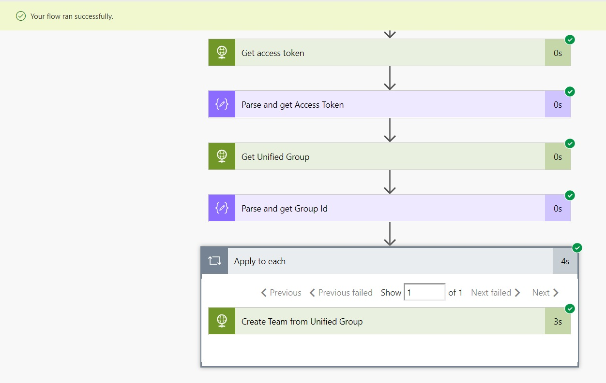

I was asked a few days ago if we could automate `Microsoft Teams` creation when a Modern Team Site is created in SharePoint Online. I got to think about it and came up with one way at least. This is using an `Graph Beta endpoint` for the Team creation, so it's not advisable to use this in production scenarios before it's in `v1.0`

* We are going to create a Site Script that calls a Flow
* The Flow utilizes the Office365 Group(Unified) after the site is created and creates a Team via the Graph.
* Since we are calling the Graph via Flow I'm setting up App Only permissions in the Azure AD for the application. 

* Via PnP PowerShell we will:
    * Register the Hub Site
    * Upload the Site Script and register withing Site Designs
    * Create a Communication Site and make it a Hub Site
    * Create a new Team Site and associate it to the Hub

 
## Setup App Permissions in Azure
1. Open a new Notepad 
2. Go to the Azure Portal -> select Azure AD -> properties.
Copy the `Directory ID` to Notepad
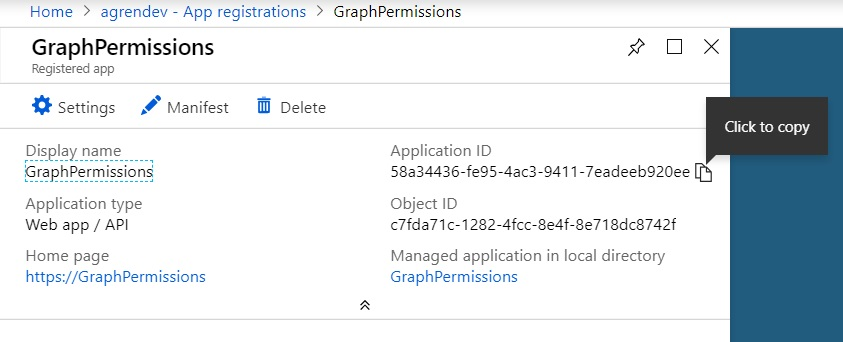

3. Select App Registrations -> Create new App and name it whatever you want -> then copy the `Application ID` to Notepad
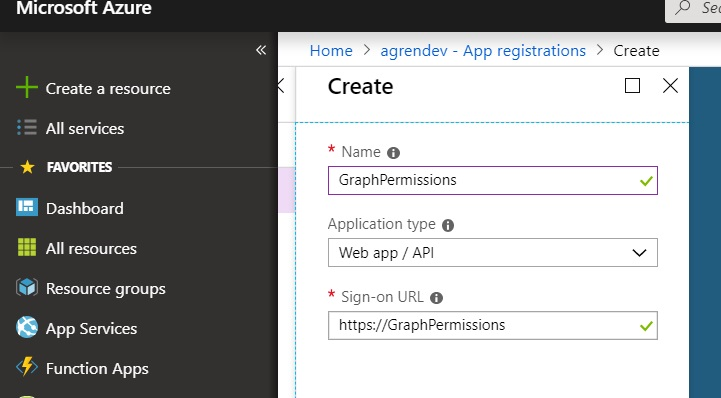

4. Go to Settings -> Keys. 
Create a new Key and Save to get the value. Copy the `Value` to Notepad
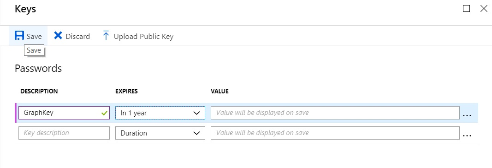

5. Go to Required Permissions -> Add Permission -> Select API -> Microsoft Graph -> under Application Permissions - Select `Read And Write All Groups`
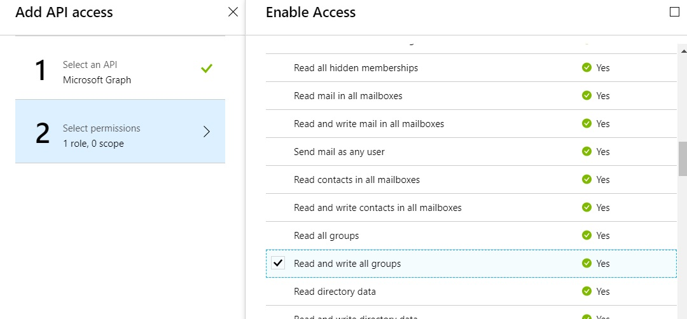

6. Grant permissions
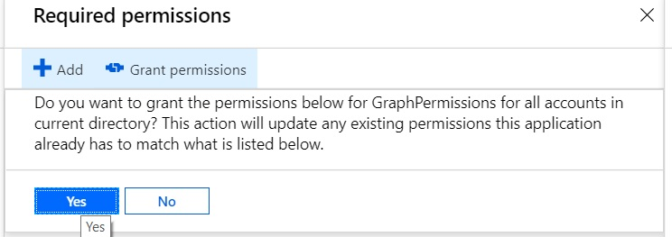

## Create Flow
1. Go to the Microsoft Flow site -> select Create from Blank

2. Search for Request and select Request - When A HTTP Request is received
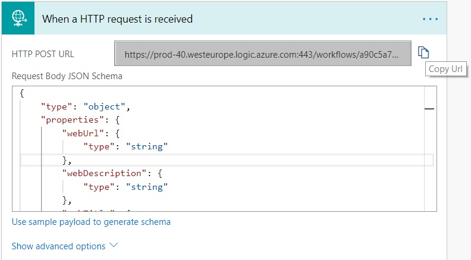

3. Copy the HTTP POST URL to Notepad -> then enter this JSON in the request body
```javascript
{
    "type": "object",
    "properties": {
        "webUrl": {
            "type": "string"
        },
        "webDescription": {
            "type": "string"
        },
        "webTitle": {
            "type": "string"
        },
        "creatorName": {
            "type": "string"
        },
        "creatorEmail": {
            "type": "string"
        },
        "createdTimeUTC": {
            "type": "string"
        },
        "parameters": {
            "type": "object",
            "properties": {}
        }
    }
}
```

4. Create new action - Search for Initialize and select Initialize Variable. Create three of these, rename them and enter the values from Notepad.
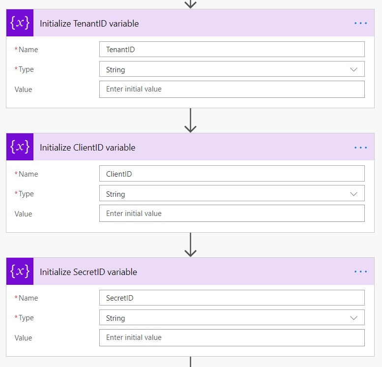

5. Create new action - Search and select HTTP. Rename it and enter the values:

*Method*: `POST`

*Uri*: `https://login.windows.net/@{variables('TenantID')}/oauth2/token`

*Headers*: `content-type: application/json;odata=verbose`
    
*Body*: `client_id=@{variables('ClientID')}&client_Secret=@{variables('SecretID')}&resource=https://graph.microsoft.com&grant_type=client_credentials`
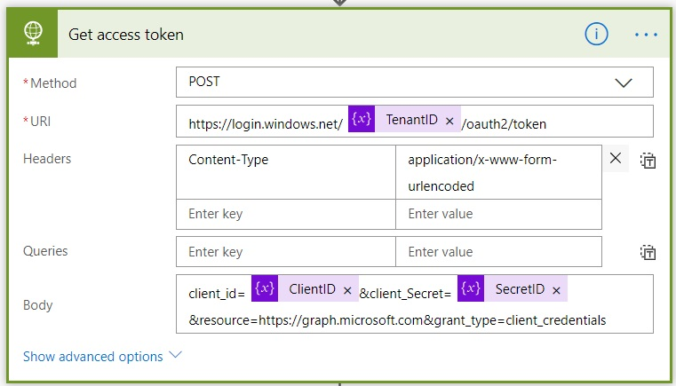

6. Create a new action - Parse JSON. Select body as content and enter this in the body:
```javascript
{
    "type": "object",
    "properties": {
        "token_type": {
            "type": "string"
        },
        "expires_in": {
            "type": "string"
        },
        "ext_expires_in": {
            "type": "string"
        },
        "expires_on": {
            "type": "string"
        },
        "not_before": {
            "type": "string"
        },
        "resource": {
            "type": "string"
        },
        "access_token": {
            "type": "string"
        }
    }
}
```
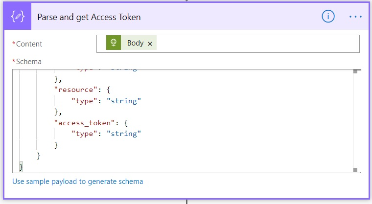

7. Create another HTTP action. Here we filter the groups based on the current site that triggered the flow. Which should be the modern Team Site we created.

*Method*: `GET`

*Uri*: `https://graph.microsoft.com/v1.0/groups?$filter=displayName%20eq%20'@{triggerBody()?['webTitle']}'`

*Headers*: `Authorization: Bearer @{body('Parse_and_get_Access_Token')?['access_token']}`

8. Create another Parse JSON. Select body as content. And enter this body:
```javascript
{
    "type": "object",
    "properties": {
        "@@odata.context": {
            "type": "string"
        },
        "value": {
            "type": "array",
            "items": {
                "type": "object",
                "properties": {
                    "id": {
                        "type": "string"
                    }
                },
                "required": [
                    "id"
                ]
            }
        }
    }
}
```

9. Create Action Apply to each, which loops through all the items. We should only have one group, but anyways. Then inside it create a new HTTP action.

*Method*: `PUT`

*Uri*: `https://graph.microsoft.com/beta/groups/@{items('Apply_to_each')?['id']}/team`

*Headers*: `Authorization: Bearer @{body('Parse_and_get_Access_Token')?['access_token']}`

*Body*: 
```javascript
{
  "memberSettings": {
    "allowCreateUpdateChannels": true
  },
  "messagingSettings": {
    "allowUserEditMessages": true,
    "allowUserDeleteMessages": true
  },
  "funSettings": {
    "allowGiphy": true,
    "giphyContentRating": "strict"
  }
}
```
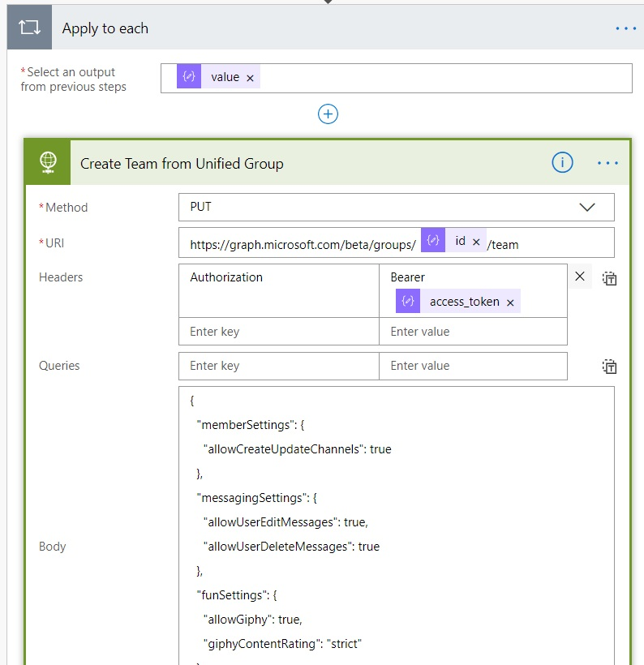

## Create Site Script
So one of the actions in Site Scripts is `triggerFlow`. Since we are associating this Site Script to a Hub Site it will be run everytime a site is associated to the hub, for that site. The Flow will start and create the Team

1. Create a .json file in Visual Studio Code. Use the following json and paste the HTTPPostUrl that we copied in to Notepad from the Flow

```javascript
{
"actions": [
    {
        "verb": "triggerFlow",
        "url": "https://prod-31.westeurope.logic.azure.com...",
        "name": "Create Team"
    }
    
	]
}
```
## Login and Create Site Design 
As I stated earlier we're going to use PnP PowerShell Commands to the extent it's possible. They are doing an awesome job updating these, so it won't be long until we can do all of this with PnP.

1. Connect to Tenant as Admin 
```powershell
$admin="user.name@tenant.onmicrosoft.com"
$cred = Get-Credential -UserName $admin -Message "Admin"
Connect-PnPOnline -Url https://tenant-admin.sharepoint.com -Credential $cred
```
2. Upload and add Site Script and Site Design
```powershell
$scriptFromFile = Get-Content 'C:\Users\...createTeam.json' -Raw
$siteScript = Add-PnPSiteScript -Title "Auto Create Team" -Description "Creates Team based on teamsite" -Content $scriptFromFile
$siteDesign = Add-PnPSiteDesign -Title "Auto Create Team" -WebTemplate "64" -SiteScriptIds $siteScript.Id -Description "Creates Team base on teamsite"
```

## Create Communication site and set as hub site

1. Create CommunicationSite
```powershell
$hub =  New-PnPSite -Type CommunicationSite -Title "Project Hub" -Url "https://tenant.sharepoint.com/sites/projecthub"
```

2. Register as Hub Site
```powershell
Register-PnPHubSite -Site $hub
```

## Associate Site Design with Hub Site

Right now Set-PnPHubSite doesn't seem to have the ability to set Site Design, so I'm using Set-SpOHubSite instead.

1. Connect again, but via SPO (Sorry for this)
```powershell
$admin="user.name@tenant.onmicrosoft.com"
$cred = Get-Credential -UserName $admin -Message "Admin"
Connect-SpOService -Url https://tenant-admin.sharepoint.com -Credential $cred
```
2. Add default Site Design to Hub
```powershell
Set-SpOHubSite -Identity $hub.ID -SiteDesignId $siteDesign.Id
```

## Create Modern Team Site and associate to hubsite

1. Create Team Site
```powershell
$teamSite = New-PnPSite -Type TeamSite -Title "Project 1" -Alias "project1"
```

2. Associate to Hub Site
```powershell
Add-PnPHubSiteAssociation -Site $teamSite -HubSite "https://tenant.sharepoint.com/sites/projecthub"
```

## Now let the Flow Do It's Work


