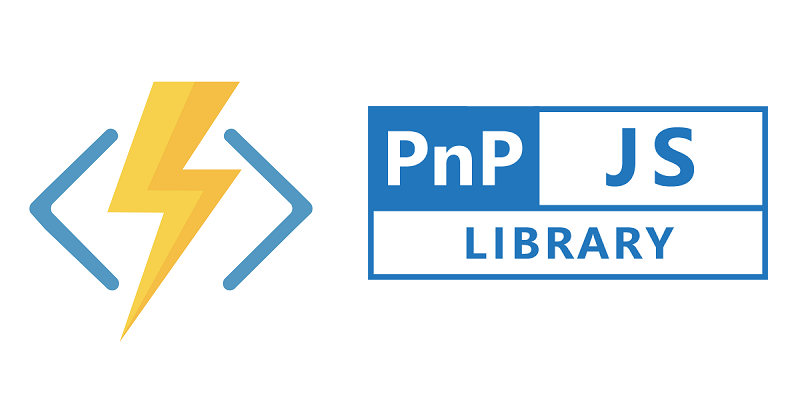
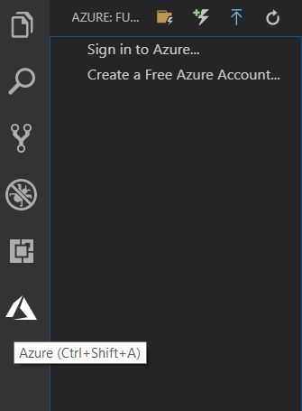
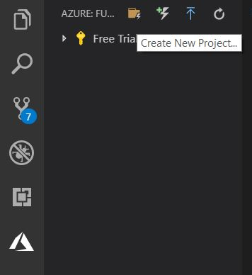
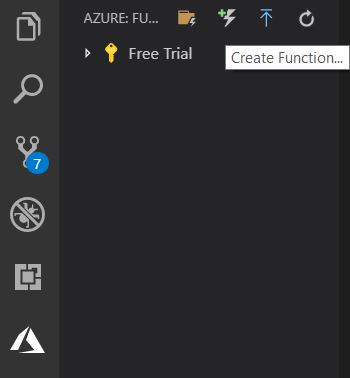

As the title may hint, you're up for some JavaScript!

Today I had a few moments over and decided to have look at Azure Functions V2. In all honesty It's been quite some time since I played around with Azure Functions, and back then I only made one or two PnP PowerShell scripts. It felt really interesting digging in to this again.

Anyways, I started to think about using PnPJs in the JavaScript function, and this might not be news to some of you, but for me this was exciting!

This first blog post will be a lot about setup and getting PnPJs to work with an Azure Function. Next post will include some deployment, local vs production variables, the Azure Storage Emulator etc. Then in the third post I will write some about Ochestrations and how we can utilize the strengths of functions vs more classic approaches.

So I ended up creating everything from Visual Studio code (you could use the CLI), and I want to share how I did it. 

## Installing prerequisites

* I assume you already have [Visual Studio Code](https://code.visualstudio.com/), and [Node](https://nodejs.org/) or else go get it already :)

* Then I installed the [Azure Functions Core Tools](https://docs.microsoft.com/sv-se/azure/azure-functions/functions-run-local#v2) for V2 by running the command: 
```javascript
npm i -g azure-functions-core-tools@2
```
* And you also need an [Azure Account](https://azure.microsoft.com/free/?ref=microsoft.com&utm_source=microsoft.com&utm_medium=docs&utm_campaign=visualstudio)

## Install Azure Function extension

1. I installed from [this url](https://marketplace.visualstudio.com/items?itemName=ms-azuretools.vscode-azurefunctions). 
But you could also search for "Azure Functions" among the extensions in VS Code.

2. Restart VS Code.

3. Select the Azure Icon -> sign in to Azure.


## Create new project

1. Select the Create a new Project icon -> make a new folder -> then select it.



2. Select JavaScript as language

3. Choose Add To WorkSpace

## Create Azure Function

1. Select the "Create Function" icon


2. Select you folder and choose HTTPTrigger

3. Type in a name -> select Anonymous authentication.

Now we have a function!

## Register an Add-in
Since we will call SharePoint from outside of SharePoint, we need to register an "add-in" to get some values that we will use later on.

Please head to the <a href="https://pnp.github.io/pnpjs/documentation/debugging/#register-an-add-in" target="_blank">debugging documentation</a> for PnPJs and follow the `Register an Add-in` and `Grant your add-in permissions`. Then come back right away!

## Init with NPM
Because we're going to add a few dependencies from `npm`, we need to create a `package.json` file.

First make sure you have a node console open, cd into the project folder. Then run this command:
```javascript
npm init
``` 
You will be asked a few things, I just went with the default values.


## Install PnPJs Dependencies
I ran this command to add these dependencies to the package.json file.
```javascript
npm install @pnp/logging @pnp/common @pnp/odata @pnp/sp @pnp/nodejs --save
```

## Creating local variables
In the local.settings.json, I added some values. We will come back to this file in the next post.

This is how mine looks like:
```javascript
{
  "IsEncrypted": false,
  "Values": {
    "AzureWebJobsStorage": "",
    "FUNCTIONS_WORKER_RUNTIME": "node",
    "spId": "{ appId }",
    "spSecret": "{ appSecret }",
    "spTenantUrl": "{ https://tenant.sharepoint.com }",
    "spNotificationUrl": "{ notification url }",
    "graphTenant": " { tenant.onmicrosoft.com }",
    "graphId": "{ AzureAppId }",
    "graphSecret": "{ AzureAppSecret }"
  }
}
```

## Let's write some code
Go in to the index.js of the function. I only changed a few things and made quite an simple example.

First off I added the PnPJs packages I needed. As far as I know you cannot use normal imports OOTB in NodeJS, so I am using require.
```typescript
// equal to: import { sp } from "@pnp/sp;"
const sp =  require("@pnp/sp").sp;

// equal to: import { SPFetchClient } from "@pnp/nodejs;"
const SPFetchClient = require("@pnp/nodejs").SPFetchClient;
```
Then I changed the querystring property from name to site. I'm using the value as siteName for the PnPJs setup. This site will be the default when using PnPJs.
```typescript
if (req.query.site || (req.body && req.body.site)) {
    const siteName = req.query.site || req.body.site;
    sp.setup({
        sp: {
            fetchClientFactory: () => {
                return new SPFetchClient(
                `${process.env.spTenantUrl}/sites/${siteName}/`, 
                process.env.spId, 
                process.env.spSecret);
        },
    },
});
```

So after the setup we make a call to our SharePoint site and selects the Title from the web and gets all of the Lists in the web. Then we send a response text back to the user.
```typescript
// Get the web and all the Lists
const web = await sp.web.select("Title").expand('Lists').get();

context.res = {
    // status: 200, /* Defaults to 200 */
    body: "All of the lists in the site " + web.Title + ": " + web.Lists.map(list => list.Title).join(', ')
};
```

## Full code

```typescript
// equal to: import { sp } from "@pnp/sp;"
const sp =  require("@pnp/sp").sp;

// equal to: import { SPFetchClient } from "@pnp/nodejs;"
const SPFetchClient = require("@pnp/nodejs").SPFetchClient;

module.exports = async function (context, req) {
    context.log('JavaScript HTTP trigger function processed a request.');

    if (req.query.site || (req.body && req.body.site)) {
        const siteName = req.query.site || req.body.site;
        sp.setup({
            sp: {
                fetchClientFactory: () => {
                    return new SPFetchClient(
                      `${process.env.spTenantUrl}/sites/${siteName}/`, 
                      process.env.spId, 
                      process.env.spSecret);
                },
            },
        });

        // Get the web and all the Lists
        const web = await sp.web.select("Title").expand('Lists').get();

        context.res = {
            // status: 200, /* Defaults to 200 */
            body: "All of the lists in the site " + web.Title + ": " + web.Lists.map(list => list.Title).join(', ')
        };
    }
    else {
        context.res = {
            status: 400,
            body: "Please pass a site on the query string or in the request body"
        };
    }
};
```

## Debugging
1. Set a break point if you want to have a closer look.

2. Press F5 and let everything load up.

3. Open a blank page in the browser and enter ex: http://localhost:7071/api/HttpFunction?site=test3

4. Watch the response in the browser!

Congrats, you have now made a working Azure Function V2, that you could deploy to Azure. Just make sure the dependencies follow along.

## Next steps

As I mentioned in the beginning of the post I will soon create another post on this subject, so stay tuned!