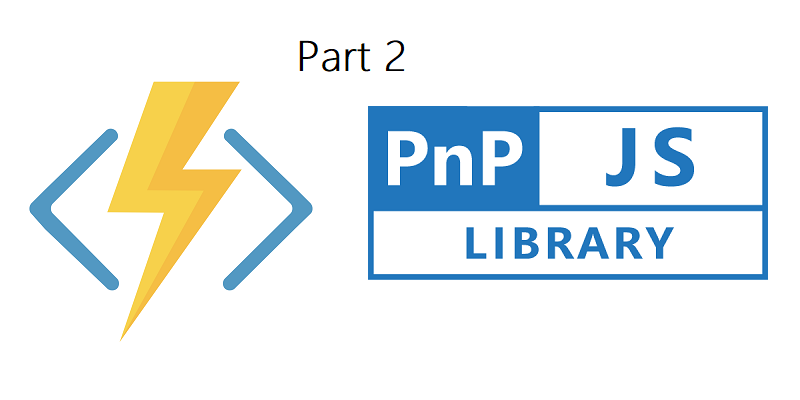
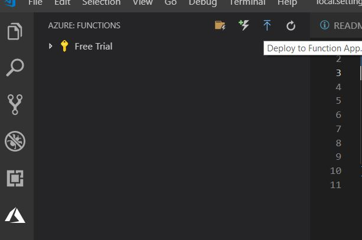
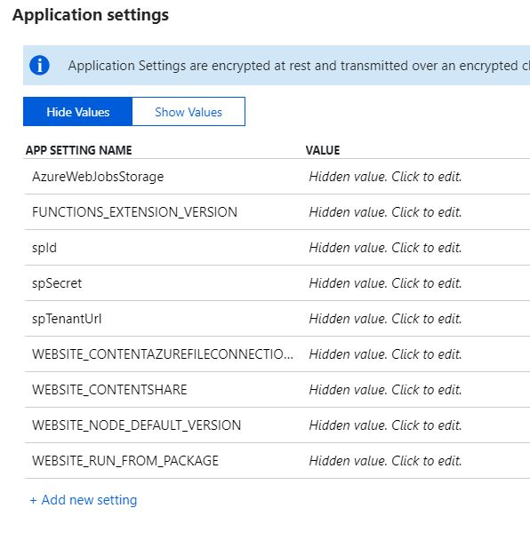
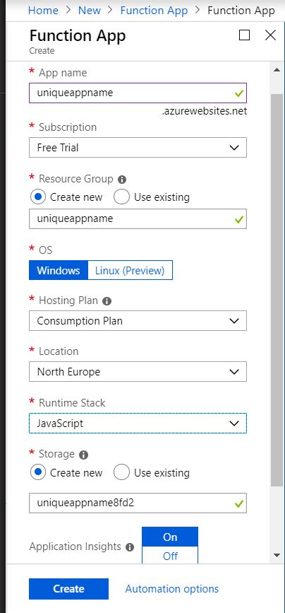
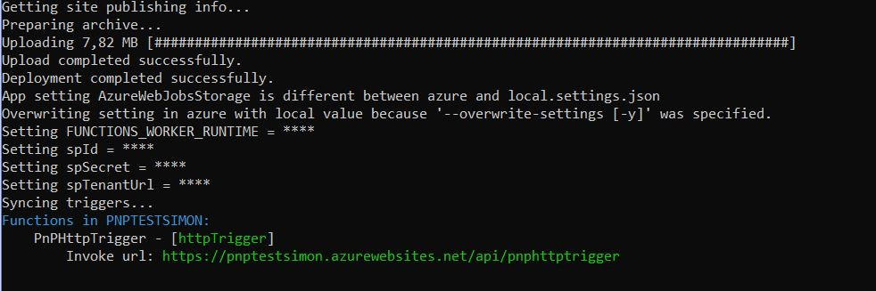
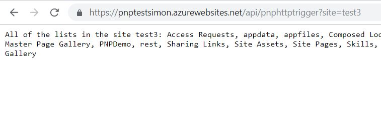

Let's deploy the Function to Azure and watch it call SharePoint!

This is the second post about Azure Functions V2, with PnPJs and Visual Studio code. I decided to split this post in two. The next post will focus on using the Azure Key Vault with our JavaScript Solution. 

This post is about deploying our app, and while we do that we have a look at the local vs productions variables.

# An Azure Function to work with
Have a look at the first post if you want to install the prerequisites and build the function from scratch:
<a href="https://simonagren.github.io/azurefunction-v2-pnpjs/" target="_blank">Part 1: Azure Functions V2 + VS Code + PnPJs === true</a>

You could also clone it from my Github and follow the instructions (please have a look at the readme):
<a href="https://github.com/simonagren/azurefuncpnpjsgetlists" target="_blank">Link to GitHub Repository</a>

# Deploy with VS Code and Azure Function Extensions
As I mentioned earlier there are multiple ways for us to deploy this function. In the last blogpost we utilized the VS Code extension so let's go with that first.

1. Press the `Deploy to Function App`

2. Select or create a new Function App
3. Select or create a new Resource Group
4. Select or create a new Storage Account

Let the extension run it's magic. After some time you should receive a message that the function has been deployed.
Right now we don't have any production variables, so we need to go into Azure to fix this:

1. Log in to the Azure Portal -> Go to Azure -> Function Apps -> select the app we just created
2. Create and enter values for the `spId`, `spSecret` and `spTenantUrl`, save!
3. Run `https://<AppName>.azurewebsites.net/api/PnPHttpTrigger?site=<SiteName>` 

It should now work in Azure, awesome!


# Deploy via Azure Function Core Tools (CLI)
Ok so here of course we have a couple of options, here are two:
- Create an Function App via the CLI and then publish our app
- Create an Function App from the UI.

Just to demonstrate how to fetch the Application settings from an existing Function App, we will create an Function App from the UI.

The `local.settings.json` is only being used locally, our settings are never transfered to Azure.

## Create Function App from the Azure Portal
If you dont't have an function app from the previous steps, create one here.

1. Log in to the Azure Portal -> Create new resource -> search for Function App and select `create`.

2. Fill in all the values and then `create`
3. Wait until the app has been created

## (OPTIONAL) Get Application Settings
We are going to use the `Azure Functions Core Tools` that we installed in the previous post, to get the application settings of our newly created app.
We don't need to get these before we deploy, I'm just showing you that you can. There might be some scenarious where you would want the storage settings etc.

1. Open a node console and cd into our VS Code project.
2. Run following command to fetch all application settings and they will be pushed into the local.settings.json file. 
```javascript
func azure functionapp fetch-app-settings <FuncApp>
```

## Deploy our function with local settings
So we publish our app and use the `local.settings.json` to overwrite the App Settings in Azure. We don't overwrite and remove all the settings, we actually just add the new settings and overwrite/update if there are any with the same name.  
```javascript
func azure functionapp publish <FuncApp> --publish-local-settings -i --overwrite-settings -y
```


And let's try it in the browser:


# Recap
So deploying an Azure Function from Visual Studio Code is really easy, I really like the Functions Extension. The only catch I could think of is that we manually must set the applications settings in Azure afterwards.

As you saw in other example, we created a new Function App to receive the settings from Azure. You don't have to do that, you could fetch settings from any of your Function Apps.

An really easy way to deploy this function would be to:
1. Create an Function App in the Azure Portal
2. Clone my repository from GitHub
3. Fill in the values in local.setting.json
4. Run `func azure functionapp publish <FuncApp> --publish-local-settings -i --overwrite-settings -y`
And you would be done!


Anyways the next post will be using the Azure CLI and Azure Key Vault!
