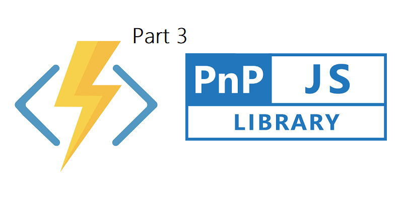
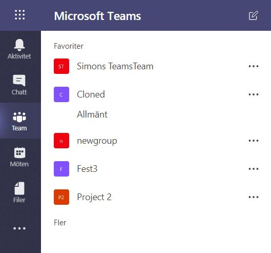
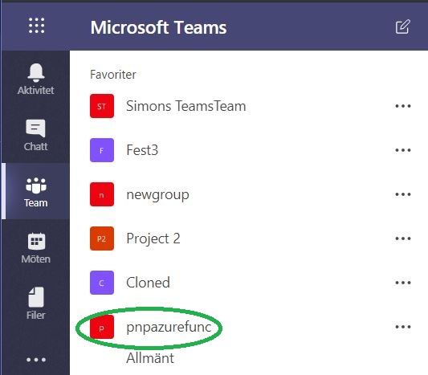

# The posts in this serie
- <a href="https://simonagren.github.io/azurefunction-v2-pnpjs/" target="_blank">Part 1 - Azure Functions V2 + VS Code + PnPJs === true</a>
- <a href="https://simonagren.github.io/part2-azurefunction/" target="_blank">Part 2 - Azure Functions V2 + VS Code + PnPJs === true</a>
- Part 3 - Azure Functions V2 + VS Code + PnPJs === true
- <a href="https://simonagren.github.io/part4-azurefunction/" target="_blank">Part 4 - Azure Functions V2 + VS Code + PnPJs === true</a>

I this post we will use the Azure CLI to create an Azure Key Vault, register our secrets in the vault, create the permissions required for us to access the keys.

After everything is set up we will call both SharePoint and the Graph via PNPJs to create a Microsoft Team based on the Group of an Modern Team site.

As we will be using Application Permissions to call the Graph we need to have an registered "app" in our Azure AD, so we get an Id and Secret. Have a look in <a href="https://simonagren.github.io/create-team-site-script/" target="_blank">This</a> blogpost of mine to see how you could register one.

Let's get to it!


# Prerequisites
Install Azure CLI globally
```json
npm install -g azure-cli
```

# Azure Key Vault
Now let's use a best practices approach, the Azure Key Vault for getting our `secrets`.

## Create a Key vault with Azure CLI
### Login to Azure with: 
```json
az login
```
### (Optional) You could create a new Resource Group by running:
```json
az group create --name myResourceGroup --location northeurope
```
### I'm using the same resource group we created earlier with the app. So let's get the name by using:

```json
az group list
```

### Create an Azure Key Vault

```json
az keyvault create --name "simonsfuncvault" --resource-group "funcresourcegroup" --location "North Europe"

```
### Add our secrets to the vault

```json
az keyvault secret set --vault-name "simonsfuncvault" --name "spSecret" --value "<SECRET>"

```
```json
az keyvault secret set --vault-name "simonsfuncvault" --name "graphSecret" --value "<SECRET>"
```

# Some code to work with
- Open a Node console and get the prepared <a href="https://github.com/simonagren/keyvaultfunc.git" target="_blank">solution</a> from my Github and I'll walk you through the code, in just a moment.


```json
git clone https://github.com/simonagren/keyvaultfunc.git
```
- cd into folder and restore dependencies

```json
npm install
```
- Open in Visual Studio Code

```json
code .
```

If you look in the package.json you can see that we have added three additional dependencies we need for our project. Note that it includes the `@pnp/graph` package since we will be calling the Graph aswell. These are those we added:

```json
ms-rest-azure
@pnp/graph
azure-keyvault 
```

# Create an app and publish via CLI
We could ofcourse like in <a href="https://simonagren.github.io/part2-azurefunction/" target="_blank">Part 2</a> deploy via the Extension in VS Code. But I wanted to show you how it's done via CLI.

### We already know/created an resource group. But let's find our storage Account:
```json
az storage account list
```

### Create the app
```json
az functionapp create --name pnptesting --storage-account pnphttptrigger98d7 --consumption-plan-location northeurope --resource-group 
```

### Publish app
As I mentioned earlier we need to have both an app registered in SharePoint, and an app registerd in our Azure AD with read/write permissions to Groups in the Graph.

Edit the `local.settings.json` and enter your:
- spId
- spTenantUrl
- graphTenant
- graphId

Let's deploy with our local settings:
```json
func azure functionapp publish pnptesting --publish-local-settings -i --overwrite-settings -y
```
Success!

## If you do get any errors
With missing connectionstring etc. Try to deploy via the VS Code extension UI then, and set the App Settings via the extension as well.

# Enable managed service identity on our Azure Function App
We do this for our specific Function App that we created

```json
az functionapp identity assign --name pnptesting --resource-group "funcresourcegroup"
```
We get a response, make sure to save the `principalId` that we get.

# Set permission policy for the app
Now we use our principalid to give the Function App permissions to get secrets from the Key vault

```json
az keyvault set-policy --name "simonsfuncvault" --object-id <PrincipalId> --secret-permissions get
```

# Let's go through the code and test our Azure Function

## Our imports
```TypeScript
const sp = require("@pnp/sp").sp;
const SPFetchClient = require("@pnp/nodejs").SPFetchClient;

const graph = require("@pnp/graph").graph;
const AdalFetchClient = require("@pnp/nodejs").AdalFetchClient;

const KeyVault = require('azure-keyvault');
const msRestAzure = require('ms-rest-azure');
```
## Getting the secrets
Here we first get a token from the general vault endpoint. Instanciate an KeyvaultClient and gets both the SharePoint and Graph secrets.

```typescript
const vaultUri = "https://simonsfuncvault.vault.azure.net/";
// Should always be https://vault.azure.net
const credentials = await msRestAzure.loginWithAppServiceMSI({resource: 'https://vault.azure.net'});

const keyVaultClient = new KeyVault.KeyVaultClient(credentials);

// Get SharePoint key value
const spVaultSecret = await keyVaultClient.getSecret(vaultUri, "spSecret", "");
const spSecret = spVaultSecret.value;

// Get Graph key value
const graphVaultSecret = await keyVaultClient.getSecret(vaultUri, "graphSecret", "");
const graphSecret = graphVaultSecret.value;
```
## Setting up Graph like we have done with SP before
```typescript
// Setup PnPJs Graph with graphSecret from Key Vault
graph.setup({
    graph: {
        fetchClientFactory: () => {
            return new AdalFetchClient(
                process.env.graphTenant,
                process.env.graphId,
                graphSecret
            );
        },
    },
});
 ```

## Create a Microsoft Team from the Team Site Group
First we get the web and select the Title. Then we get and filter all groups to find the one with the same displayName as our Modern Team Site.

We then get that specific group by Id and creates a Microsoft Team via the new `createTeam()` 
```typescript
// Get the web and select only Title
const web = await sp.web.select("Title").get();

// Filter Office365 groups for any with the same displayName as the web title
const filtGroups = await graph.groups.filter(`displayName eq '${web.Title}'`).get();

let createdTeam;
// If only one group. It should only be one
if (filtGroups.length === 1) {
    // Get the group from the array
    const group = filtGroups[0];
    // Create a Team based on that Group
    createdTeam = await graph.groups.getById(group.id).createTeam({
        "memberSettings": {
            "allowCreateUpdateChannels": true
        },
        "messagingSettings": {
            "allowUserEditMessages": true,
            "allowUserDeleteMessages": true
        },
        "funSettings": {
            "allowGiphy": true,
            "giphyContentRating": "strict"
        }
    });
}
```

# Lets call the Azure Function and see what happens
## Before


## Make the call in the browser or Postman
Make sure that the name of the site you use is a Modern Team Site
```json
https://pnptesting.azurewebsites.net/api/PnPHttpTrigger?site=pnpazurefunc

```
In the browser you should now have received a message that the Team have been created.

## After


# Finishing words
Next post will be about securing the Function App with Azure AD.
