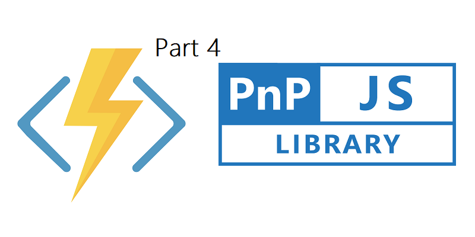


## The posts in this serie

- <a href="https://simonagren.github.io/azurefunction-v2-pnpjs/" target="_blank">Part 1 - Azure Functions V2 + VS Code + PnPJs === true</a>
- <a href="https://simonagren.github.io/part2-azurefunction/" target="_blank">Part 2 - Azure Functions V2 + VS Code + PnPJs === true</a>
- <a href="https://simonagren.github.io/part3-azurefunction/" target="_blank">Part 3 - Azure Functions V2 + VS Code + PnPJs === true</a>
- Part 4 - Azure Functions V2 + VS Code + PnPJs === true

This is the last post of this series and in this post we will secure a Function App with Azure AD and create a custom connector. Then we will call the Azure Function from both Flow and SPFx

When I started to implement this, the Azure subscription for my dev tenant expired. Then I was reminded that I could use my organizational MSDN subscription. But wait, if I build my Function Apps in the organizational tenant how could I access them in my dev tenant? This blog post ends up involving a multi-tenant scenario - which isn't that bad really - it helped me refresh some knowledge.

In the previous post we discussed how to use the Azure Key vault to make our calls to SharePoint and the Microsoft Graph a little more secure. But we have not really discussed how to secure our Azure functions themselves. In production the anonymous access (alone) is a bad idea, since anyone could call your function. Another common scenario is to use "function" permission, which gives you a code that you would need to pass along in the query string of the URL. Even though this is more secure, anyone with that code could call the Azure Function - so I ended up securing the Function App via Azure AD while I kept the anonymous access to the Azure Function itself. 

Let's get started.

## Prerequisites
For this blog post I assume you already have created a Function App. If you havn't you could clone this <a href="https://github.com/simonagren/AzureADAzureFunction" target="_blank">solution</a> from my Github, and follow the steps in the readme file. 

## Secure the Function App via Azure AD
We will secure the Function App with Azure AD by creating an App Registration, make it a multi-tenant app, enable CORS for my Dev tenant and then consent as an Admin.

### Register AD App for Azure Function in GUI
- Go to your Azure Portal and navigate to your Function App.
- Select "Platform Features" and then "Authetication/Authorization"

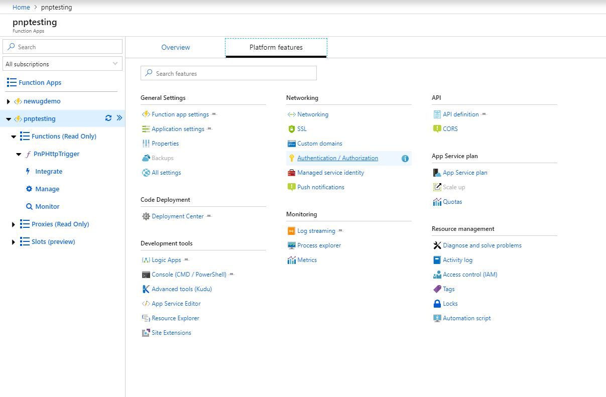

- Switch App Service Authentication to On, select "Log in with Azure Active Directory", and Select Azure Active Directory as the Authentication Provider

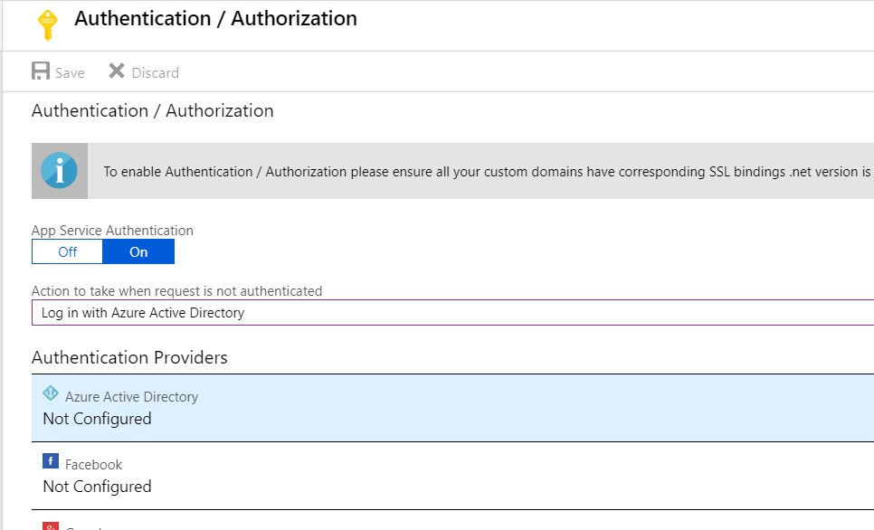

- Select "Express", and "Create New AD App", rename if you want to and then save everything.
- Make a note of the `Application ID`, we will use it later.

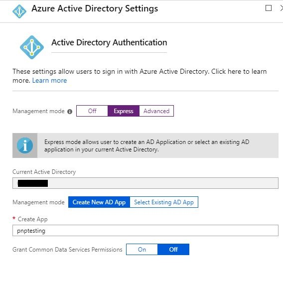

### Change to Multi-tenant
Now there should be an "Authentication" link available directly in the overview of the Function App. Either press that Authentication link, or navigate the same way we did in the previous step via "Authetication/Authorization".
- Select Azure AD again from Application Providers -> Manage Application -> Settings -> Properties.
- Enter a App Id URI based on your tenant, mine was: `https://<tenant>.onmicrosoft.com/pnptesting`
- Flip the Multi-tenant switch and then save!


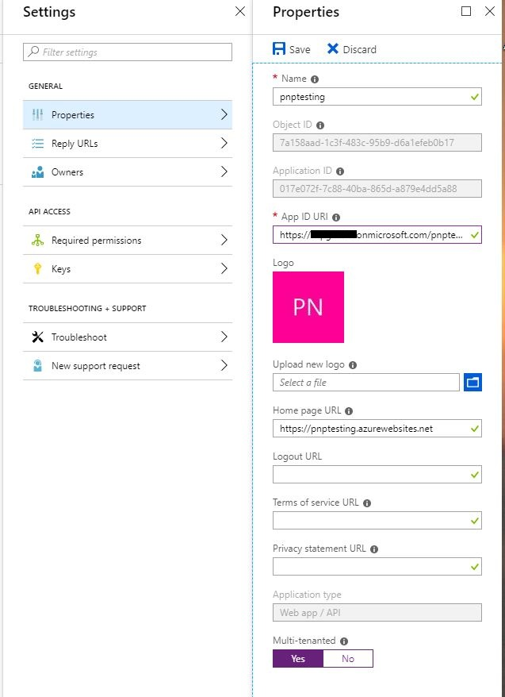

- Change the "Express" setting to Advanced, and then remove the Issuer Url. Press OK, then Save.

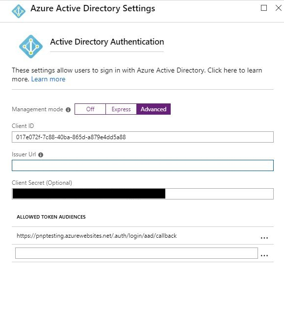

### Fix CORS
- In "Platform Features" again select CORS, and add the url to your other tenant, mine was `https://agrendev.sharepoint.com`

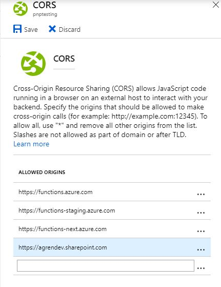

### Consent with an user from the other tenant
I opened a new window with the Chrome profile for my dev tenant. Then I navigated to the url of the Function App (not the AD app), and was asked to consent. As I was logged in with the Admin account I was able to consent for the whole organization (sorry for the Swedish).

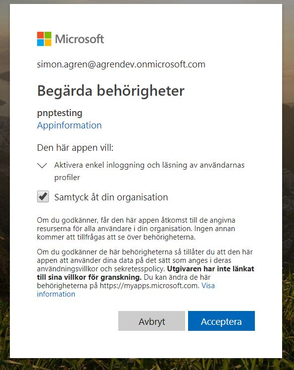

Now we could access this application in my dev tenant. The next step is to create a custom connector for Flow/PowerApps and then call the Azure Function via SPfx.

## Create A Custom Connector
What I like to do is make an Azure AD Application in my dev tenant, with delegated permission to the App we created. So that is what we will do initially. Then we will create a custom connector from the UI in Flow.

### Create AD Application and delegate permissions
Go to the Azure Portal of your consuming (in my case dev tenant), select Azure AD and the Application Registration.
- Enter a name and a sign-on url, then create

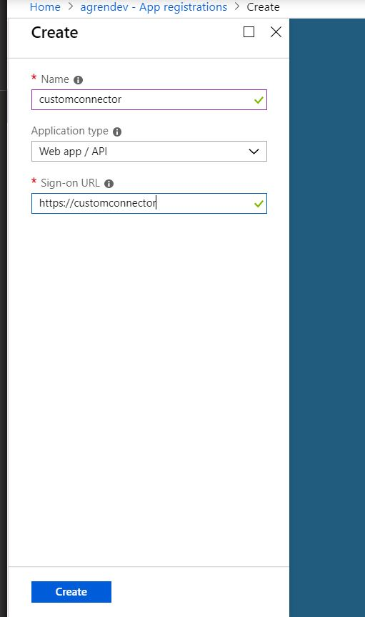

- Go in to settings, permissions, select permissions and then search for the name of your AD Application from the other tenant. In my case it's `pnptesting`.
- Delegate the permissions and select

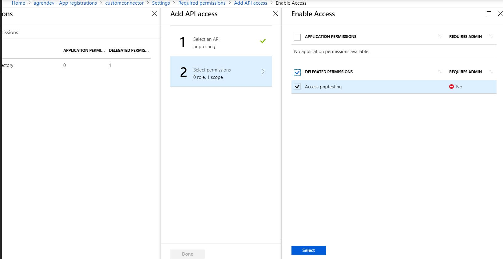

- Press "Grant Permissions" and ok.

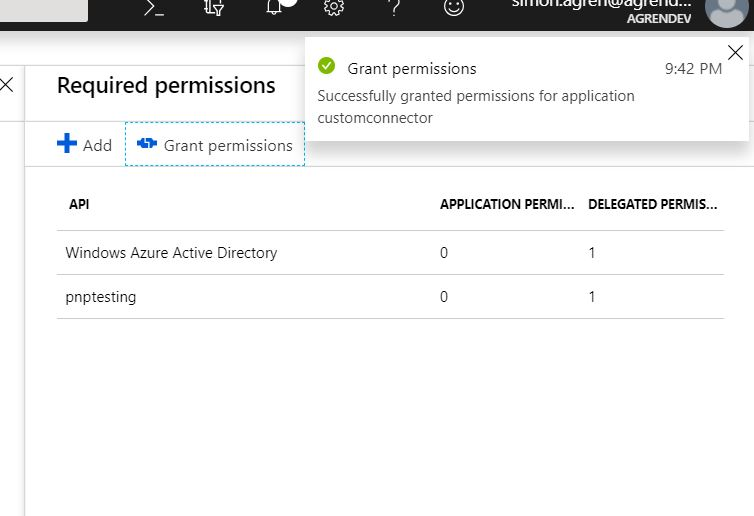

- Go in to keys, create a new key. Make a note of the `key value` and the `application id` of this app.
Make sure to leave the window open, since we're going to change the reply url.

### Create Custom Connector in Flow

You could use the Wizard directly in Flow/PowerApps, import an OpenAPI (swagger) file, or a Postman collection.
My experience revolves around creating collections in Postman and importing them, so for this post we will use the Wizard in the UI. 

- Navigate to the Flow portal, under data select custom connectors. Then select "create custom connector"

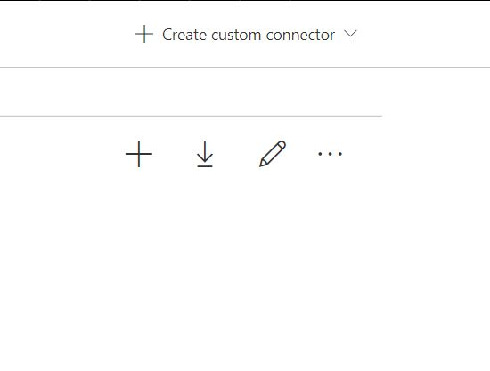

- Enter the url to your function app (not the HttpTrigger) as "Host", then move to security

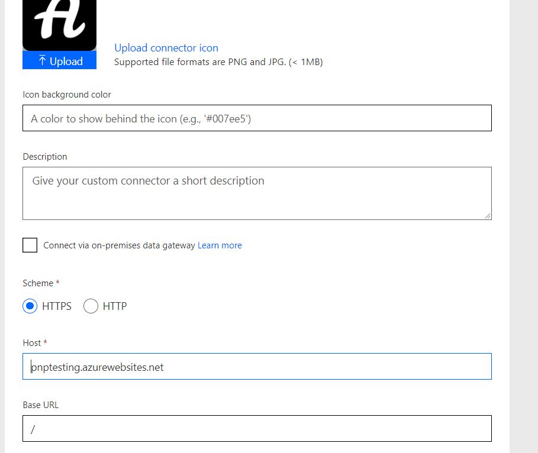

- Select Oauth 2.0, Azure Active Directory as identity provider, enter the client Id and secret of your newly created app.
- The resource URL is the ID of the Azure AD app we created in the other tenant, the one I told you to make a note of the ID.
- Save now, and you will receive a redirect url.

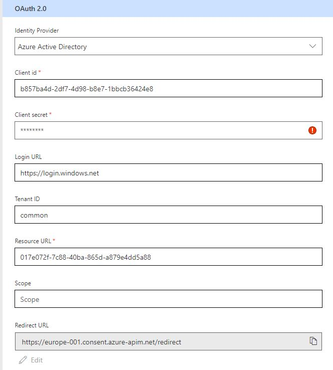

- Go back into the `Azure Portal` and change the Reply Url to the one you received in the custom connector.
- Go back into the `Custom connector`, and move on to definition.
- Add a new Action, I just named everything GetLists

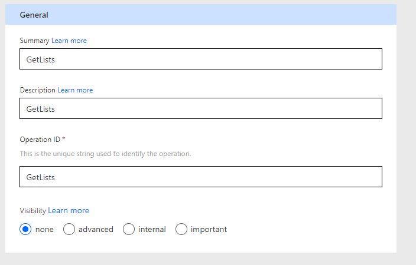

- Under request, select import from sample.
- Select "POST", and enter something like this in the body
```json
{
    "site": "test3"
}
```

- Create the Connection and move on to test. 

We will have to wait a couple of minutes for it to be provisioned, so go get some coffee.
After, you could test the connector in the test operation.

## Test the Connection in Flow
Let's try this in Flow.
I'm adding a manual trigger and then the custom connector.
Filling in the properties that we need.
This Azure Function creates an Item in a custom list - very basic.

As you can see we've created an item in SharePoint now.

## Call the Azure Function from SPFx
UPDATE:
I added the link to two articles that involves similar things that I'm doing in this post.

- Waldek Mastykarz wrote a good blog post on this subject about how you could solve the API Permissions easier with Office365 CLI [here](https://blog.mastykarz.nl/grant-api-permissions-office-365-cli/).

- Vesa Juvonen, Waldek Mastykarz, Linda Caputo and Chris Kent have written a good post [here](https://docs.microsoft.com/en-us/sharepoint/dev/spfx/use-aadhttpclient-enterpriseapi) about similar things that I do in this post. 

---------------------------------------------------


So I've created a simple SPFx webpart [solution](https://github.com/simonagren/SPFxAzureFunction) that you could clone from my Github.

Follow the readme and replace with your own variables in the code. In this web part we are requestion API Permissions.


### Package solution
Package the solution with the following commands. The file will end up in the `sharepoint\solution` folder.
```bash
gulp bundle --ship
gulp package-solution --ship
```

### Deploy solution
- I usually right click in VS Code and choose reveal in Explorer.

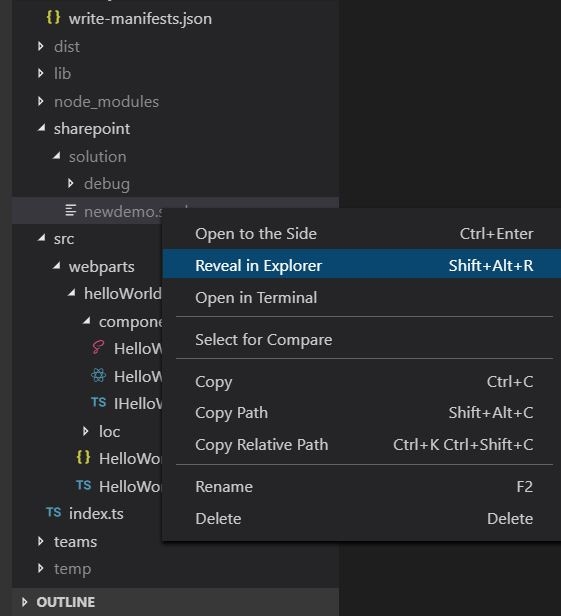

- Copy the path to the folder

- Navigate to your App catalog. Then later in the browser when I upload I  just paste the path in the upper pane, then select the package.

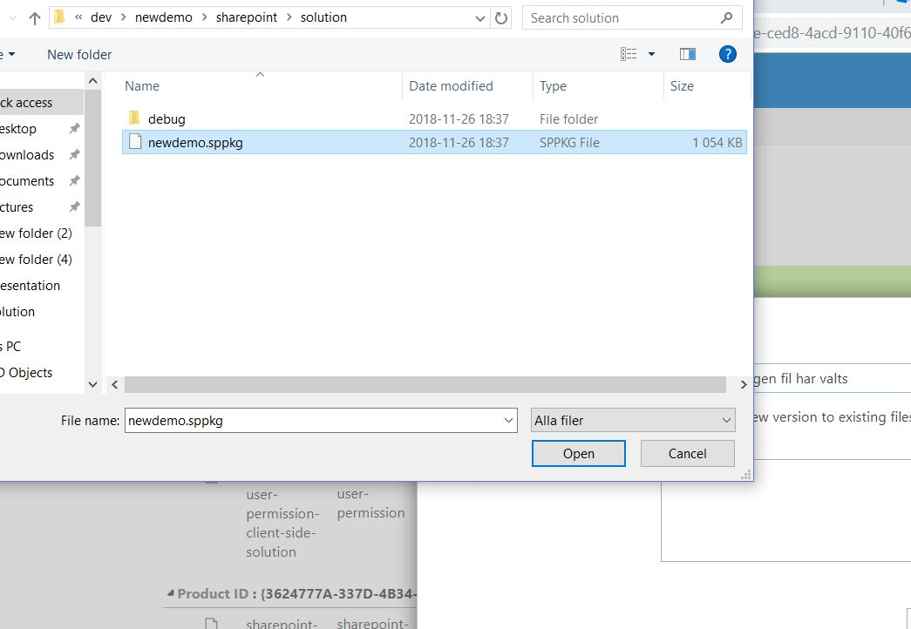

- Deploy

### Test the web part
- Open a page add the web part.
- Now you should see all you SharePoint Lists.

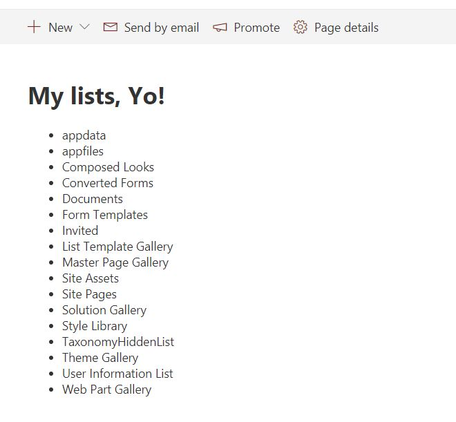

## Thank you
Thank you for following along in this series.


