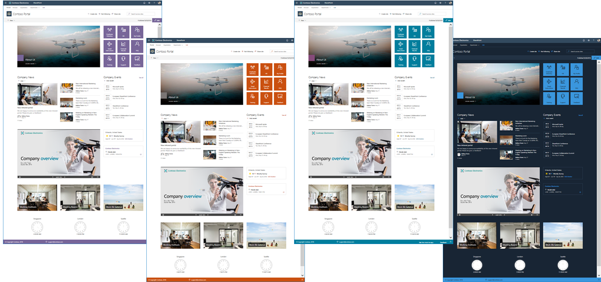

I have been getting some questions about how to resolve some of the issues with the footer and links in the SharePoint Starter Kit, so I decided to quickly document some of the findings here in a post. That way it is easily accessible to others.

If you haven't checked out the SharePoint Starter Kit, I suggest you do that. It's basically a joint effort by representatives from Microsoft, the PnP core team and the community to make a really nice base for a modern intranet solution.

Recently there has been a few issues regarding the portal footer in the SharePoint Starter kit, with the current SharePoint Framework update. 

# Background
A colleague of mine showed me an issue regarding the footer and IE11 specifically. When I began to investigate the matter I noticed a few other issues in Chrome aswell. 

I made a [pull request](https://github.com/SharePoint/sp-starter-kit/pull/232) with some fixes and there is both workarounds and some improvements with how the links are being saved. 

## Steps to reproduce
  - Get the latest version of the SP Starter Kit [here](https://github.com/SharePoint/sp-starter-kit)
  - Follow the documentation and install
  - Open the portal
  - Try out the footer


## Current state issues
In the current state you have these issues/things that could be improved:
- In IE11 you cannot open the "edit" dialog for your personal links. It closes right away with an error.
- Opening the edit dialog and closing it, makes the user unable to open it again. The dialog freezes.
- Opening the dialog and just saving without changes breaks the whole footer.
- Cancelling still saves links to user profile and the user gets an success message.
- The "expand footer" button looks weird in IE11.


## How could we fix these issues

### Prerequisites
First off I needed the PnPJs polyfill for IE11 for the footer to even show, you might not need it.
- Here is the [documentation](https://pnp.github.io/pnpjs/documentation/polyfill/)
- Make sure to install the package
- Then I imported it to the PortalFooterApplicationCustomizer.ts

### Fixes to the current state issues

**1. In IE11 you cannot open the "edit" dialog for your personal links. It closes right away with an error.**

I found that the usage of a `Resize Event` was throwing errors in IE11, as Event its not supported. What I did was to replace that code with UIEvents that works in all browsers.

In `MyLinksDialog.tsx` `componentDidMount` I removed: 

```typescript
window.dispatchEvent(new Event('resize'));
```

And added:
```typescript
let resizeEvent = window.document.createEvent('UIEvents');
    resizeEvent.initUIEvent('resize', true, false, window, 0);
    window.dispatchEvent(resizeEvent);
```

So now it looks like this:
```typescript
public componentDidMount(): void {
    // fire the resize event to paint the content of the dialog
    let resizeEvent = window.document.createEvent('UIEvents');
    resizeEvent.initUIEvent('resize', true, false, window, 0);
    window.dispatchEvent(resizeEvent);
  }
 ```
 <br/>  

**2. Opening the edit dialog and closing it, makes the user unable to open it again. The dialog freezes.**

With `BaseDialog` and mostly with SPFx 1.7x there is an issue. 
We could overwrite the basedialogs `onAfterClose` but then it would only work in Chrome. So I ended up unmounting the component right before we close it in the save and cancel methods. 
But clicking outside of the dialog does not `dismiss` the dialog for some reason, so to fix the error fully I needed to set the dialog to blocking. This just means we cannot click outside, only close it by normal means.

In the constructor of `MyLinksDialog:
```typescript
super({isBlocking: true});
```

In the `_cancel` and `_save` right before the `this.close()` of BaseDialog I added:
```typescript
ReactDOM.unmountComponentAtNode(this.domElement);
```
<br/>

**3. Opening the dialog and just saving without changes breaks the whole footer.**

The method was checking if something had been changed, or else just return an object with null values. Ofcourse then we had no links to map and the footer broke.

- So I added the optional boolean isSaving. And if that is true, compare if new values.
- If no new values then return the links from the userprofile so we could map the links in the footer.
- If any updated values, save to user profile and display a saved success messagebar.

So I changed the constructor of `MylinksDialog` to take an optional boolean:
```typescript
constructor(public links: Array<IMyLink>, public isSave?: boolean) {
  ```
Then in the `_cancel` method I set it to false and in the `_save` I set it to true:

```typescript
this.isSave = false;
```

```typescript
this.isSave = true;
```

Now they look like this with both fixes from `2.` and here:
```typescript
@autobind
  private _cancel(): void {
    this.isSave = false;
    this.links = this.initialLinks;
    // Fix for all browsers regarding SP Dialog not being to open twice
    ReactDOM.unmountComponentAtNode(this.domElement);
    this.close();
  }

  @autobind
  private _save(links: Array<IMyLink>): void {
    this.isSave = true;
    // Fix for all browsers regarding SP Dialog not being to open twice    
    ReactDOM.unmountComponentAtNode(this.domElement);
    this.links = links;
    this.close();
  }
```

And in the `PortalFooterApplicationCustomizer` check if it's a save or a cancel:
```typescript
// Do not save if the dialog was cancelled
    if (myLinksDialog.isSave) {
```

And I changed so it always gives you the links nomatter if being saved or not:

```typescript
result.links = await this.loadLinks();
    return (result);
```

So now it looks like this:
```typescript
@autobind
  private async _editLinks(): Promise<IPortalFooterEditResult> {

    let result: IPortalFooterEditResult = {
      editResult: null,
      links: null,
    };

    const myLinksDialog: MyLinksDialog = new MyLinksDialog(this._myLinks);
    await myLinksDialog.show();

    // update the local list of links
    let resultingLinks: IMyLink[] = myLinksDialog.links;

    // Do not save if the dialog was cancelled
    if (myLinksDialog.isSave) {
      if (this._myLinks !== resultingLinks) {
        this._myLinks = resultingLinks;
        
        // save the personal links in the UPS, if there are any updates
        let upsService: SPUserProfileService = new SPUserProfileService(this.context);
        result.editResult = await upsService.setUserProfileProperty(this.properties.personalItemsStorageProperty,
          'String',
          JSON.stringify(this._myLinks));

      }
    }
    result.links = await this.loadLinks();
    return (result);
  }
  ```
<br/>

**4. Cancelling still saves links to user profile and the user gets an success message. And the edited values are still there even after cancel.**

Since we added the boolean isSave in the last step, now the cancel only returns the values from the user profile. And since we get "fresh" link values it also resets any edits you had done and cancelled.

Before an addition of a link in the dialog, and then a cancel - the value would still be there if you opened the dialog again. Now that is also fixed.

<br/>

**5. The "expand footer" button looks weird in IE11.**

This was just some CSS change in `PortalFooter.module.scss` changing inheriting to transparent.
```css
.toggleButton {
      background-color: transparent;
      border: 0;
      color: inherit;
      padding: 0;
      min-width: 0;

      div {
        width: 1em;
        height: 40px;
        line-height: 40px;
      }
    }
  ```

## Final words
If these small code samples were confusing to you, go into the pull request and have a look. This is one way if fixing some of the issues, and I hope it could be beneficial to some of you.
