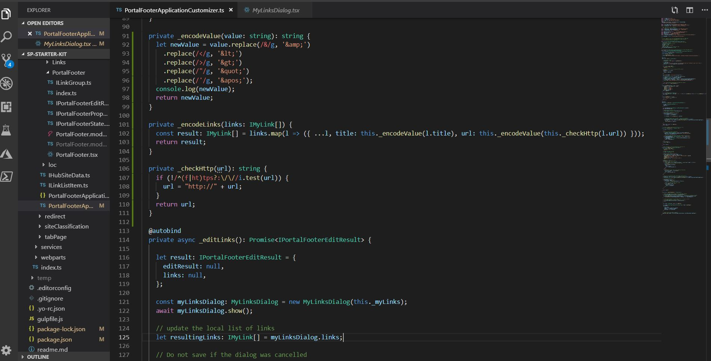

I made two posts at once and here is the previous: [Findings from issues with SharePoint Starter Kit](https://simonagren.github.io/sp-starter-footer/)

Another post about SharePoint Starter Kit. This time it's a small post about saving links to the "my links". As I see it the starter kit has been created to showcase a lot of best practices and creative ways of doing things. But it's also quite generic, which is good because it suits so many purposes, but it also means that we might have to adjust it in some cases.

A colleague of mine asked me how we could save more "complex" urls containing querystrings etc. If you remove the validation and try to save whatever URL you will get errors, since the special characters needs to be encoded.

First of there is a regexp to see that only ok simple urls are entered, which is good in some cases. For this scenario we had to remove that validation check.

"My Links" are being saved to you userprofile via a service call, that utilizes XML. And that XML presents a few "challenges" as we need to encode our URL values so they are ok for saving, or else we're bound to have errors.

So what I basicly did was:
- A method to encode some special characters
- A method to map all the link titles and urls with encoded values, before saving
- A method that adds "http://" to the URL if no https:// or http://

## The methods

### Encode values

```typescript
private _encodeValue(value: string): string {
    return newValue = value.replace(/&/g, '&amp;')
      .replace(/</g, '&lt;')
      .replace(/>/g, '&gt;')
      .replace(/"/g, '&quot;')
      .replace(/'/g, '&apos;');
  }
```

### Check for http:// or https://

```typescript
private _checkHttp(url): string {
    if (!/^(f|ht)tps?:\/\//i.test(url)) {
      url = "http://" + url;
    }
    return url;
  }
```

### Encode the links

Here we are using `map` which means that we return an array based on the callback function we supply. In this case we encode both the title and the url. In the url case we use the `_checkHttp` to check and possible "fix" the http:// situation, before the value is being encoded.
Then we return all the links like they were but encoded.

We are only doing this encoding when we save the links to the user profile, so they will look "normal" in the UI.

```typescript
private _encodeLinks(links: IMyLink[]) {
    const result: IMyLink[] = links.map(l => ({ ...l, title: this._encodeValue(l.title), url: this._encodeValue(this._checkHttp(l.url)) }));
    return result;
}
```

## Changed _editLinks

This is how my new _editLinks looks like. It should also be noted that it includes the changes made in the previous blog post.

For this specific purpose I have only changed one row. This is added just before the saving to the user profile.

```typescript
this._myLinks = this._encodeLinks(this._myLinks);
```

### Full code

```typescript
@autobind
  private async _editLinks(): Promise<IPortalFooterEditResult> {

    let result: IPortalFooterEditResult = {
      editResult: null,
      links: null,
    };

    const myLinksDialog: MyLinksDialog = new MyLinksDialog(this._myLinks);
    await myLinksDialog.show();

    // update the local list of links
    let resultingLinks: IMyLink[] = myLinksDialog.links;

    // Do not save if the dialog was cancelled
    if (myLinksDialog.isSave) {
      if (this._myLinks !== resultingLinks) {
        this._myLinks = resultingLinks;
        
        // Encode the links
        this._myLinks = this._encodeLinks(this._myLinks);

        // save the personal links in the UPS, if there are any updates
        let upsService: SPUserProfileService = new SPUserProfileService(this.context);
        result.editResult = await upsService.setUserProfileProperty(this.properties.personalItemsStorageProperty,
          'String',
          JSON.stringify(this._myLinks));

      }
    }
    result.links = await this.loadLinks();
    return (result);
  }
  ```