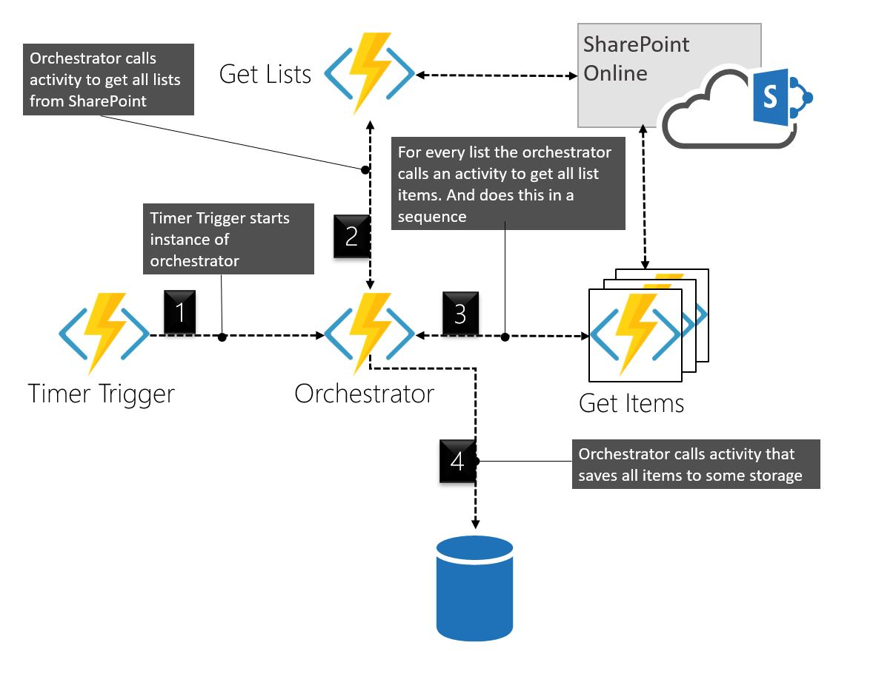
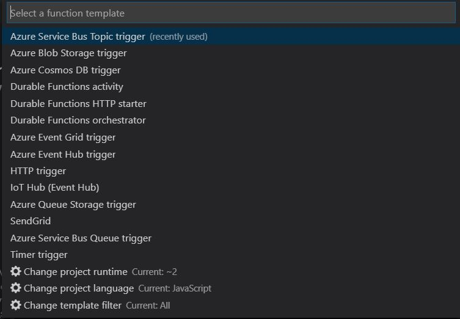

Durable function sare what Microsoft is calling "orchestrator functions". It's an extension of Azure Functions and takes a series of functions and wraps them as a single, long transaction. It lets you write stateful functions and workflows on top of the normally stateless Azure Functions. 

I've been playing around with Durable Functions in Node.js now and then for a few months now, and it has been awesome for quite some time. Now with the recent updates, I feel the maturity has come to another level.

[Katy Shimizu](https://twitter.com/kashimizMSFT) has done an amazing job fixing a lot of bugs and implementing a lot of new functionality, kudos! 

In this post, we will create some code and have a quick look at what I find to be some of the core concepts. The focus will be on getting something up and running, so we could debug locally. In the next post, I will further discuss some of the briefly mentioned topics.

We will touch on:
 - The different types of Azure Functions a Durable Function consists of
 - Triggers - only Timer Trigger in this post
 - Function chaining - the only pattern we discuss in this post.

## Give me some code, bro

If you would like to follow along, [here](https://github.com/simonagren/durable-intro) is the code.
___

## Definitions for Durable functions

### Activity
The functions and tasks being orchestrated by the workflow.

> Activities are part of the checkpoint and replay pattern. Among the differences with other functions, they do not respond to other triggers than an orchestrator calling them.
>
>An activity is a perfect place to have code accessing a database, sending emails, or any other external systems. Activities that have been called and returned have their results cached. Meaning, that returning 1000 rows from a database won’t be done multiple times but only a single time.

### Orchestrator
The orchestrator is a function that describes the way and order actions are executed in code.

> An Orchestrator is an Azure Function with specific behaviors attached to them. As an example, it automatically set checkpoint during its execution, shut itself down while waiting for other functions to finish executing, then replay through the checkpoint to resume execution.
It is important to remember how an Orchestrator function operates differently than a standard function. While a normal function only executes once per event, the orchestrator is restarted many times while waiting for other functions to complete.
>
> This kind of behavior means that this function needs to be deterministic. It must return the same result each time. It is crucial then to not use DateTime.Now, Guid.NewGuid() or anything generating a different result in this method

### Client
Is the entry point for creating an instance of a durable orchestration.

> The orchestration client binding enables you to write functions that interact with orchestrator functions. For example, you can act on orchestration instances in the following ways:
>
> - Start them.
> - Query their status.
> - Terminate them.
> - Send events to them while they're running.
> - Purge instance history.

In another blog post, we will discuss the Client usage, how we could poll, etc.

___

## Yield vs Await

You will see me using **yield** instead of **await** in most cases, the exception is when I'm working directly with PnPJs. **yield** is being used in the durable functions, and here's an explanation:

> In C# Durable Functions, the framework will terminate an orchestrator function before it completes if it needs to schedule async work and sleep. JavaScript does not have this capability, so we took advantage of using generators to move step-by-step through a function to achieve a similar "termination before completion" effect. Because the shim library in this repository uses generators, it uses the "yield" keyword.

## Prerequisites
All of these are not essential for this post, but they are when it comes to the later stages. So get all of these installed.

- [Visual Studio Code](https://code.visualstudio.com/download)
- [Azure Core Tools 2.x](https://docs.microsoft.com/en-us/azure/azure-functions/functions-run-local#install-the-azure-functions-core-tools)
- [Azure Cli](https://docs.microsoft.com/en-us/cli/azure/install-azure-cli)
- [Azure Functions VS Code Extension](https://marketplace.visualstudio.com/items?itemName=ms-azuretools.vscode-azurefunctions)
- [Node.js 8.6.0 or later](https://nodejs.org/en/)
- [Azure Storage Emulator](https://docs.microsoft.com/en-us/azure/storage/common/storage-use-emulator)

___

## Creating the Project and adding dependencies
We will use a simple pattern called "Function Chaining", which is executing a sequence of functions in a particular order. For our fictional use case, there is no real reason to do things in a specific order, it's more common in scenarios where you pass the returned values into the next step. But for the sake of things, let's just go with it.




I will use [this](https://simonagren.github.io/azurefunction-v2-pnpjs/) post as a reference for some installation here.
You could also have a look at the documentation in the durable functions repository [here](https://github.com/Azure/azure-functions-durable-js)

After all the prerequisites are installed, create a new folder via the Node.js console, then cd into the new folder and open Visual Studio code by writing `code .`.
Then create a New Project (not a new Function) via the Azure Functions extension, you could get some inspiration from the post.

Now we need to install the Durable Functions Extension, and you do this via the console again:

```Node
func extensions install -p Microsoft.Azure.WebJobs.Extensions.DurableTask -v 1.7.0
```

And I like to put all my dependencies into a package.json, so we need to do an `npm init` and then install the PnPJs dependencies. Look how I did in the linked post.

Now we also need to add the dependencies of the durable function:

```Node
npm install durable-functions --save
```
___

## Creating the Timer Trigger
In the linked post I'm showing how to create an Http Trigger via the extension, but now we will create a Timer Trigger. In this timer trigger, we will include a "Client" that is capable of starting an orchestrator.

While selecting the function template, you could change the template filter to `All`, then you will see that there are provided templates of a durable function scenario (the ones starting with durable). 



Feel free to look at them if you want to, but for this, we are going with the Timer Trigger, I named mine `PnPTimerTrigger`.

As always we get two files:
 - function.json
 - index.js

### function.json
In the function.json we need to set the schedule and add some bindings for the Client. For this example, I have set the timer to run every two minutes.

```json
{
  "disabled": false,
  "bindings": [
    {
      "name": "myTimer",
      "type": "timerTrigger",
      "direction": "in",
      "schedule": "0 */2 * * * *"
    },
    {
      "name": "starter",
      "type": "orchestrationClient",
      "direction": "in"
    }
  ]
}
```
### index.js
In index.js we just add some things to the code. We first:
- Import the durable-functions dependencies
- Create a new client instance
- Start an instance of an Orchestration (that we will soon build)

```javascript
// Import durable functions
const df = require("durable-functions");

module.exports = async function (context, myTimer) {
    // Create client instance
    const client = df.getClient(context);

    const timeStamp = new Date().toISOString();
    
    if(myTimer.isPastDue)
    {
        context.log('JavaScript is running late!');
    }

    // start orchestration with hardcoded site name
    const instanceId = await client.startNew('OGetUniquePermItems', undefined, 'test3');
    
    // Log the started instance
    context.log(`Started orchestration with ID = '${instanceId}'.`);
    context.log('JavaScript timer trigger function ran!', timeStamp);   
};
```

## Creating the Orchestrator (OGetUniquePermItems)

I normally just create a HttpTrigger and change the code after.
I named this OGetUniquePermItems, and I like to keep an "O" in the name if it's an orchestrator.

These are the bindings for an Orchestrator

### function.json

```json
{
  "bindings": [
    {
      "name": "context",
      "type": "orchestrationTrigger",
      "direction": "in"
    }
  ],
  "disabled": false
}
```
### index.js

And this is some simple code in this orchestrator. Don't worry we will do cooler things in upcoming posts.
- We set up PnPJs
- Call an activity to get all lists from the SharePoint Site
- For every list start activities in a sequence. Get the uniquely permissioned items from each list.
- When all has been fetched, log or call activity to save the data to some storage.

```javascript
const sp =  require("@pnp/sp").sp;
const SPFetchClient = require("@pnp/nodejs").SPFetchClient;
const df = require("durable-functions");

module.exports = df.orchestrator(function* (context) {
    
    // Get input from the client that started
    const siteName = context.df.getInput();
    
    // Setup PnPJs
    sp.setup({
        sp: {
            fetchClientFactory: () => {
                return new SPFetchClient(
                  `${process.env.spTenantUrl}/sites/${siteName}/`, 
                  process.env.spId, 
                  process.env.spSecret);
            },
        },
    });
    
    // Call Activity that fetches all lists that arent hidden, and wait for it to finish
    const lists = yield context.df.callActivity("AGetLists", siteName);

    const output = [];

    for (let list of lists) {
        // For this example we will do all the calls in sequence
        // This could also be done in parallel, but then we need to handle throttling
        output.push(yield context.df.callActivity("AGetUniqueItems", list));
    }

    // Here we could save the result to some DB if we want to
    // yield context.df.callActivity('SaveItems', output);
    
    // For this example we just log the result  
    context.log(JSON.stringify(output));
    
    return context.instanceId;

})
```

## Creating the Get Lists Activity (AGetLists)

In this activity we just perform one task and return the values, for this we are using PnPJs. I like to keep an A in the function name if it's an activity.

### function.json

```json
{
  "bindings": [
    {
      "name": "siteName",
      "type": "activityTrigger",
      "direction": "in"
    }
  ],
  "disabled": false
}
```

### index.js

```javascript
const sp =  require("@pnp/sp").sp;

module.exports = async function (context) {
    
    const siteName = context.bindings.siteName;

    if (!siteName) {
        throw new Error("A Site name is required as input.");
    }
    
    context.log(`Getting lists in '${siteName}'...`);
    
    // Get all the Lists
    const lists = await sp.web.lists.select('Id','Title','Hidden').filter('Hidden eq false').get();
    
    return lists;
        
};
```

## Creating the Get Unique Items Activity

It's similar to the previous function.

### function.json
```json
{
  "bindings": [
    {
      "name": "list",
      "type": "activityTrigger",
      "direction": "in"
    }
  ],
  "disabled": false
}
```

### index.js
```javascript
const sp =  require("@pnp/sp").sp;

module.exports = async function (context) {

    const list = context.bindings.list;

    if (!list) {
        throw new Error("A List is required as input.");
    }
    context.log(`Getting items in '${list.Title}'...`);

    // Get all the uniquely permissioned items in this list
    // It's not possible to filter on the server
    const items = await sp.web.lists.getById(list.Id).items.select('Id','HasUniqueRoleAssignments','FileRef').get();
    const uniqueItems = items.filter(item => item.HasUniqueRoleAssignments);

    return uniqueItems;
        
};
```
___

## Debug

In a previous post, we used the emulator for debugging, and that is fully possible in this scenario as well.

### Azure Storage Emulator
First, make sure that you have started Azure Storage Emulator and that you are using version 5.9 or later (this moment 5.9 is the latest).

### local.settings.json
Then make sure your local.settings.json is configured in the right way for our scenario. We need to use development storage and we also need to provide the SharePoint values for PnPJs to work. Have a look at mine:

```json
{
  "IsEncrypted": false,
  "Values": {
    "AzureWebJobsStorage": "UseDevelopmentStorage=true",
    "AzureWebJobsSecretStorageType": "files",
    "FUNCTIONS_WORKER_RUNTIME": "node",
    "spId": "{AppId}",
    "spSecret": "{AppSecret}",
    "spTenantUrl": "https://{tenant}.sharepoint.com"
  }
}
```

### Press F5

You could set breakpoints where you feel like.
If everything works out you should see some logging of all the items with unique role assignments.

___

## Next Steps
In the next post, we will look at the fan-out fan-in pattern, where we will do a lot in parallel. This means we also need to talk about throttling in SharePoint and how we could handle this.

We will also extend our example with something called sub orchestrations, which could be very useful in more complex orchestrations.
