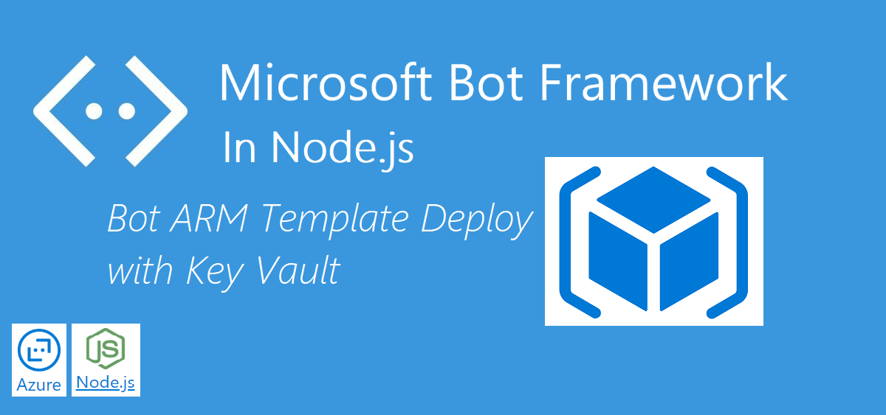
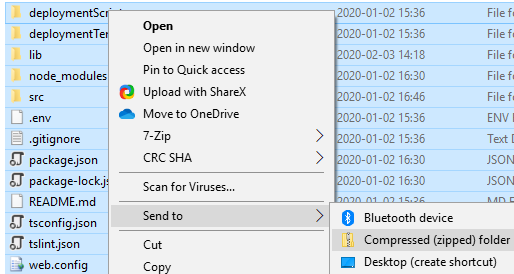
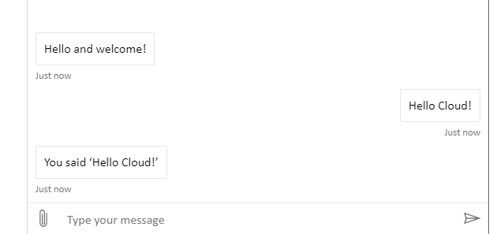

This post assumes that you already have generated your Bot and you have ARM Templates available to deploy with. Follow the steps in I broke this out to another post here:
<a href="https://simonagren.github.io/azurebot-nodejs-part1" target="_blank">This</a> post.

# Prerequisites

- [Azure CLI](https://docs.microsoft.com/en-us/cli/azure/install-azure-cli)
- [An Azure Account](https://azure.microsoft.com/free/)

# Login Azure CLI and Create Azure AD App

1.  First, log in to Azure

```json
az login
```

2. Set a default location so you don't have to enter it all the time

```json
az configure --default location=northeurope
```

3. Create an Azure AD registration that will be used for the different channel authentication. Make sure to save these values, because we will need to use them later. This application is a multi-tenant app, to make sure it works with all the channel registrations. In upcoming posts where we will use Microsoft Graph, we will create another app registration.

```json
az ad app create --display-name "AADSimonBot" --password "SimonBlogBotDemoStuff1!" --available-to-other-tenants
```

# Create Resource Group and Key Vault to be used in ARM deployment

1. Create a resource group

```json
az group create --name RGSimonBot
```

2. In this example, we will create Key Vault and give us the possibility to use it in ARM deployment.

```json
az keyvault create --enabled-for-template-deployment true --name "VaultSimonBot" --resource-group "RGSimonBot"
```

3. Add the AAD App secret to the key vault

```json
az keyvault secret set --vault-name "VaultSimonBot" --name "SecretSimonBot" --value "SimonBlogBotDemoStuff1!"
```

# Slightly modify ARM parameters file and then use it for deployment

We will use the parameters file in this case to input the values, and then use it in the template deployment. We could also pass in the parameters in the Azure CLI command if we wanted to (as they do in the Microsoft article I linked to).

- `appId` - here we use the appId value of the Azure AD app registration we did
- `appSecret` - here we use a reference to the Key Vault we created and the specific secret we created. For the `secretName`, we will use the name of the secret we added to the Key Vault. As the id for the Key Vault we use this syntax:

```json
/subscriptions/<SubscriptionId>/resourceGroups/<ResourceGroup>/providers/Microsoft.KeyVault/vaults/<KeyVaultName>
```

The rest is quite self explanatory. We have also added values for `botId`, `botSku`, `newAppServicePlanName`, `appServicePlanLocation` and `newWebAppName` in the parameter file and now it looks like this:

```json
{
  "$schema": "https://schema.management.azure.com/schemas/2015-01-01/deploymentParameters.json#",
  "contentVersion": "1.0.0.0",
  "parameters": {
    "appId": {
      "value": "198eb0c2-33e1-4808-a7b4-d326043e839b"
    },
    "appSecret": {
      "reference": {
        "keyVault": {
          "id": "/subscriptions/4866dad4-d39c-4a12-9466-de00b6a66718/resourceGroups/RGSimonBot/providers/Microsoft.KeyVault/vaults/VaultSimonBot"
        },
        "secretName": "SecretSimonBot"
      }
    },
    "botId": {
      "value": "BotSimonBot"
    },
    "botSku": {
      "value": "F0"
    },
    "newAppServicePlanName": {
      "value": "SPSimonBot"
    },
    "newAppServicePlanSku": {
      "value": {
        "name": "S1",
        "tier": "Standard",
        "size": "S1",
        "family": "S",
        "capacity": 1
      }
    },
    "appServicePlanLocation": {
      "value": "northeurope"
    },
    "existingAppServicePlan": {
      "value": ""
    },
    "newWebAppName": {
      "value": "WASimonBot"
    }
  }
}
```

# Deploy using ARM template and parameter file

1. Make sure you cd into the folder where the `DeploymentTemplates` reside. Using `template-with-preexisting-rg.json` and `preexisting-rg-parameters.json` will create a new App Service plan, App Service (Web application), and a Bot Channel registration into our already created resource group.

```json
az group deployment create --name "DeploySimonBot" --resource-group "RGSimonBot" --template-file template-with-preexisting-rg.json --parameters @preexisting-rg-parameters.json
```

2. Cd back into the main bot folder. The infrastructure has been deployed and we will now prepare the Bot for deployment, creating two web.config files. These are needed as we run the application on NodeIIS in Azure

```json
az bot prepare-deploy --code-dir "." --lang Typescript
```

3. We need to compress the content to a .zip file. I usually just write "start ." in `cmd` to open file explorer and then mark everything and "send to .zip"
   

4. Then we zip deploy the bot to the Web Service

```json
az webapp deployment source config-zip --resource-group "RGSimonBot" --name "WASimonBot" --src "nameOfZip.zip"
```

5. And now we can test the webchat. We have our Bot running and working in Azure - nothing runs locally anymore!


