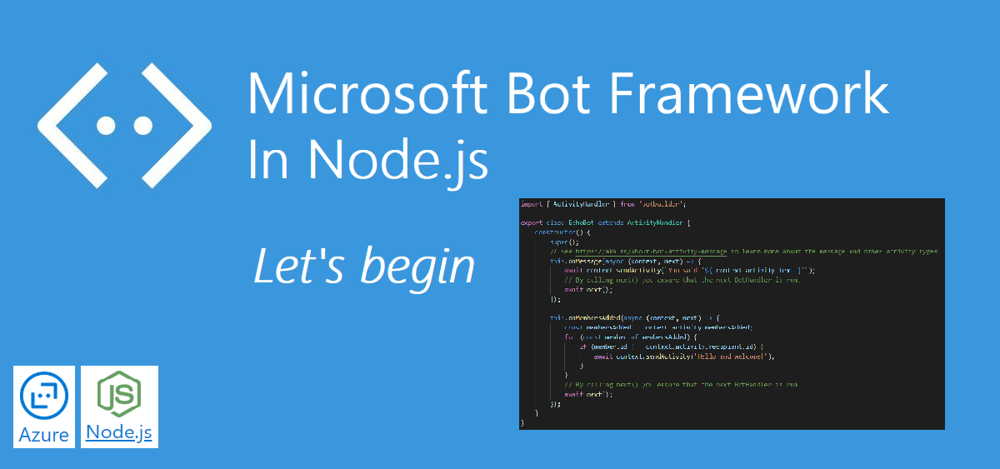
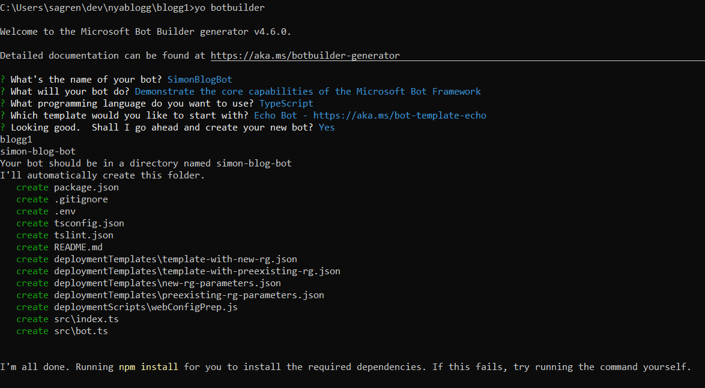
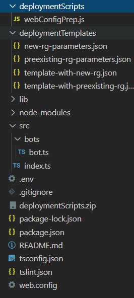
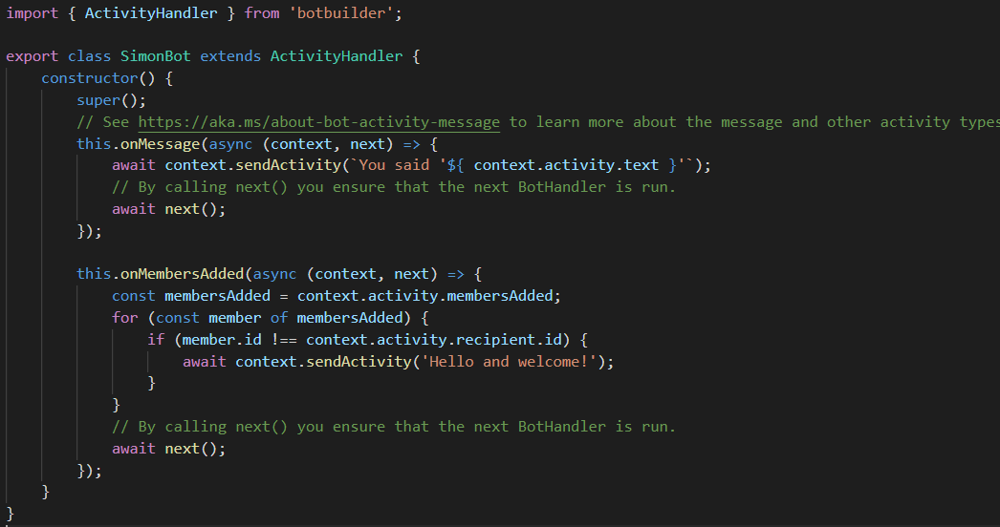
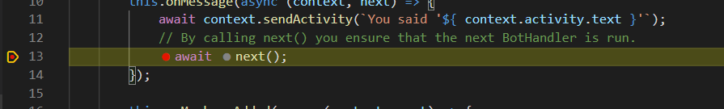
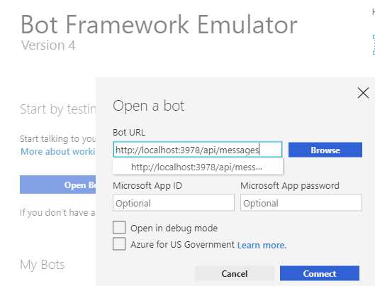
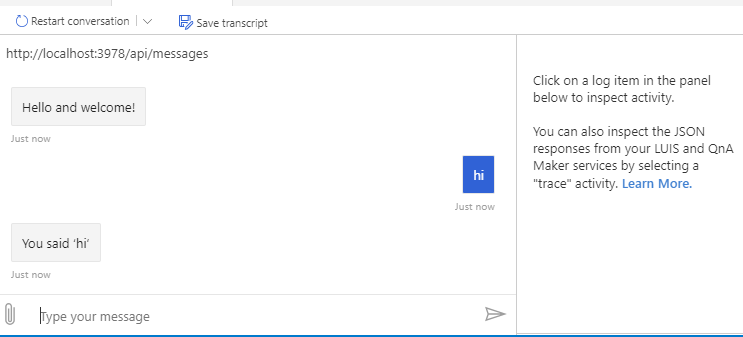
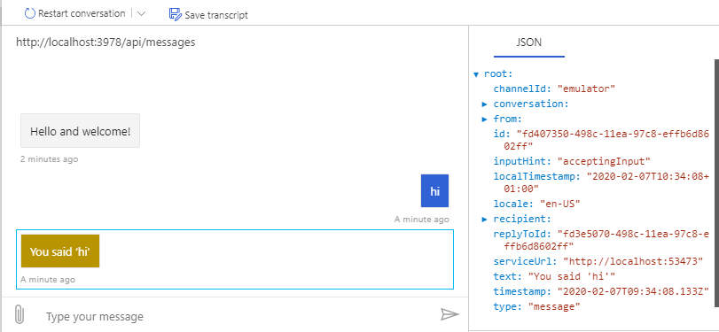

This is the first of a series of blog-posts regarding Bot Framework 4, Node.js and TypeScript. There's a lot of material out there and it might seem redundant to start with the basics. 
I will take you on a journey where we begin with the most simple concepts, and in each post, we develop the Bot a bit further while introducing some new concepts. And it's going to be my ways of doing things, with workarounds and both simple and creative ways to get things done.

| Bot Framework in Node.js                                                                  | Complimentary post                                                                                                          |
|-------------------------------------------------------------------------------------------|-----------------------------------------------------------------------------------------------------------------------------|
| Let's begin (Part 1)     | <a href="https://simonagren.github.io/azurebot-armtemplate-keyvault"  target="_blank">Bot Framework 4 ARM template Deploy with Key Vault</a> |
| <a href="https://simonagren.github.io/azurebot-nodejs-part2"  target="_blank">Microsoft Teams (Part 2)</a> |                                                                                                                             |
| <a href="https://simonagren.github.io/azurebot-nodejs-part3"  target="_blank">Dialogs (Part 3)</a>         |                                                                                                                             |

# Planned topics

***As of right now these are the intended topics that we will go trough:***
1. Generating a Bot, run it locally with the emulator and deploy to Azure using Azure CLI and Azure Resource Manager (ARM) templates + key vault integration.
2. Running the Bot in Microsoft Teams using ngrok
3. Creating dialogs, prompts, and validation
4. OAuth prompt, Microsoft Graph and more on validation
5. Adaptive Cards in Prompts and Microsoft Teams
6. Proactive messages and token validation using HMAC
7. LUIS Natural Language Processing

# Introduction

In this first post, I will show you how to easily create a Bot in Node.js using the Bot Framework 4 Yeoman generator. As usual, we will work with TypeScript, and I will briefly walk you through some of the project structure.
We will run and debug the Bot locally by using the Bot Emulator, and we will also deploy the bot to Azure using my Azure CLI and ARM templates.

# Sourcecode
Here is the link to the Github repository for the finished Bot code from this post: [https://github.com/simonagren/simon-blog-bot-v1](https://github.com/simonagren/simon-blog-bot-v1)

# Prerequisites 
- [Bot Emulator](https://aka.ms/Emulator-wiki-getting-started)
- [Node.js 10.4+](https://nodejs.org/en/download/)
- [Visual Studio Code](https://code.visualstudio.com/)
- [An Azure Account](https://azure.microsoft.com/free/)

# Creating the Bot

## Install generator
Install the Bot builder generator using Node package manager (npm)

```json
npm install -g generator-botbuilder
```

## Generate Bot

Run this command to start the generator 

```json
yo botbuilder
```
Select the echo bot for this example, and fill in the information.



When the Bot is generated you could "cd" into the new folder and open the project in Visual Studio Code by using the command
```json
code .
```

I suggest you run the command `npm start` just to see that the Bot can build and start, then you could just shut it down again.

## Initial project structure

You get a lot of things for free from the generator. 
- `deploymentScripts`: we will use it later for generating a `web.config` for the Azure Deployment
- `deploymentTemplates`: various Azure Resource Manager (ARM) templates that you could use for provisioning Azure Resources needed.
- And in `src` we have two files: `index.ts` and `bot.ts`. 


# Project walkthrough

## Slight change
Create a new folder in `src` named `bots` and then you could just drag the `bot.ts` file to the `bots` folder inside of VS Code. And if you get prompted to make import-adjustments, select `yes`.



I also changed the Bot class name already to something more generic, since it will not be an Echo Bot for long.

## bot.ts


As you can see the bot class extends activityHandler, and we have two methods that derive from activityHandler:
### onMessage
```typescript
this.onMessage(async (context, next) => {
  await context.sendActivity(`You said '${ context.activity.text }'`);
  // By calling next you ensure that the next BotHandler is run.
  await next();
});
```
When the bot receives a message it will be handled in the `onMessage` method. And normal user input text could be reached from the `context.activity.text`, and then you could do whatever you want with that text. In this case, the bot just sends back or Echoes what you wrote to the Bot.

### onMembersAdded

```typescript
this.onMembersAdded(async (context, next) => {
  const membersAdded = context.activity.membersAdded;
  for (const member of membersAdded) {
    if (member.id !== context.activity.recipient.id) {
      await context.sendActivity('Hello and welcome!');
    }
  }
  // By calling next() you ensure that the next BotHandler is run.
  await next();
});
```
This one sends a welcome message to the user(s) when the bot first is added

## index.ts
The index.ts contain a lot of things, but we will quickly have a look at this.

We have imported the Bot at the top of the file, and now creating an instance of the class.

```typescript
const myBot = new SimonBot();
```
And it has also been created a restify server, and it's going to listen for incoming requests and handle them
```typescript
server.post('/api/messages', (req, res) => {
    adapter.processActivity(req, res, async (context) => {
        // Route to main dialog.
        await myBot.run(context);
    });
});
```
# Run the Bot locally

We have a few options here, but we will use the emulator so make sure you start it.

## Start the Bot
```json
npm start
```
This builds the project and starts the bot running on localhost.

## Watch the Bot with Nodemon

```json
npm run watch
```
By using nodemon we have the opportunity to hot-reload the application upon save. This is a really good option while we develop, so we don't have to shut down the bot and restart.

## Debug in Visual Studio Code
Set a breakpoint and press F5. Then select Node.js from the available options.


## Connect to the bot via emulator
1. Press connect and then enter the localhost http://localhost:3978/api/messages

2. Write something in the chat and watch it get echoed back to you.

You could select a message to inspect the JSON.



Now we have everything working for a development scenario. If you want you could follow along in the Azure Deployment step as well.

# Azure Deployment.
You could either go with the Microsoft post explaining how to do a "normal" ARM template deployment, or mine with a twist - using key vault in the deployment process.


## ARM Templates deployment with key vault

I broke this out to its own post here: 
<a href="https://simonagren.github.io/azurebot-armtemplate-keyvault" target="_blank">Bot Framework 4 ARM template Deploy with Key Vault</a>


## ARM Templates deployment 
You could follow along [This](https://docs.microsoft.com/en-us/azure/bot-service/bot-builder-deploy-az-cli?view=azure-bot-service-4.0&tabs=csharp) blog post from Microsoft explaining how to deploy.

# Next step
In the next post, we will run the Bot in Microsoft Teams both from locally and hosted in Azure