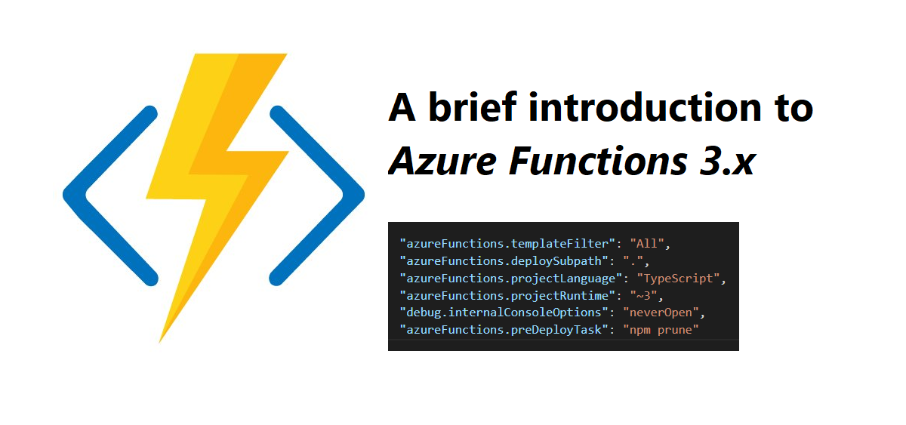
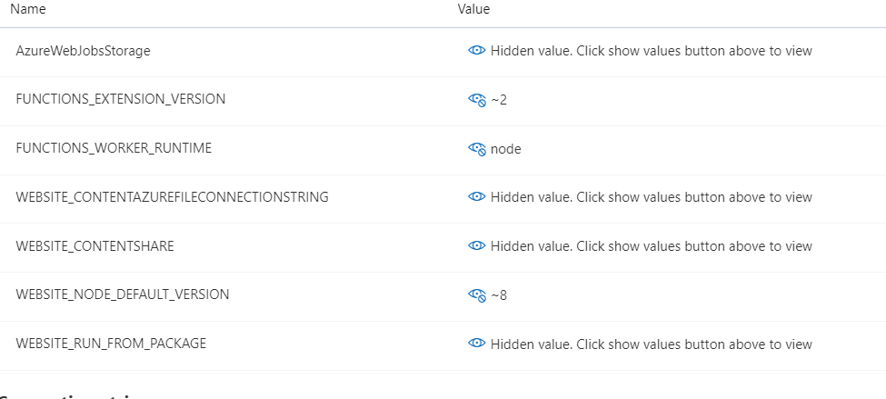
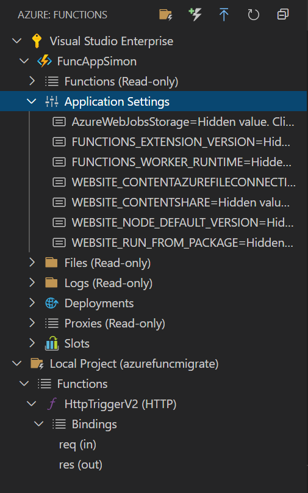

In this post, I will talk about Azure Functions 3.0 that has become generally available (GA) and was announced almost a month ago [here](https://azure.microsoft.com/en-us/updates/azure-functions-runtime-30-is-now-available/). This is a nice update, allowing for newer function runtime and also some performance improvements. The new capabilities in the release include support for `Node 12` and `.Net Core 3.2`. 

If you are familiar with me, you know I will focus on `Node.js` and TypeScript today.

# Speaking of versions
As you can see in the table below, the runtime you use gives you different options regarding which versions of the available platform. So if we have a Node.js `Function App` running `Node 6`, we cannot just upgrade to a `2.x` or `3.x`, since that Node version is not supported.

| Language   | 1.x      | 2.X           | 3.x           |
|------------|----------|---------------|---------------|
| JavaScript | Node 6   | Node 8 & 10   | Node 10 & 12  |
| C#         | .Net 4.7 | .Net Core 2.2 | .Net Core 3.2 |
| PowerShell | N/A      | PS Core 6     | PS Core 6     |
| TypeScript | N/A      | GA            | GA            |

And just to clarify, TypeScript transpiles to JavaScript, so TypeScript versions have the same options regarding Node versions as JavaScript does.

[Table source](https://docs.microsoft.com/sv-se/azure/azure-functions/functions-versions#languages)

# Backward compatibility

Microsoft claims that previous versions of Azure Functions should be able to run in the version 3.x runtime without changing the code. They claim the latest release to be very backward compatible.

> Users running on earlier versions of Azure Functions will continue to be supported and we’re not deprecating either 1.0 or 2.0 at this time. Customers running Azure Functions targeting 1.0 or 2.0 will also continue to receive security updates and patches moving forward—to both the Azure Functions runtime and the underlying .NET runtime—for apps running in Azure. 


# Possibility to move between versions
The default version for creating Function Apps via `Azure CLI` or the `Azure Portal` is the `3.x` version. If you look at this picture from the `Function app settings` you can see that `1.x is grayed out`, but both 2.x and 3.x is available.


We can ONLY move to 1.x version if we have a `Function app` with no `functions` created. Moving between `2.x` and `3.x` is possible even with `Function apps` that already have functions.

# Seeing current runtime and versions

## Azure Portal
From the Azure portal, you could move into your Function App and then `Configuration` where you get to see your application settings. And if you click on the value for `FUNCTION_EXTENSION_VERSION` and `WEBSITE_NODE_DEFAULT_VERSION` you will be able to see the current versions. 



## Azure CLI
From the Azure CLI, we could run the following commands

### All Application Settings
Here we use the `az functionapp config appsettings list` and then we give the `name` and the `resource-group` of the function app. And this lists all the application settings.

```json
az functionapp config appsettings list -n funcappsimon -g rgfuncappsimon
```

### Get runtime version
To get the runtime version, we make a `--query` and get the `value` of `FUNCTIONS_EXTENSION_VERSION` and then pipe the value from the result array.  

```json
az functionapp config appsettings list --query "[?name=='FUNCTIONS_EXTENSION_VERSION'].value | [0]" -n funcappsimon -g rgfuncappsimon
```

### Get node.js version
To get the Node.js version, we make a `--query` and get the `value` of `WEBSITE_NODE_DEFAULT_VERSION` and then pipe the value from the result array.

```json
az functionapp config appsettings list --query "[?name=='WEBSITE_NODE_DEFAULT_VERSION'].value | [0]" -n funcappsimon -g rgfuncappsimon
```

## Azure Functions VS Code Extension

I love this extension, you could do so much. We could see application settings from here.



# Next steps
I'm planning another post showing a couple of ways to migrate from 2.x to 3.x. 