In the <a href="https://simonagren.github.io/azurebot-nodejs-part1" target="_blank">previous post</a>, we built the Bot, tested it locally in the emulator, created all resources in Azure and also deployed the Bot to the web service in Azure using ARM templates and Key Vault (<a href="https://simonagren.github.io/azurebot-armtemplate-keyvault" target="_blank">separate post</a>).

In this second post, we will continue with the Bot and run it from within **Microsoft Teams**. From localhost with the help of **ngrok** and, from the **Azure deployment**. 

Just for fun, we will add an **@mention** in the **echo** when the Bot is in Microsoft Teams.

| Bot Framework in Node.js                                                                  | Complimentary post                                                                                                          |
|-------------------------------------------------------------------------------------------|-----------------------------------------------------------------------------------------------------------------------------|
| <a href="https://simonagren.github.io/azurebot-nodejs-part1" target="_blank">Let's begin (Part 1)</a>     | <a href="https://simonagren.github.io/azurebot-armtemplate-keyvault" target="_blank">Bot Framework 4 ARM template Deploy with Key Vault</a> |
| Microsoft Teams (Part 2) |                                                                                                                             |
| <a href="https://simonagren.github.io/azurebot-nodejs-part3" target="_blank">Dialogs (Part 3)</a>         |                                                                                                                             |
| <a href="https://simonagren.github.io/azurebot-nodejs-part4" target="_blank">Interruptions (Part 4)</a> |                                                                                                                             |

# Sourcecode
Here is the finalized source code. [https://github.com/simonagren/simon-blog-bot-v2](https://github.com/simonagren/simon-blog-bot-v2)

# Prerequisites 
- [Bot Emulator](https://aka.ms/Emulator-wiki-getting-started)
- [Node.js 10.4+](https://nodejs.org/en/download/)
- [Visual Studio Code](https://code.visualstudio.com/)
- [An Azure Account](https://azure.microsoft.com/free/)
- [Office 365 dev tenant](https://developer.microsoft.com/office/dev-program) - for Microsoft Teams
- [Ngrok](https://ngrok.com/download)
- [App Studio installed in Teams](https://docs.microsoft.com/en-us/microsoftteams/platform/concepts/build-and-test/app-studio-overview#installing-app-studio)

# Infrastructure
Last time we created a resource group in Azure that contains the service plan, the web service that runs the Bot, the Bot channels registrations, and the Key vault.

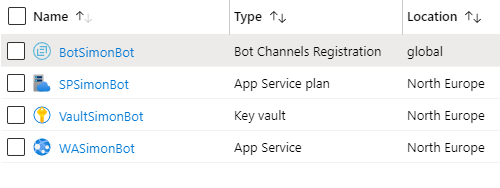

# Code changes
There are possibilities to utilize Microsoft Teams context to receive information about the specific Team or channel where the Bot is installed. You could also get information about the user(s) in a chat. 

- You import **TeamsInfo** from the **botbuilder** package.
- We will not use the Teams context in this Bot, you have
[more info here](https://docs.microsoft.com/en-us/microsoftteams/platform/bots/how-to/get-teams-context?tabs=typescript)

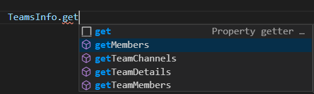


## bot.ts
We will add a few imports, and change the **onMessage** method to call the **_messageWithMention** method, that adds a **@mention** if we are in Microsoft Teams.

### Imports
```typescript
import { Activity, ActivityHandler, ActivityTypes, Mention, TurnContext} from 'botbuilder';
```

### onMessage
In the previous post, we only sent the and echo of what the user wrote. Now we add an if-statement to see if we are in Microsoft Teams or not, and if we are, we call the function to do a **@mention** and pass in the **context**(TurnContext).

```typescript
this.onMessage(async (context, next) => {
    // If we are in Microsoft Teams
    if (context.activity.channelId === 'msteams') {
        
        // Send a message with an @Mention
        await this._messageWithMention(context);
    } else {
        
        // Otherwise we send a normal echo
        await context.sendActivity(`You said '${ context.activity.text }'`);
    }
    // By calling next() you ensure that the next BotHandler is run.
    await next();
});
```

### _messageWithMention
We receive the context (**TurnContext**) from the **onMessage** method calling this method.

We first build a **Mention** object, which is an [Entity](https://docs.microsoft.com/en-us/azure/bot-service/bot-service-activities-entities?view=azure-bot-service-4.0&tabs=js#mention-entities). A mention object consists of three properties:
- ***mentioned***: takes a **ChannelAccount**. We utilize the user that sent the message **context.activity.from**
- ***text***: takes a string. Here we add **\<at\>**  to make the **@** and add the users name **context.activity.from.name**
- ***type***: takes a string. Here we set the type to **'mention'**

Then we build a **Partial\<Activity\>** object. There are plenty of properties, and we will only use a few:
- ***entities***: This is an array of `Entity`, and here we add the `Mention` object we created.
- ***text***: takes a string. We use the `mention.text` with what the user wrote `context.activity.text`
- ***type***: takes a string. We use `ActivityTypes.Message` to get the correct value.

This is how the method looks like:
```typescript
private async _messageWithMention(context: TurnContext): Promise<void> {
    // Create mention object
    const mention: Mention = {
        mentioned: context.activity.from,
        text: `<at>${context.activity.from.name}</at>`,
        type: 'mention'
    };

    // Construct message to send
    const message: Partial<Activity> = {
        entities: [mention],
        text: `${mention.text} You said '${ context.activity.text }'`,
        type: ActivityTypes.Message
    };

    // Send the message with @mention
    await context.sendActivity(message);
}
```

# Run the Bot in Microsoft Teams from localhost
Okay, cool. Now we need to try this code change in the wild.

We will run the Bot locally and it will access the Channel Registration in Azure. 

We created an Azure AD Application registration last time we deployed the resources, and the channel registration is using that **clientId** and **secret**. We will use this going forward as well. 

First, we need to change the variables in the **.env** file and use the **clientId** and **secret**.

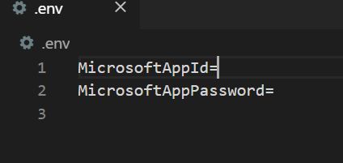

The Bot that is deployed and running in the Azure **Web Service** also has these as environment variables in the **application settings**. 

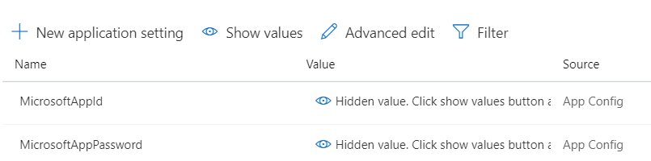


## Spin up Ngrok
When using a Bot in Microsoft Teams we can't use **HTTP** anymore, we need to utilize **HTTPS**. And for that, we are going to use the tunneling service **ngrok**.

This means we can have the Bot running on **http://localhost:3978** as normal.

Spin up **ngrok** and then copy the **https** value.

```json
ngrok http 3978 --host-header=localhost
```

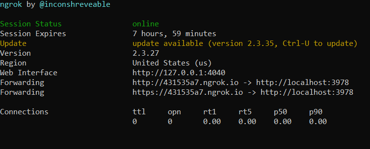

## Change Messaging Endpoint in the Bot Registration
Open the Azure Portal, go to your resource group and then the **Bot Channels Registration** we created. Change the **Messaging endpoint** value from pointing to the Azure Web Service, to the value we copied from **ngrok**. And don't forget **/api/messages**

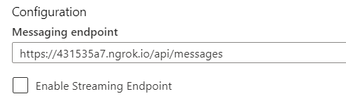

## Activate Teams Channel
In the channels tab press on the Teams logo to configure the Teams channel registration.

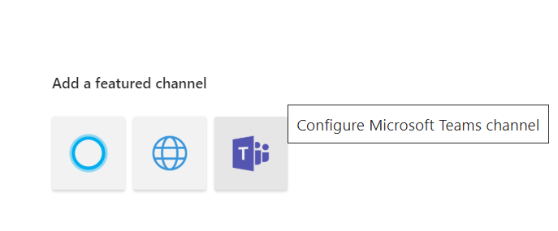

## Start the Bot 
You can now start the bot locally with
```json
npm start
```

## Sideload to Teams
If you press the Teams icon from channels it will open the Bot inside of Microsoft Teams.

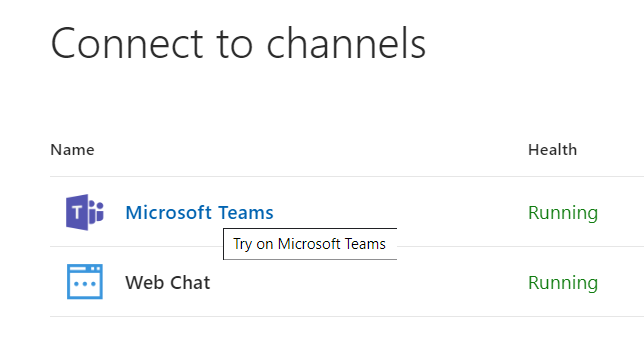

## Test that it works in Teams as it should
Now it should be working fine within the context of Teams. The Bot is running locally and sending messages via the Bot Registration in Azure.

- And if we write something we should get a notification

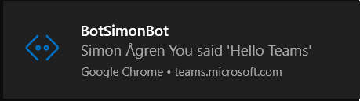

- We should also see this in Microsoft Teams

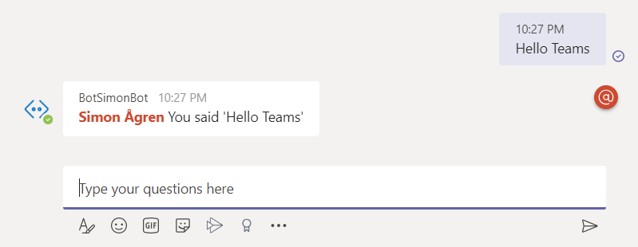

- And if we start up the **emulator** again and connect to localhost using the **appId** and **secret** (remember the .env file?) we could see that, as expected, it's only in Teams that we get then mention.

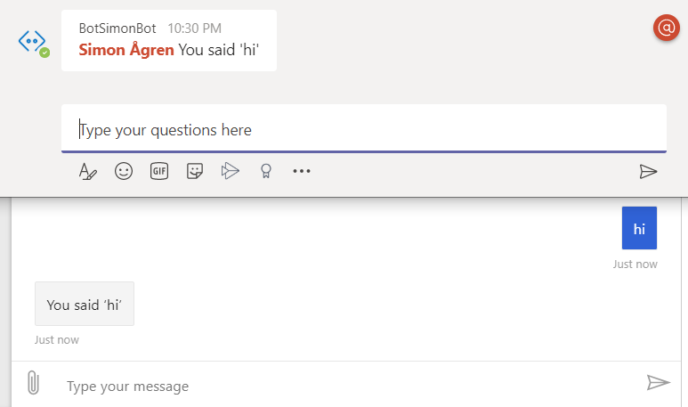


# Let's install the Bot in Microsoft Teams
Oh, this post is getting long...

You need to know how to install the Bot in Teams as well! 

We will use **App Studio** but you could also create the manifest manually. [Read more here](https://docs.microsoft.com/en-us/microsoftteams/platform/bots/how-to/create-a-bot-for-teams#create-it-manually). If you haven't already installed App Studio, look at the prerequisites and there's a link.

This is a generic Microsoft Teams App that we are creating, and then we add a Bot to the application, so the process would be similar if we were adding a Tab.

- Start by opening  App Studio and go into the **Manifest editor**.
- From there press **Create a new app**

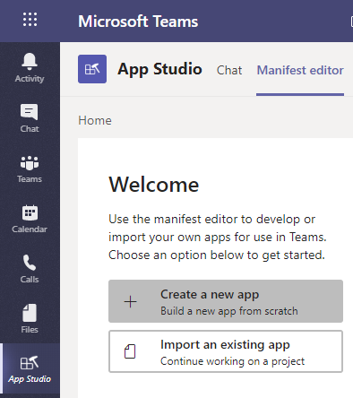

- Fill in all the details and generate an **App ID**.

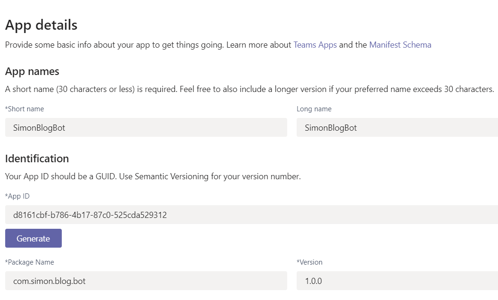

- Select the Bot tab. From there press **Set up** and select **Existing bot**. Then pick our Bot from the existing Bots. And we will use **personal** scope.

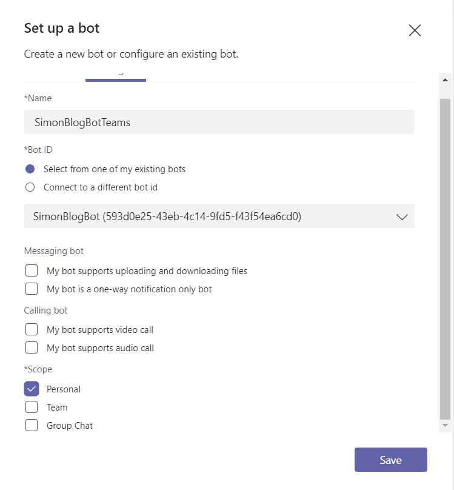

- As you can see the **Message endpoint** still points to the **ngrok** URL we changed in Azure. 

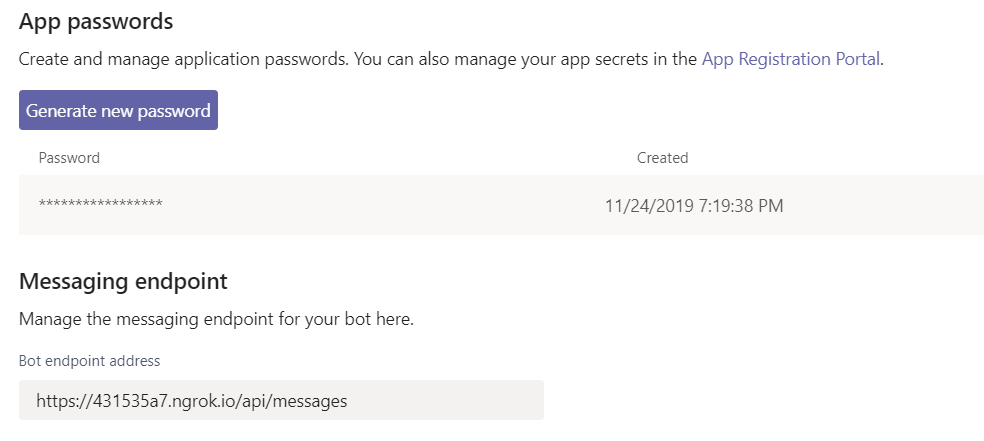

- We can now go down to the **Test and distribute** tab and press **install**
The Bot should work now, congrats!

## Running the Bot from Azure

Now we will change the message endpoint to point to Azure again and skip ngrok. Feel free to shut down the local running Bot and ngrok.

Go back to the Azure Portal, go to your resource group and then the **Bot Channels Registration** we created. Change the **Messaging endpoint** value to the Azure Web Service URL and save.

This will automatically change the message endpoint in the Teams App.

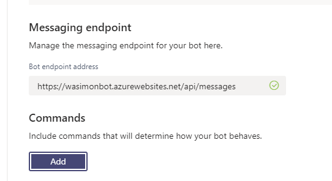

# Final words
Remember that we haven't re-deployed the Bot to Azure. The updated version is running locally. Don't stress is, we will primarily work from localhost, going forward.

Have a look at the previous post regarding how to .zip deploy the Bot again, if you want.

In the next post, we will look at dialogs, prompts, and validation.