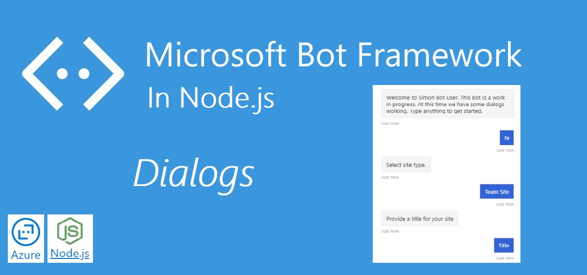
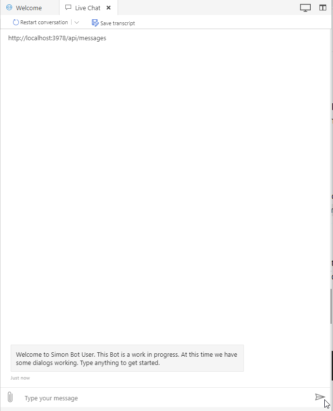
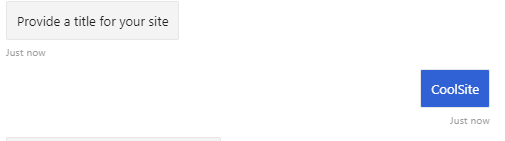
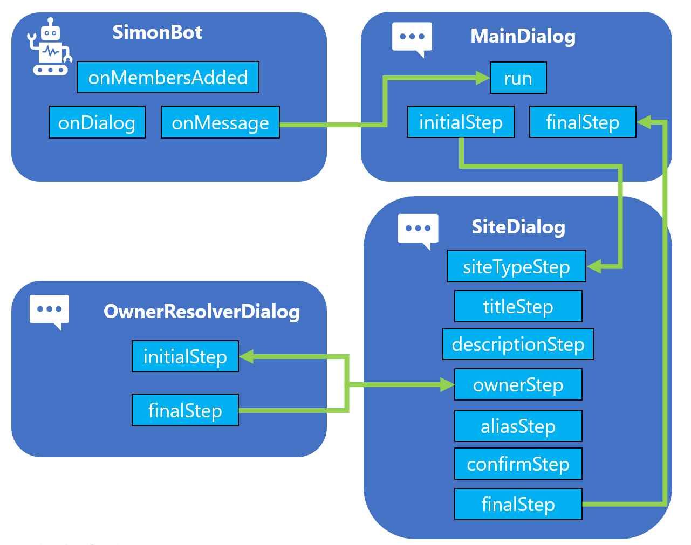
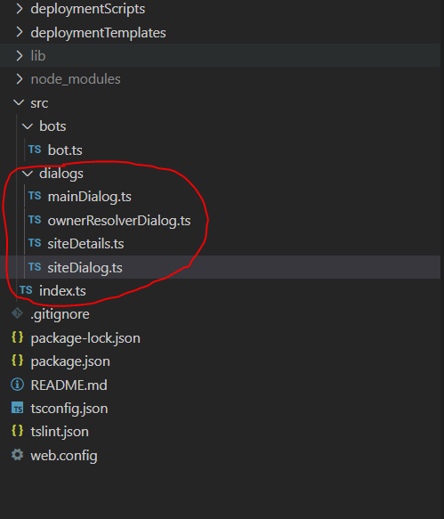

In the previous post, we tried the Bot in Microsoft Teams using **ngrok**, and we also added a **@mention**. 

This post will be a bit code-heavy. A lot needed to be explained and a lot going on behind the scenes. Hopefully, this put things a bit into context. 

Dialogs are powerful in Bot Framework 4, and we could utilize them in very structured ways, and complicated branched conditional situations. 

I will try to stick to the basics, but at the same time prepare the Bot for upcoming posts.

| Bot Framework in Node.js                                                                  | Complimentary post                                                                                                          |
|-------------------------------------------------------------------------------------------|-----------------------------------------------------------------------------------------------------------------------------|
| <a href="https://simonagren.github.io/azurebot-nodejs-part1" target="_blank">Let's begin (Part 1)</a>     | <a href="https://simonagren.github.io/azurebot-armtemplate-keyvault" target="_blank">Bot Framework 4 ARM template Deploy with Key Vault</a> |
| <a href="https://simonagren.github.io/azurebot-nodejs-part2" target="_blank">Microsoft Teams (Part 2)</a> |                                                                                                                             |
| Dialogs (Part 3)         |                                                                                                                             |
| <a href="https://simonagren.github.io/azurebot-nodejs-part4" target="_blank">Interruptions (Part 4)</a> |                                                                                                                             |
| <a href="https://simonagren.github.io/azurebot-nodejs-part5" target="_blank">Auth and Microsoft Graph (Part 5)</a> |<a href="https://simonagren.github.io/azcli-adscope" target="_blank">Azure CLI Azure AD registration with permission scopes</a>                                                                                                                             |
|  |<a href="https://simonagren.github.io/azcli-connection" target="_blank">Azure CLI OAuth Connection to Azure AD V2</a>                                                                                                                             |


## What we will build today




# Sourcecode
Here is the link to the Github repository for this post: [https://github.com/simonagren/simon-blog-bot-v3](https://github.com/simonagren/simon-blog-bot-v3)

# Prerequisites 
- [Bot Emulator](https://aka.ms/Emulator-wiki-getting-started)
- [Node.js 10.4+](https://nodejs.org/en/download/)
- [Visual Studio Code](https://code.visualstudio.com/)
- [An Azure Account](https://azure.microsoft.com/free/)
- [Office 365 dev tenant](https://developer.microsoft.com/office/dev-program) - for Microsoft Teams
- [Ngrok](https://ngrok.com/download)
- [App Studio installed in Teams](https://docs.microsoft.com/en-us/microsoftteams/platform/concepts/build-and-test/app-studio-overview#installing-app-studio)


# Dialogs in Bot Framework 4
We have a few different dialogs: `prompts`, `waterfall dialogs` and `component dialogs` 

## Prompts
Prompts are used to ask the user for input and wait until the user enters input. If the value is valid the prompt returns the value, otherwise it will re-prompt the user.
We have to ability to define our custom validators for each prompt, and we could could also create our own custom prompts.

There are different prompts available, and among those:
- **Choice Prompt**: Asks for a choice from a set of options
- **Text prompt**: Asks for general text input
- **Confirm prompt**: Asks for a confirmation.
- **Number prompt**:	Asks for a number.
- **OAuth Prompt**: Asks the user to sign in using the Bot Frameworks Single Sign On (SSO) service

## Waterfall dialogs
A waterfall dialog is composed of a sequence of steps. Each step of the conversation is implemented as an asynchronous function that takes a waterfall step context parameter.
Usually, in each step, we prompt the user for input(for instance a question), which then the user can respond to. 



The input from the user will be passed to the next step. 

Another option is to begin a child dialog from a step, and this could be as simple or complex as we want to build the branching.

You could read some more [here](https://docs.microsoft.com/en-us/azure/bot-service/bot-builder-dialog-manage-complex-conversation-flow?view=azure-bot-service-4.0&tabs=javascript) regarding complex conversation flows.

## Component dialogs
The component dialog makes it easy to create **reusable dialogs** for specific scenarios, and sometimes it makes sense to break up the Bots' logic into smaller pieces. A **component** could be added as a **dialog** to another **ComponentDialog** or **DialogSet** - we will use both of these scenarios in the Bot. 

We can have **Waterfall dialogs** and **prompts** in each component and it will have its' own "dialog flow". The dialogs could be imported and run as the main dialog or started as child dialogs.

In our case we will have three components deriving from `ComponentDialog`:
- The main component that we run from the Bot
  ```typescript
  export class MainDialog extends ComponentDialog {
  ``` 
- The site dialog that we will import to and run from `MainDialog` 
  ```typescript
  export class SiteDialog extends ComponentDialog {
  ``` 
- And the owner resolver dialog that will be used for displaying an own dialog for validation
  ```typescript
  export class OwnerResolverDialog extends ComponentDialog {
  ``` 

# Project changes

This is a high-level visualization of how the Bot is built:



## Files we added
In the **src** folder, we create an additional folder named **dialogs**. It will contain 4 new files:

- **mainDialog.ts**: The main dialog will now at first just kick off the **siteDialog** and then collect the results. In upcoming posts, we will add some additional steps.
- **siteDetails.ts**: the class that defines all the properties we use and need.
- **siteDialog.ts**:  Will contain the conversational flow between the user and the Bot, where the user "orders" a site.
- **ownerResolverDialog**: an example where we create a new dialog to validate user input.      



## bot.ts
We have also done a few changes in the **bot.ts** file

### Imports
We added some more imports from **botbuilder** for handling state in the dialogs, and a few from **botbuilder-dialogs**. We have also imported the **MainDialog** that we will run. 

```typescript
import {
  Activity,
  ActivityHandler,
  ActivityTypes,
  BotState,
  ChannelAccount,
  ConversationState,
  Mention,
  StatePropertyAccessor,
  TurnContext,
  UserState
} from 'botbuilder';
import { Dialog, DialogState } from 'botbuilder-dialogs';
import { MainDialog } from '../dialogs/mainDialog';	
```

And handling state is not in the scope of this post, you can read more [here](https://docs.microsoft.com/en-us/azure/bot-service/bot-builder-concept-state?view=azure-bot-service-4.0)

### Variables and constructor
- Before the constructor, we have added a few private variables.
- The constructor now expects properties **conversationState**, a **userState** and a **dialog**, that we need to supply when creating an instance of the Bot later.
- After making sure that we get these properties, we initialize the private variables with the values we got in. 

```typescript
private conversationState: BotState;
private userState: BotState;
private dialog: Dialog;
private dialogState: StatePropertyAccessor<DialogState>;
/**
  *
  * @param {ConversationState} conversationState
  * @param {UserState} userState
  * @param {Dialog} dialog
  */
constructor(
  conversationState: BotState,
  userState: BotState,
  dialog: Dialog
) {
  super();
  if (!conversationState) {
      throw new Error('[SimonBot]: Missing parameter. conversationState is required');
  }
  if (!userState) {
      throw new Error('[SimonBot]: Missing parameter. userState is required');
  }
  if (!dialog) {
      throw new Error('[SimonBot]: Missing parameter. dialog is required');
  }
  this.conversationState = conversationState as ConversationState;
  this.userState = userState as UserState;
  this.dialog = dialog;
  this.dialogState = this.conversationState.createProperty<DialogState>('DialogState');
  ...
  
  ```

### Method changes
The **onMessage** method will now run the **MainDialog** with the current **context** and **dialogState**. Before it sent back a message to the user **@mention** and echoing what was written to the Bot.

```typescript
this.onMessage(async (context, next) => {

  // Run the Dialog with the new message Activity.
  await (this.dialog as MainDialog).run(context, this.dialogState);

  // By calling next() you ensure that the next BotHandler is run.
  await next();
  });
```

We have added the **onDialog** method to save the state changes.
```typescript
this.onDialog(async (context, next) => {
  // Save any state changes. The load happened during the execution of the Dialog.
  await this.conversationState.saveChanges(context, false);
  await this.userState.saveChanges(context, false);

  // By calling next() you ensure that the next BotHandler is run.
  await next();
});
```
The **onMembersAdded** have instead gotten the **@mention** part (slightly changed).

```typescript
this.onMembersAdded(async (context, next) => {
  const membersAdded = context.activity.membersAdded;
  for (const member of membersAdded) {
    if (member.id !== context.activity.recipient.id) {
      // If we are in Microsoft Teams
      if (context.activity.channelId === 'msteams') {
        // Send a message with an @Mention
        await this._messageWithMention(context, member);
      } else {
        // Otherwise we send a normal echo
        await context.sendActivity(`Welcome to Simon Bot ${member.name}. This Bot is a work in progress. At this time we have some dialogs working. Type anything to get started.`);
      }
    }
  }
```

## Index.ts

### Imports
Here we also used to have a single import from **botbuilder** and now we have a couple more imports from. We have also imported the **MainDialog** that we will use and inject in the Bot class instance. 

```typescript
import { BotFrameworkAdapter, ConversationState, MemoryStorage, UserState } from 'botbuilder';
import { MainDialog } from './dialogs/mainDialog';
import { SimonBot } from './bots/bot';	
```

### Code changes
in **adapter.onTurnError** at the end of the method, we have added some code to delete the **conversationState** on error.
```typescript
await conversationState.delete(context);
```

- First, we set up the required instances of **ConversationState** and **UserState**
- Then, we initialize an instance of the **MainDialog**
- And finally, create a new Bot instance with the required properties.

```typescript
let conversationState: ConversationState;
let userState: UserState;

const memoryStorage = new MemoryStorage();
conversationState = new ConversationState(memoryStorage);
userState = new UserState(memoryStorage);

const dialog = new MainDialog('mainDialog');
const myBot = new SimonBot(conversationState, userState, dialog);
```
## mainDialog.ts
The main dialog consists of two steps **initialStep** and **finalStep**. That will kick off the **siteDialog** and then collect the result.

At first, we add some constants. It's the name of the dialogs we will add.
```typescript
const SITE_DIALOG = 'siteDialog';
const MAIN_WATERFALL_DIALOG = 'waterfallDialog';
```
Then later we use them in the constructor while adding the dialogs we want.

```typescript
constructor(id: string) {
    super(id);

    this.addDialog(new SiteDialog(SITE_DIALOG))
        .addDialog(new WaterfallDialog(MAIN_WATERFALL_DIALOG, [
            this.initialStep.bind(this),
            this.finalStep.bind(this)
        ]));

    this.initialDialogId = MAIN_WATERFALL_DIALOG;
  }
}  
```
First, we add the dialogs we will use, there's the **SiteDialog** and a **WaterFallDialog**. The Waterfall Dialog contains steps, and these have been added in the sequence they are intended to be run. 

### initialStep
This step creates a new instance of the **SiteDetails** class and injects it while starting the **siteDialog** child dialog. We are using the constant `SITE_DIALOG` to make sure there are no spelling errors.
```typescript
private async initialStep(stepContext: WaterfallStepContext): Promise<DialogTurnResult> {
    const siteDetails = new SiteDetails();
    return await stepContext.beginDialog(SITE_DIALOG, siteDetails);
}
```

### finalStep
In this step, we collect the result from the previous step. It's the result of all the **siteDialog** steps. This is where we would typically save something to a "database".
```typescript
private async finalStep(stepContext: WaterfallStepContext): Promise<DialogTurnResult> {
    if (stepContext.result) {
        const result = stepContext.result as SiteDetails;
        const msg = `I have created a ${ JSON.stringify(result) }`;
        await stepContext.context.sendActivity(msg);
    }
    return await stepContext.endDialog();
}
```


## siteDialog.ts
The site dialog consists of multiple **prompts**, the **OwnerResolverDialog** and another **WaterFallDialog**.

This is what the constructor looks like:
```typescript
constructor(id: string) {
    super(id || 'siteDialog');
    this
        .addDialog(new ChoicePrompt(CHOICE_PROMPT))
        .addDialog(new TextPrompt(TEXT_PROMPT))
        .addDialog(new OwnerResolverDialog(OWNER_RESOLVER_DIALOG))
        .addDialog(new ConfirmPrompt(CONFIRM_PROMPT))
        .addDialog(new WaterfallDialog(WATERFALL_DIALOG, [
            this.siteTypeStep.bind(this),
            this.titleStep.bind(this),
            this.descriptionStep.bind(this),
            this.ownerStep.bind(this),
            this.aliasStep.bind(this),
            this.confirmStep.bind(this),
            this.finalStep.bind(this)
        ]));
    this.initialDialogId = WATERFALL_DIALOG;
}   
```

### SiteTypeStep
The first **siteTypeStep** will use a **ChoicePrompt**. 

We will use the **WaterFallStepContext** to populate **siteDetails** with values in every step. 

If we don't have a siteType value in siteDetails, we will prompt the user. In this case, we use the dialog/prompt we added using the **CHOICE_PROMPT**. 

And if we have a value, we will just run **.next(siteDetails.siteType)** and send the value to the next step in the WaterFall Dialog.

```typescript
private async siteTypeStep(stepContext: WaterfallStepContext): Promise<DialogTurnResult> {
  const siteDetails = stepContext.options as SiteDetails;

  if (!siteDetails.siteType) {

      return await stepContext.prompt(CHOICE_PROMPT, {
          choices: ChoiceFactory.toChoices(['Team Site', 'Communication Site']),
          prompt: 'Select site type.'
      });

  } else {
      return await stepContext.next(siteDetails.siteType);
  }
}
```
### TitleStep
The second step `siteTitleStep` will use a `TextPrompt`.

We will first get the **siteType** value from the previous step. 
And as in the previous step, if we don't have the value from the user, we will prompt the user. And if we have a value, we will just run **.next(siteDetails.title)** and send the value to the next step in the WaterFall Dialog.

```typescript
private async titleStep(stepContext: WaterfallStepContext): Promise<DialogTurnResult> {
  const siteDetails = stepContext.options as SiteDetails;

  siteDetails.siteType = stepContext.result;

  if (!siteDetails.title) {

      const promptText = 'Provide a title for your site';
      return await stepContext.prompt(TEXT_PROMPT, { prompt: promptText });
  } else {
      return await stepContext.next(siteDetails.title);
  }
}
```
### OwnerStep
The **ownerStep** will not use any of the prompts we added. It will instead kick off the **OwnerResolverDialog**.

```typescript
private async ownerStep(stepContext: WaterfallStepContext): Promise<DialogTurnResult> {
  const siteDetails = stepContext.options as SiteDetails;

  // Capture the results of the previous step
  siteDetails.description = stepContext.result;

  if (!siteDetails.owner) {
      return await stepContext.beginDialog(OWNER_RESOLVER_DIALOG, { siteDetails });
  } else {
      return await stepContext.next(siteDetails.owner);
  }
}
```

## OwnerResolverDialog
I have created a dialog similar to the **MainDialog** only a bit smaller.

We also add a **prompt** here and a **WaterFallDialog**, but only two steps - an initial and final step.

```typescript
this
  .addDialog(
    new TextPrompt(TEXT_PROMPT, OwnerResolverDialog.ownerPromptValidator.bind(this))
  ).addDialog(
    new WaterfallDialog(WATERFALL_DIALOG, [
      this.initialStep.bind(this),
      this.finalStep.bind(this)
  ]));

this.initialDialogId = WATERFALL_DIALOG;
}
```
Here we supply a validation method to the text prompt. Sometimes we need multiple validation methods, we will add some extra validation here in another post using **Microsoft Graph** to see that the user exists.

```typescript
private static async ownerPromptValidator(promptContext: PromptValidatorContext<string>): Promise<boolean> {
  if (promptContext.recognized.succeeded) {
    const owner: string = promptContext.recognized.value;
    // Regex for email
    if (!OwnerResolverDialog.validateEmail(owner)) {
      promptContext.context.sendActivity('Malformatted email adress.');
      return false;
    } else {
      return true;
    }

  } else {
    return false;
  }
}
```
This is how the steps look like, they should be familiar. Note that we don't use a **repromtMessage** since we handle the message to the user in the validator method.
```typescript
private async initialStep(stepContext: WaterfallStepContext): Promise<DialogTurnResult> {
  const siteDetails = (stepContext.options as any).siteDetails;

  const promptMsg = 'Provide an owner email';

  if (!siteDetails.owner) {
    return await stepContext.prompt(TEXT_PROMPT, {
      prompt: promptMsg
    });
  } else {
    return await stepContext.next(siteDetails.owner);
  }
}

private async finalStep(stepContext: WaterfallStepContext): Promise<DialogTurnResult> {
  const owner = stepContext.result;
  return await stepContext.endDialog(owner);
}
```

# Next step
The next post will be a short one focusing on how to handle user interruptions. If the user asks for help or restarts the Bot.