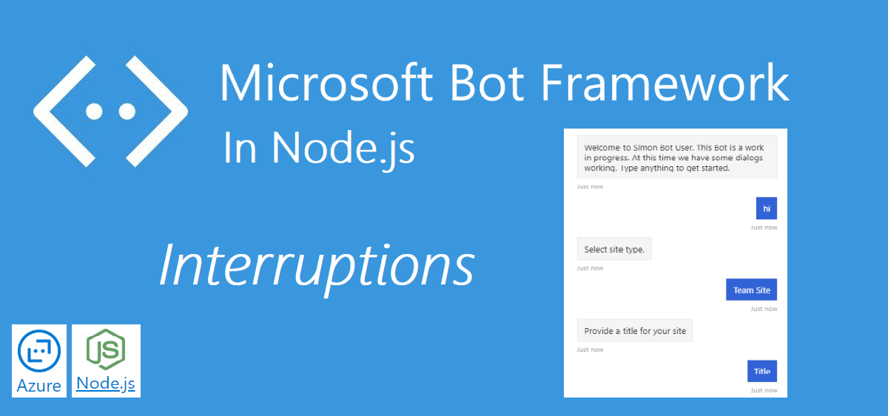
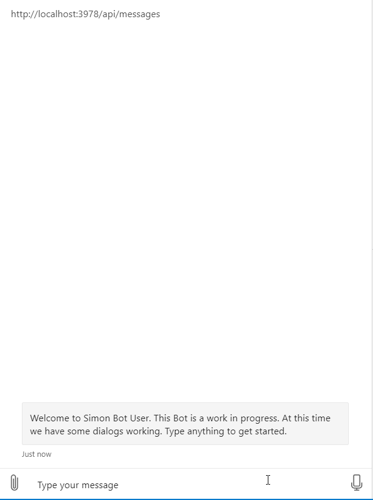
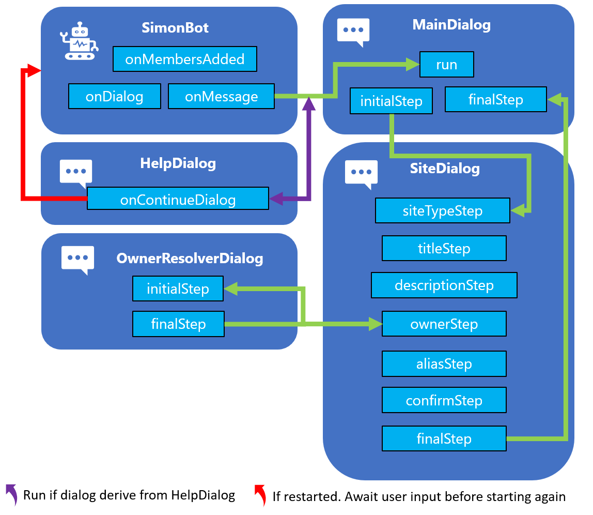

The last post was long. It was a lot of explaining regarding the code, and hopefully, that put things a bit into context. 

This post will be shorter and focus on how to handle user interruptions. Currently, the only option in the Bot is to follow the conversation step by step, there is no way to get help and restart the Bot.

| Bot Framework in Node.js                                                                  | Complimentary post                                                                                                          |
|-------------------------------------------------------------------------------------------|-----------------------------------------------------------------------------------------------------------------------------|
| <a href="https://simonagren.github.io/azurebot-nodejs-part1" target="_blank">Let's begin (Part 1)</a>     | <a href="https://simonagren.github.io/azurebot-armtemplate-keyvault" target="_blank">Bot Framework 4 ARM template Deploy with Key Vault</a> |
| <a href="https://simonagren.github.io/azurebot-nodejs-part2" target="_blank">Microsoft Teams (Part 2)</a> |                                                                                                                             |
| <a href="https://simonagren.github.io/azurebot-nodejs-part3" target="_blank">Dialogs (Part 3)</a>         |                                                                                                                             |
| Interruptions (Part 4) |                                                                                                                             |
| <a href="https://simonagren.github.io/azurebot-nodejs-part5" target="_blank">Auth and Microsoft Graph (Part 5)</a> |<a href="https://simonagren.github.io/azcli-adscope" target="_blank">Azure CLI Azure AD registration with permission scopes</a>                                                                                                                             |
|  |<a href="https://simonagren.github.io/azcli-connection" target="_blank">Azure CLI OAuth Connection to Azure AD V2</a>                                                                                                                             |


## What we will build today



# Sourcecode
Here is the link to the Github repository for this post: [https://github.com/simonagren/simon-blog-bot-v4](https://github.com/simonagren/simon-blog-bot-v4)

# Prerequisites 
- [Bot Emulator](https://aka.ms/Emulator-wiki-getting-started)
- [Node.js 10.4+](https://nodejs.org/en/download/)
- [Visual Studio Code](https://code.visualstudio.com/)
- [An Azure Account](https://azure.microsoft.com/free/)
- [Office 365 dev tenant](https://developer.microsoft.com/office/dev-program) - for Microsoft Teams
- [Ngrok](https://ngrok.com/download)
- [App Studio installed in Teams](https://docs.microsoft.com/en-us/microsoftteams/platform/concepts/build-and-test/app-studio-overview#installing-app-studio)

# Project changes

This is a high-level visualization of how the Bot is built:



We will incorporate another component dialog to handle the user asking for help or wanting to restart the conversational flow. In the upcoming post, we will also add some log out-logic to this dialog.

This dialog will inherit from **componentDialog**
```typescript
export class HelperDialog extends ComponentDialog {
```

We want to check every time the user writes something if there is a help or cancel command. We change **siteDialog** and **ownerResolverDialog** to inherit from **HelperDialog** in order to enable this:

```typescript
export class SiteDialog extends HelperDialog {
```

```typescript
export class OwnerResolverDialog extends HelperDialog {
```

## HelperDialog
Every time a dialog that derives from this component dialog is run, we will check for user interruption.
We have added **onContinueDialog** that is a overridden method from **ComponentDialog**.

### interruption
A method has been added to check if the user has written anything that corresponds to the helper dialog actions. If the user is asking for **?** or **help** we send a message back with information, and then the **DialogTurnStatus.waiting** makes sure we wait for user input before continuing

On the other hand, if the user writes **cancel**, **quit** or **restart** we will cancel all the dialogs with **cancelAllDialogs()**

```typescript
private async interruption(dc: DialogContext): Promise<DialogTurnResult|undefined> {
    if (dc.context.activity.text) {
        const text = dc.context.activity.text.toLowerCase();

        switch (text) {
            case 'help':
            case '?':
                const helpMessageText = 'Answer the questions asked. If you want to restart use: cancel, quit or restart';
                await dc.context.sendActivity(helpMessageText, helpMessageText, InputHints.ExpectingInput);
                return { status: DialogTurnStatus.waiting };
            case 'cancel':
            case 'quit':
            case 'restart':
                const cancelMessageText = 'Restarting...';
                await dcc.context.sendActivity(cancelMessageText, cancelMessageText, InputHints.IgnoringInput);
                return await dc.cancelAllDialogs();
        }
    }
}
```
### onContinueDialog
We will call the **interruption** method every time we receive a message from the user. If the user has written something that's not equal to any of the commands in the HelperDialog, we will just continue as normal.

```typescript
public async onContinueDialog(dc: DialogContext): Promise<DialogTurnResult> {
    const result = await this.interruption(dc);
    if (result) {
        return result;
    }
    return await super.onContinueDialog(dc);
}
```

# Main Dialog
As explained earlier, the main dialog consists of two steps **initialStep** and **finalStep**. The initial step will kick off the **siteDialog** and then the final step will collect the result.

If the user restarts the dialog the **stepContext.result** will return null in the **finalStep**. We will not collect any values from the **siteDialog** and for now, just end the dialog. The user must write something again to start it again.

You can see it beneath:

```typescript
private async finalStep(stepContext: WaterfallStepContext): Promise<DialogTurnResult> {
    if (stepContext.result) {
        const result = stepContext.result as SiteDetails;
        const msg = `I have created a ${ JSON.stringify(result) }`;
        await stepContext.context.sendActivity(msg);
    }
    return await stepContext.endDialog();
}
```
# Next step
In the next post, we will look at how to secure the Bot and give the user the ability to log in and then call Microsoft Graph, utilizing the Azure Bot service built-in authentication abilities.