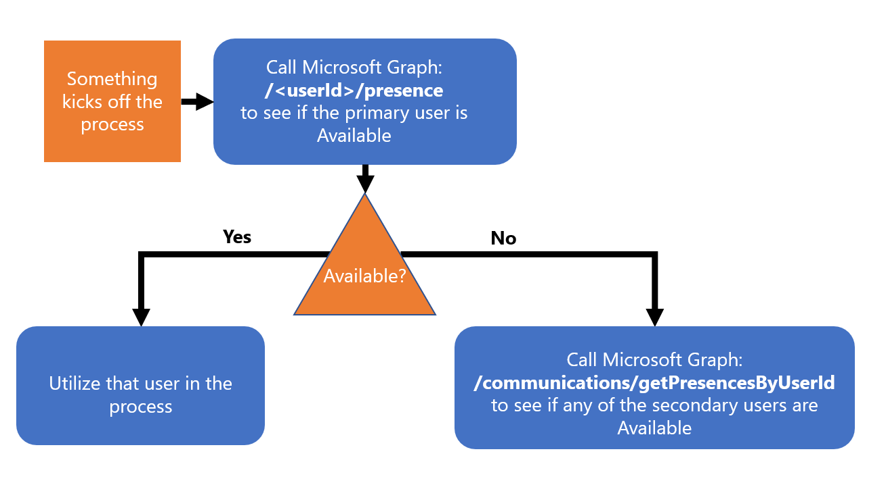
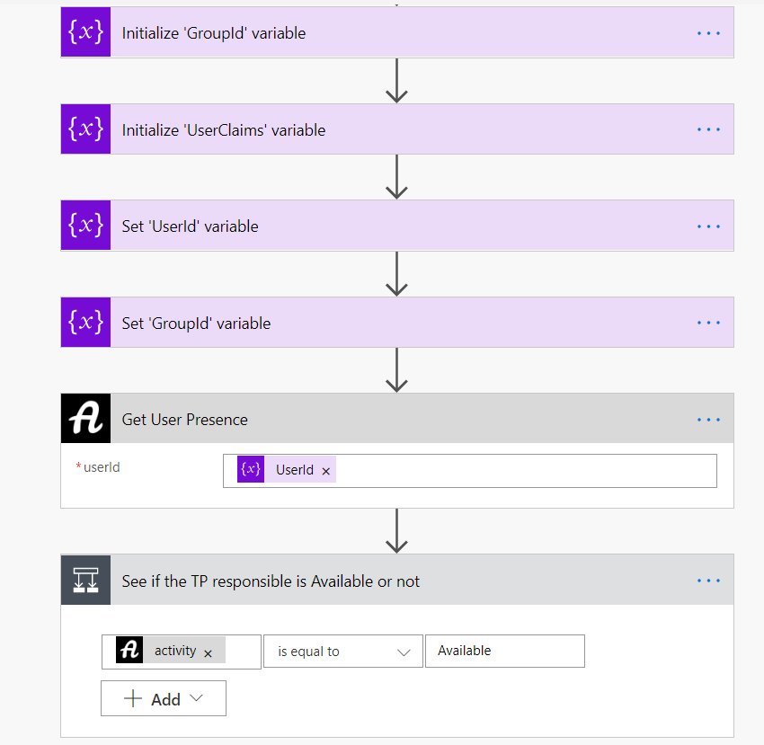
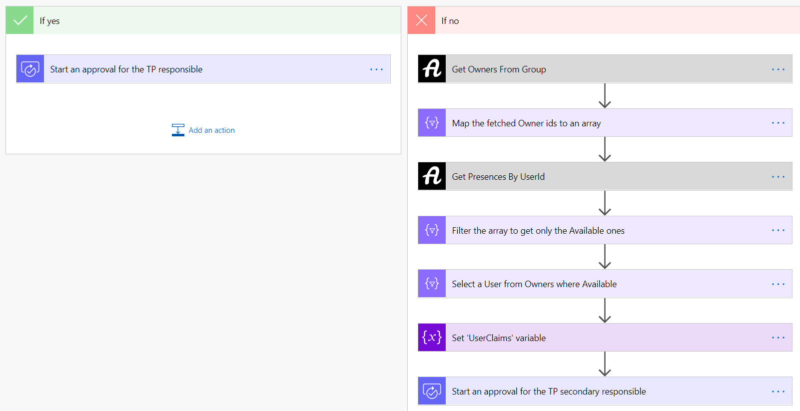
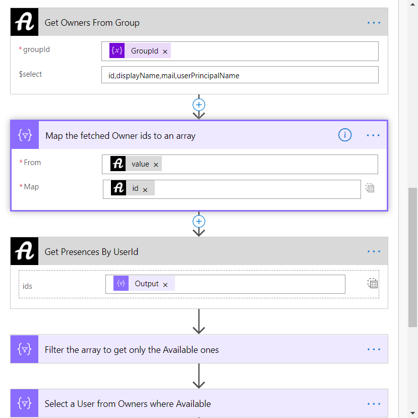
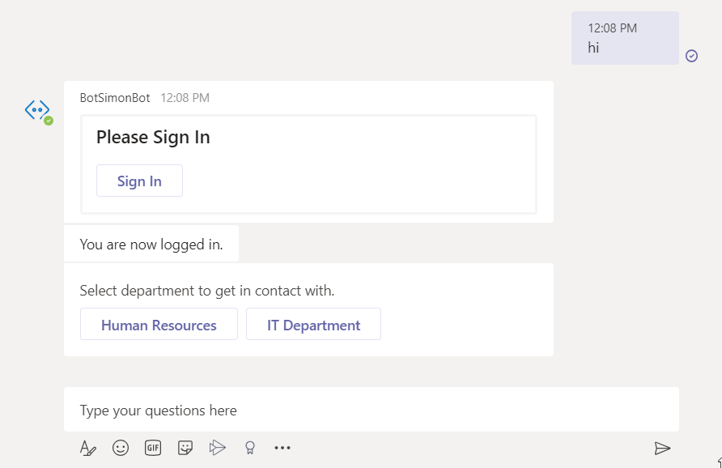
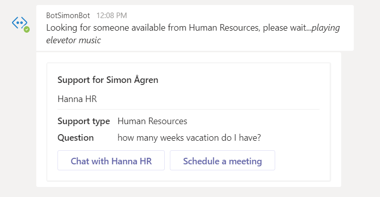

The new presence API in Microsoft Graph is very popular. We've seen a lot of blog post where people create their own "Busy lights", that displays a different color based on your presence, in many creative ways.

I this post I will show you some other "top of mind" use cases, that you could build upon and make it work in more business scenarios.


# The different presence APIs
First off all, you need to realize that these APIs are currently under `/beta`. It's not recommended to use beta APIs in production scenarios. 

There, disclaimer done. Let's have fun...

## Get presence 

You can read more here: <a href="https://docs.microsoft.com/en-us/graph/api/presence-get?view=graph-rest-beta&tabs=http" target="_blank">documentation</a> to learn about the APIs, the permissions they require etc.

We use these to get the presence of a single user, either you or someone else in your tenant. And we use it like this:
```typescript
https://graph.microsoft.com/beta/me/presence

or

https://graph.microsoft.com/beta/me/presence
```

## Get presence for multiple users

You can read more here: <a href="https://docs.microsoft.com/en-us/graph/api/cloudcommunications-getpresencesbyuserid?view=graph-rest-beta&tabs=http" target="_blank">documentation</a> to learn about the APIs, the permissions they require etc.

We use these to get the presences of multiple user, by supplying the ids of multiple users in the request body of our POST operation.

This is an example of a request body:
```typescript
{
	"ids": ["fa8bf3dc-eca7-46b7-bad1-db199b62afc3", "66825e03-7ef5-42da-9069-724602c31f6b"]
}
```

That we use with this:

```typescript
https://graph.microsoft.com/beta/communications/getPresencesByUserId
```
# Scenario 1: Redirection in a process
Let’s say we have a process that involves a very time-critical task at hand. It is very important that we get hold of someone that is available.

For instance we could have a primary contact/document owner and secondary contacts/document owners. 

If you look at the following image, we first: 
- Check to see if the `primary user` is `Available` via the `Get presence` API.
- If available, we continue the process with that user
- Otherwise we take the ids of the `secondary users` and check their availability via the `Get presence for multiple users` API.
- And then we continue with one of the available ones.



Simple enough. Let's visualize this... 

## Example: Toilet Paper request
In this fictional scenario we have run out of toilet paper (too soon?) and we need to make sure that the `primary TP responsible` (the father in the family) buys some more, from whatever source may be these days.

We also have an `Office 365 Group` (family), where the `Owners` are `secondary TP responsible`.

I quickly created a custom connector with delegated permission to Microsoft Graph, just to make it a little more readable. This post is not about how to create the Power Automate Flow itself.



First I set up a few variables and then use the `Get User Presence` action from my custom connector along with the `UserId` of the `primary TP responsible`.

Then we check to see if that user is Available.



If the user is available we, in this case, start an approval with the instruction to get more toilet paper.

If the user isn't available we use the `Get Owners from groups` action along with the `GroupId` of the `secondary TP responsible`.

A good practice to remember when querying REST APIs is to only select the properties you need, which you could see in the `$select`.




I then map only the ids, of the fetched `Owners` from the group, to an array. And the use that array as input in the `Get Presences By UserId` actions.

I then filter the result to get the Available ones, select one of them and get that specific user.

And then creates the approval with an available user.

# Scenario 2: Directly route to someone available
In this case we also have a time-critical question that needs to be answered. It could be important to get a hold of someone that's currently available.

In this scenario we might know where to look for that user, in a specific Office 365 group, or based on department, skills etc.

## Example: Microsoft Teams Bot



In this fictional scenario we have a simple Bot in Microsoft Teams. The user needs help with a question, selects which department and asks the question. 

Behind the scenes the Bot calls Microsoft Graph to first get the people from the `Office 365 Group`.

```typescript
public async getGroupOwners(groupId: string): Promise<User[]> {
    if (!groupId || !groupId.trim()) {
        throw new Error('SimpleGraphClient.getGroupOwnerPresence(): Invalid `groupId` parameter received.');
    }
    try {
        // Get userIds
        const users = await this.graphClient.api(`/groups/${groupId}/owners`)
        .select(['mail', 'userPrincipalName', 'id', 'displayName']).get(); 
        return users.value;
    } catch (error) {
        return Promise.reject(error);
    }
```

Then checks to see if anyone is `Available` using the `Get presence for multiple users` API.

```typescript
public async getPresencesById(idStr: string[]): Promise<any> {
    if (!idStr) {
        throw new Error('SimpleGraphClient.getPresencesById(): Invalid `ids` parameter received.');
    }
    try {
        const presences = await this.graphClient.api('/communications/getPresencesByUserId').version('beta').post({ ids: idStr }); 
        return presences.value;
    } catch (error) {
        return Promise.reject(error);
    }
}
```

Then the Bot selects one of the available, and returns an Adaptive Card (inspired by Icebreaker Bot), with the possibility to start a chat (with the question) or schedule a meeting (with the topic and meeting body already set). 




# Finishing up

Hopefully you got some ideas from this. Make sure to follow the evolving of these APIs. And please let me know if you have any cool ideas.
