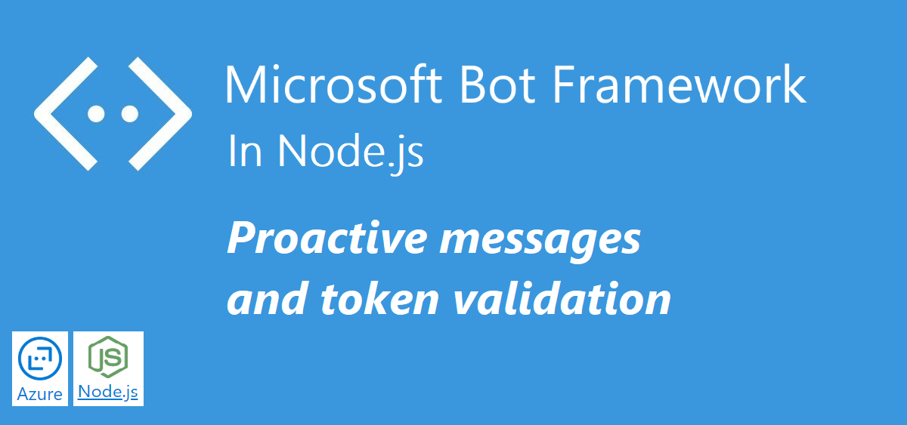

In the last post we got a little fancy using Adaptive cards in the Bot. We talked about workarounds to allow AC usage in `prompts`, how to collect the user input, especially when it comes to `Microsoft Teams`.

In this post we will have a high level look at proactive messages, and also get a little creative with them. We will validate the token, with the purpose of making sure the messages are coming from a trusted source.

# Sourcecode
This is the finished source code: [https://github.com/simonagren/simon-blog-bot-v8](https://github.com/simonagren/simon-blog-bot-v8)

# Prerequisites 
- [Bot Emulator](https://aka.ms/Emulator-wiki-getting-started)
- [Node.js 10.4+](https://nodejs.org/en/download/)
- [Visual Studio Code](https://code.visualstudio.com/)
- [An Azure Account](https://azure.microsoft.com/free/)
- [Office 365 dev tenant](https://developer.microsoft.com/office/dev-program) - for Microsoft Teams
- [Ngrok](https://ngrok.com/download)


# Proactive messages
Proactive messages could look a bit different. They could, as in the `onMembersAdded` give a predefined welcome message. It could be a `notification` from another system. And we could `mention` people, `create new conversations` with people and even `continue conversations`.
We will look at continuing a conversation.

# Example: message all conversations
In the `proactive messages` Bot builder sample, they are saving all the conversations references, and they add a `restify` API endpoint `/api/notify`. When someone does a `GET` request to - http://localhost:3978/api/notify - the Bot sends a predefined message to all the previous conversations.

```typescript
for (const conversationReference of Object.values(conversationReferences)) {
        await adapter.continueConversation(conversationReference, async turnContext => {
            // If you encounter permission-related errors when sending this message, see
            // https://aka.ms/BotTrustServiceUrl
            await turnContext.sendActivity('proactive hello');
        });
    }
```

# Message a specific conversation

Sometimes we want to message a specific user, and continue a specific conversation. To continue a specific conversation we need the Conversation Id. In reality, the Id must be saved to somewhere from the Bot. In this example we "just have it". 

We receive the `referenceId` in the body of a POST, then we get that reference and continue the conversation.  The user then gets a `message`, sent via the Bot.

```typescript
const reference = conversationReferences[req.body.refId];
// Proactively notify the user.
if (reference) {
    await adapter.continueConversation(reference, async (context) => {
        await context.sendActivity(req.body.message);
    });
```                

# Project changes

Just a brief walkthrough and the rest will be explained in the other sections.

## index.ts

### Imports
We import `crypto` and some additional things from `botbuilder`

```typescript
import * as crypto from 'crypto';
...

import { BotFrameworkAdapter, ConversationReference, ConversationState, MemoryStorage, UserState } from 'botbuilder';
```

### Code changes
We add a constant of `conversationReferences` that will hold the conversation reference to the user. This is injected to the Bot.

```typescript
const conversationReferences: Array<Partial<ConversationReference>> = [];
const myBot = new SimonBot(conversationState, userState, dialog, conversationReferences);
```

A new `restify` API endpoint has been added which allows `POST`. We will go over it in details further down.
```typescript
server.post('/api/notify', async (req, res) => {
...

In order to parse the body with restify, this line of code has also been added:
```typescript
server.use(restify.plugins.bodyParser());
```

## bot.ts

### Variables and constructor
A private variable for `conversationReferences`, added a `@param`, and also a check to make sure that we actually receive the references. And just as before we initialize the private variable with what we got via the constructor.

### Methods
We have added a method for adding conversation references, and it looks like this:

```typescript
private addConversationReference(activity: Activity) {
    const conversationReference = TurnContext.getConversationReference(activity);
    this.conversationReferences[conversationReference.conversation.id] = conversationReference;
}
```

The `onMessage` now utilizes that method
```typescript 
this.onMessage(async (context, next) => {
    
    this.addConversationReference(context.activity);

    // If result comes from an Adaptive Card
    if (context.activity.text === undefined && context.activity.value ) {
    context.activity.text = JSON.stringify(context.activity.value);
    }

    // Run the Dialog with the new message Activity.
    await (this.dialog as MainDialog).run(context, this.dialogState);

    // By calling next() you ensure that the next BotHandler is run.
    await next();
});
```

# How to make sure not anyone could just send a message?
The problem is that anyone could post something to that endpoint now, so we need to do something in order to make sure we only receive the messages we want. 

## processActivity
Looking at the normal api/messages we could see that the `adapter` has a method (`processActivity`) that parses and authenticates the incoming request. Inspects the bearer token in the auth header, and compares this with our credentials (appId and secret).

```typescript
server.post('/api/messages', (req, res) => {
    adapter.processActivity(req, res, async (context) => {
        await bot.run(context);
    });
});
```
## continueConversation
This method works similarly as it creates the context, runs through the middleware, and then continues the conversation. There is No token validation included in this method.

## Validating via HMAC
We resort to the HMAC concept that is utilized in Microsoft Teams Outgoing Web hooks.
It revolves around creating a `shared secret` (and rotate this now and then). I will store the secret in `Azure Key Vault` and use it as an environment variable. We generate a HMAC token based on the message we want to send, and the shared secret. Using standard `SHA256` cryptography and `UTF8`.

### PowerShell (our server side example)
Imagine we have an Azure Function in PowerShell. The function is provisioning/administering a SharePoint site, and we receive messages from the Azure Function. 

We use the `secret` environment variables that has been fetched from Azure Key Vault.
We generate the HMAC token from the message we want to send, containing the `refId` and `message`. 

1. Convert message to a byte array in UTF8
```powershell
$message = '{"refId":"adf1b490-3315-11ea-8b32-436f2f76cf33|livechat","message":"Hello!"}'
$msgBuf = [Text.Encoding]::UTF8.GetBytes($message)
``` 
2. Convert secret to byte array in UTF8
```powershell
$secret = $env:hmacsecret
$secretBuf = [Text.Encoding]::UTF8.GetBytes($secret)
```
3. Create HMAC using SHA256 and add the secret byte array as key
```powershell
$hmac = New-Object System.Security.Cryptography.HMACSHA256
$hmac.Key = $bufSecret
```
4. Create the hash and convert to Base64 string
```powershell
$msgHash = 'HMAC ' + [Convert]::ToBase64String($hmac.ComputeHash($msgBuf))
```
5. Invoke a Post to the Bot notify endpoint using the message hash as authorization, and message itself in the body
```powershell
$header = @{
  "Accept"="application/json"
  "Authorization"=$msgHash
  "Content-Type"="application/json"
 }

Invoke-WebRequest -Uri "http://localhost:3978/api/notify" -Method POST -Headers $header -Body $message
```

### In the Bot
We will generate the HMAC token from the request body of the message using Crypto. See the comments in the code. Since we in PowerShell based the hash on the same message we receive and the shared key, the result of the hash we create here should be the same.

```typescript
server.post('/api/notify', async (req, res) => {
    if (req.body.refId && req.body.message) {
        try {
            const authHeader = req.headers.authorization || '';
            // Get message from the request body and convert to a byte array in UTF8
            const messageStr = JSON.stringify(req.body);
            const msgBuf = Buffer.from(messageStr, 'utf8');
            // Use shared secret and convert to byte array i UTF8
            const sharedSecret = process.env.hmacSecret;
            const secretBuf = Buffer.from(sharedSecret, 'utf8');
            // create a SHA256 HMAC and convert to base64 string
            const msgHash = 'HMAC ' + crypto.createHmac('sha256', secretBuf).update(msgBuf).digest('base64');
            // Compare is the created message hash is the same is the one in the auth header
            if (msgHash === authHeader) {
                const reference = conversationReferences[req.body.refId];
                // Proactively notify the user.
                if (reference) {
                    await adapter.continueConversation(reference, async (context) => {
                        await context.sendActivity(req.body.message);
                    });
                    // Everything went ok
                    res.send(200);
                } else {
                    // Couldn't find reference
                    res.send(404);
                }
            } else {
                res.send(401);
            }
        } catch (err) {
            res.send(404, err);
        }
    }
});
```

# Next step
In this post, we looked at using proactive messaging in a secure way.

I hope I get to finish the last post about implementing LUIS. I also have some ideas on creating a provisioning project including all of these concepts, along with Azure Functions, PnP templates etc. We will see.
