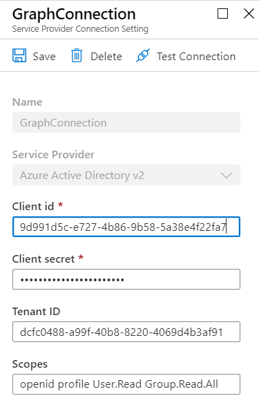

In the previous post <a href="https://simonagren.github.io/azcli-adscope" target="_blank">Azure AD & Microsoft Graph permission scopes, with Azure CLI</a>, we registered an Azure AD Application using specific scopes to the service principal `Microsoft Graph`. We also prepared it with a reply-URL that works for Bot Framework auth.

In this post we will create an `OAuth connection` from the Bot Channels Registration to the Azure AD Registration, giving the Bot the possibility to get a token to call Microsoft Graph.

# Prerequisites 
- [Azure Cli](https://docs.microsoft.com/en-us/cli/azure/install-azure-cli)
- [An Azure Account](https://azure.microsoft.com/free/)

# Create command
When we use the command [az bot authsetting create](https://docs.microsoft.com/en-us/cli/azure/bot/authsetting?view=azure-cli-latest#az-bot-authsetting-create) there are some common things we need to enter such as: 
- `--resource-group`
- `--name`
- `--setting-name`
- `--provider-scope-string`
- `--client-id`
- `--client-secret`. 

Depending on which `--service` (service provider) you decide to use there are a few service-specific things we need to add in `--parameters`. 

As you can see in the picture with **Azure Active Directory V2** we need to add a `Tenant ID`.



## We need some more things
At first, I tried to create the OAuth connection with the common properties and only `tenantId=<tenantId>`in the property string. 

The connection seemed to work just fine, although, from the UI in the portal, the Client id, and Client secret were blank.

This made no sense since I had provided the `--client-id` and `--client-secret` in the creation. 

Turns out the **Azure Active Directory V2** service takes more `--parameters` key-value pairs:
- `clientId`
- `clientSecret`
- `tenantId`

If you provide all of them everything will be fine!

# List all available service providers
We use the command `az bot authsetting list-providers` to get all service providers. 

We also add a query `--query "value[].[properties.displayName, properties.serviceProviderNamme]"` to get the display name and the service provider name, and output it as a table.

```powershell
az bot authsetting list-providers --query "value[].[properties.displayName, properties.serviceProviderName]" -o table
```

# Use the service provider name in a variable
You could of course just copy the service provider name from the table we printed. 

If you are running Azure CLI from PowerShell, like I am, this is an example to grab the Azure Active Directory service provider name to a variable.

```powershell
$providerName = az bot authsetting list-providers --query "value[?properties.displayName=='Azure Active Directory v2'].properties.serviceProviderName | [0]" 
```

# Creating an OAuth connection setting

In this example, we create a connection setting to an Azure AD V2 application. The registered Azure Active Directory Application has permissions to the Microsoft Graph.

1. Create variables
  
  ```powershell
  $clientId = "<IdFromAADapp>" 
  $clientSecret = "<secretFromAADapp>"
  $tenantId = "<tenantId>"
  $rGroup = "RGSimonBot"
  $botName = "BotSimonBot"
  $connName = "GraphConnection"
  $scopeString = "openid profile User.Read Group.Read.All"
  ```

2. Get Azure Active Directory V2 service provider name
  
  ```powershell
  $providerName = az bot authsetting list-providers --query "value[?properties.displayName=='Azure Active Directory v2'].properties.serviceProviderName | [0]" 
  ```

3. Create Connection

```powershell
az bot authsetting create -g $rGroup -n $botName -c $connName --client-id $clientId --client-secret $clientSecret --provider-scope-string $scopeString --service $providerName --parameters "clientId=$clientId" "clientSecret=$clientSecret" "tenantId=$tenantId"
```
