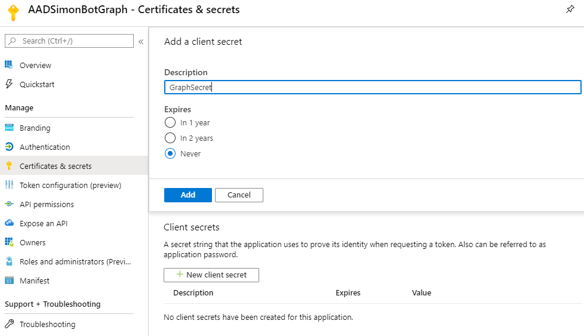

In the previous post, we had a look at user interruptions.

In this post, we will have a look at how to secure the Bot and give the user the ability to log in (and out) and then call Microsoft Graph. We will utilize the Azure Bot service built-in authentication abilities.

| Bot Framework in Node.js                                                                  | Complimentary post                                                                                                          |
|-------------------------------------------------------------------------------------------|-----------------------------------------------------------------------------------------------------------------------------|
| <a href="https://simonagren.github.io/azurebot-nodejs-part1" target="_blank">Let's begin (Part 1)</a>     | <a href="https://simonagren.github.io/azurebot-armtemplate-keyvault" target="_blank">Bot Framework 4 ARM template Deploy with Key Vault</a> |
| <a href="https://simonagren.github.io/azurebot-nodejs-part2" target="_blank">Microsoft Teams (Part 2)</a> |                                                                                                                             |
| <a href="https://simonagren.github.io/azurebot-nodejs-part3" target="_blank">Dialogs (Part 3)</a>         |                                                                                                                             |
| <a href="https://simonagren.github.io/azurebot-nodejs-part4" target="_blank">Interruptions (Part 4)</a> |                                                                                                                             |
| Auth and Microsoft Graph (Part 5) |<a href="https://simonagren.github.io/azcli-adscope" target="_blank">Azure CLI Azure AD registration with permission scopes</a>                                                                                                                             |
|  |<a href="https://simonagren.github.io/azcli-connection" target="_blank">Azure CLI OAuth Connection to Azure AD V2</a>                                                                                                                             |

## What we will build today


# Sourcecode
Here is the link to the Github repository for this post: [https://github.com/simonagren/simon-blog-bot-v5](https://github.com/simonagren/simon-blog-bot-v5)

# Prerequisites 
- [Bot Emulator](https://aka.ms/Emulator-wiki-getting-started)
- [Node.js 10.4+](https://nodejs.org/en/download/)
- [Visual Studio Code](https://code.visualstudio.com/)
- [An Azure Account](https://azure.microsoft.com/free/)
- [Office 365 dev tenant](https://developer.microsoft.com/office/dev-program) - for Microsoft Teams
- [Ngrok](https://ngrok.com/download)
- [App Studio installed in Teams](https://docs.microsoft.com/en-us/microsoftteams/platform/concepts/build-and-test/app-studio-overview#installing-app-studio)

# Register a new Azure AD Application
In the first post, we created an Azure AD App Registration, and that was for the channel authentication and making sure we don't receive messages from somewhere we shouldn't.

The last time we used `Azure CLI`. It was less complicated since we just needed the `appId` and `appSecret`, we didn't need to add any permission scopes.
In this post, we will create the App registration and add the connection using the portal. 

## Using Azure CLI
I did make two additional posts as a "bonus" to find the `scopes` we want to use, create the AD Application with them, and then create the `connection` from the Bot to the application - all by using `Azure CLI`.

- <a href="https://simonagren.github.io/azcli-adscope" target="_blank">Azure CLI Azure AD registration with permission scopes</a>
- <a href="https://simonagren.github.io/azcli-connection" target="_blank">Azure CLI OAuth Connection to Azure AD V2</a>                                     

## Using the portal

### Register AD Application

Go to the `Azure Active Directory` blade in the Azure Portal, then `App registrations` and `New registration`. Fill in the values and set the `redirect URI` to **https://token.botframework.com/.auth/web/redirect**, then register. 

As always, take notes of the `appId` and `tenantId`


Create a new **never expiring** `secret` and make note of the value.



Under `API Permissions`, we are going to add `Microsoft Graph` delegated permission scopes. In this case, we added `openid`, `profile`, and `Group.Read.All` (`User.Read` was already there).

The `Group.Read.All` require Admin consent. We don't need it now, but I did want to prepare us for upcoming posts. Make sure you admin consent in whatever way you find feasible.


### Create Connection from the Bot

Got to your `Bot Channels Registration`, into settings and under `OAuth Connection Settings` press `Add setting`. Fill in a new name, I'm using `Azure AD V2`, the `appId`, `secret`, and the `tenantId`. The scopes are case sensitive and separated by one single space. 


And after saving, you could click on the connection and `test connection` as well. First, you need to consent and then you could get a token.


### Add connection to .env
We add the name of the connection we just created into the `.env` file. For production scenarios, we have to also add the `connectionName` to the Azure App Service application settings.

```json
MicrosoftAppId=<idToFirstAADregistration>
MicrosoftAppPassword=<secretToFirstAADregistration>
connectionName=GraphConnection
```

# Project changes
This is a high-level visualization of how the Bot is built:


## bot.ts

Since we want to use the Bot in Microsoft Teams later, we will change so the Bot no longer derived from `ActivityHandler`, instead `TeamsActivityHandler`.

```typescript
export class SimonBot extends TeamsActivityHandler {
```

We also add two more methods

### onTokenResponseEvent
In non-Teams situations, we need to implement the onTokenResponseEvent to make sure the dialog is run with the new token response event.

```typescript
this.onTokenResponseEvent(async (context, next) => {
      console.log('Running dialog with Token Response Event Activity.');

      // Run the Dialog with the new Token Response Event Activity.
      await (this.dialog as MainDialog).run(context, this.dialogState);

      // By calling next() you ensure that the next BotHandler is run.
      await next();
  });
  }
```

### handleTeamsSigninVerifyState
And in Teams situations, we need to implement handleTeamsSigninVerifyState, because Teams handles it a bit differently. 

```typescript
protected async handleTeamsSigninVerifyState(context: TurnContext, query: SigninStateVerificationQuery): Promise<void> {
    await (this.dialog as MainDialog).run(context, this.dialogState);
  }
```

## mainDialog
In the main dialog, we import the `OAuthPrompt`, add a new constant
```typescript
const OAUTH_PROMPT = 'OAuthPrompt';
```

And then add `promptStep` and the `OAuthPrompt` using the connection.
```typescript
this.addDialog(new SiteDialog(SITE_DIALOG))
        .addDialog(new WaterfallDialog(MAIN_WATERFALL_DIALOG, [
            this.promptStep.bind(this),
            this.initialStep.bind(this),
            this.finalStep.bind(this)
        ]))
        .addDialog(new OAuthPrompt(OAUTH_PROMPT, {
            connectionName: process.env.connectionName,
            text: 'Please Sign In',
            timeout: 300000,
            title: 'Sign In'
        }));
```

### promptStep

The prompt step only kicks off the new login prompt.

```typescript
private async promptStep(stepContext: WaterfallStepContext): Promise<DialogTurnResult> {
    return await stepContext.beginDialog(OAUTH_PROMPT);
}
```

### initialStep
The initial step is changed. It will now get the `token` from the previous step in the `stepcontext.result`. 

An important thing to notice is that we don't save the token. The idea is to call the prompt again when we need the token. If the user is still logged in it will just send back a token. Otherwise, the user will have to log in again - so there's no need to save the token locally since we could end up with expired tokens.

If we didn't get a token, the login wasn't successful.

```typescript
private async initialStep(stepContext: WaterfallStepContext): Promise<DialogTurnResult> {
    const tokenResponse = stepContext.result;
    if (tokenResponse) {
        await stepContext.context.sendActivity('You are now logged in.');
        
        const siteDetails = new SiteDetails();
        return await stepContext.beginDialog('siteDialog', siteDetails);
    }
    await stepContext.context.sendActivity('Login was not successful please try again.');
    return await stepContext.endDialog();  
}
```

# Test login
1. Run the local Bot by using `npm start`

2.  Start the emulator and check the settings at first. 

    I had some issues getting the login to work. Your best bet is to download the latest emulator, and these are the settings that work well for me:


3. Then connect to the Bot from the emulator using http://localhost:3978/api/messages and the `appId` and `secret`.

4. Write something to kick off the dialogs. And the press login, and open the window.


This opens a window where you can copy the verification code and message back to the Bot. Then you receive your token.


## Login in Teams
We need to make some changes to the `manifest` in App Studio for the login to work. Right now the window would not open.

As we did in <a href="https://simonagren.github.io/azurebot-nodejs-part2" target="_blank">Microsoft Teams (Part 2)</a>, we will start App studio from Microsoft Teams and edit the manifest of our Teams App.

Under `domain and permissions` we need to add `token.botframework.com` as a supported host, this will allow the popup to be opened.


Spin up `ngrok` again **ngrok http 3978 --host-header=localhost**

Then we could go to Azure once again and change the `messaging endpoint` in the Bot Channels Registration to point to the `https://<ngrokUrl>/api/messages`

Now if you write something to the Bot in Teams, you get a similar login experience


If you press signin Teams will open a window and use the **Single Sign On** to get you the token.

And we are logged in


# Next step
In the next post, we will add some helpers and enable the user to utilize the Microsoft Graph. We will create an example using both the `Microsoft Graph Client` and `PnPJs Graph` for hooking into the Azure Bot Service auth-flow.

