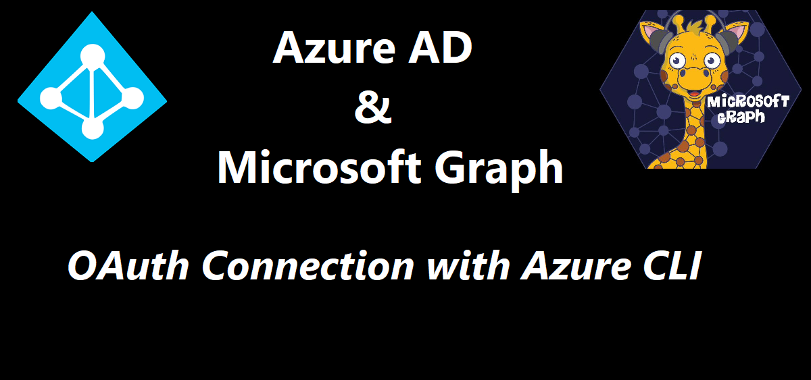

In this post we will work with Azure Cli to create resources

# Prerequisites 
- [Azure Cli](https://docs.microsoft.com/en-us/cli/azure/install-azure-cli)
- [An Azure Account](https://azure.microsoft.com/free/)

# Commands
We will use `az cognitiveservices account` to create the accounts we need. 

## Creating the resources
We will create an authoring and an prediction

### list all
First we could have a look at the ones we need for `--kind`
```powershell
az cognitiveservices account list-kinds
```
### create the authoring
then we could create an authoring resource
We use `--yes` to not prompt for terms confirmation.
I have the default location set to `northeurope`, and this resource is unavailable there, so I need to deploy it to `westeurope` by using `--location` or `-l`.

```powershell
az cognitiveservices account create --kind LUIS.Authoring -n AuthoringSimonBot -g RGSimonBot -l westeurope --sku F0 --yes
```

## create the prediction

```powershell
az cognitiveservices account create --kind LUIS -n PredictionSimonBot -g RGSimonBot -l westeurope --sku F0 --yes
```