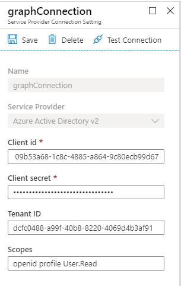

# Introduction

In a previous post [Azure CLI Azure AD registration with permission scopes](https://simonagren.github.io/az-cli-ad-scope) we registered an Azure AD Application using specific scopes to the service principal `Microsoft Graph`, and we also pre-prepared it with an reply url that works for Bot Framework auth.

In this post we will create a `auth connection` from the Bot Channels Registration, to the Azure AD Registration, giving the Bot the possibility to get a token to call Microsoft Graph.

# Prerequisites 
- [Azure Cli](https://docs.microsoft.com/en-us/cli/azure/install-azure-cli)
- [An Azure Account](https://azure.microsoft.com/free/)

# Command overview
When we use the command [az bot authsetting create](https://docs.microsoft.com/en-us/cli/azure/bot/authsetting?view=azure-cli-latest#az-bot-authsetting-create) there are some common things we need to enter such as: `--resource-group`, `--name`, `--setting-name`, `--provider-scope-string`, `--client-id` and `--client-secret`. Depending on which `--service` you decide to use there are a few other service specific things we need to add in `--parameters`. As you can see in the picture with Azure AD V2 we need `Tenant ID`.



## List all available service providers
We use the command `az bot authsetting list-providers` and ` --all` to get all service providers. We also add a query `--query "[].{Name:appDisplayName, Id:appId}`. The first brackets takes all the results, and then we use the `{}` to create an object with custom header names `appDisplayName` and the `appId` and output it as a table.

```json
az bot authsetting list-providers --query "[].{Name:appDisplayName, Id:appId}" --output table --all
```

## Get Azure AD V2 from the service providers 
We use the same base command but change the query slightly `--query "[?appDisplayName=='Azure AD V2'].{Name:appDisplayName, Id:appId}"`. Now in the first bracket we only look for a service provicer with the `appDisplayName` of Microsoft Graph and then we output the values in a table. 

```json
az bot authsetting list-providers --query "[?appDisplayName=='Azure AD V2'].{Name:appDisplayName, Id:appId}" --output table --all
```

## Use the service provider appId in a variable
You could ofcourse just copy the Id from the table we printed. But it could be really good to know how to work with variables. If you are runnign Azure CLI from PowerShell, like I am, this is an example to grab the Microsoft Graph service provider Id to a variable.

```json
$aadV2Id = az bot authsetting list-providers --provider-name "Aadv2" --query "properties.id" 
```

# Creating an OAuth connection setting

In this example we create an connection setting to an Azure AD V2 application. The already registered application has permissions to Microsoft Graph already.

1. Create variables
  ```json
  $appName = "AADSimonBotGraphTest"
  $secret = "SimonBlogBotDemoStuff1!"
  $rGroup = "RGSimonBot"
  $bot = "BotSimonBot"
  $connName = "GraphConnection"
  $scopeString = "openid profile User.Read"
  $paramString = "tenantId=$tenantId"
  $clientId = "<IdFromAADapp>" 
  $secret = "<secretFromAADapp>"
  $providerName = "Aadv2"
  ```

2. Get Azure AD V2 Id
  
  ```json
  $aadV2Id = az bot authsetting list-providers --provider-name "Aadv2" --query "properties.id" 
  ```

3. Create connection
`--provider-scope-string`, `--client-id` and `--client-secret`
```json
az bot authsetting create --resource-group $rGroup --name $bot --setting-name $connName --client-id $clientId --client-secret $secret --provider-scope-string $scopeString --service $providerName --parameters $paramString
```
