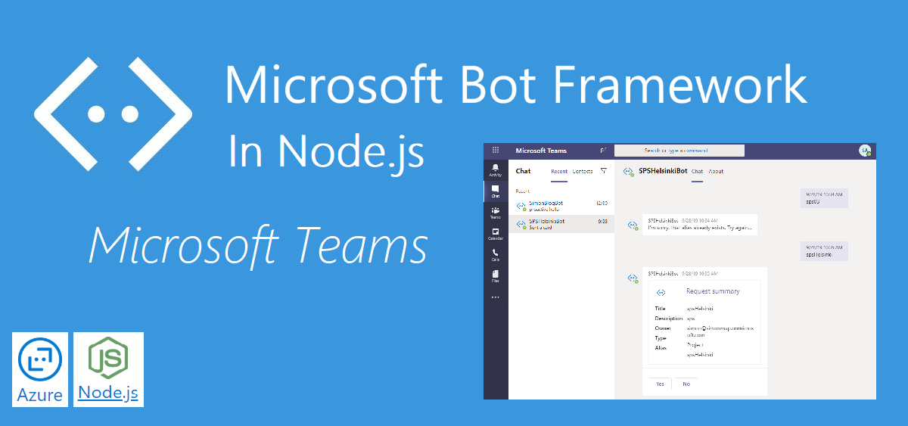

Today build an Azure Functions 3 in TypeScript and using PnPjs 2

## What we will build today

# Sourcecode
Here is the link to the Github repository for this post: [https://github.com/simonagren/simon-blog-bot-v3](https://github.com/simonagren/simon-blog-bot-v3)

# Prerequisites 
Fixa

# Create the Azure Function

- Create a folder, cd into and run code .
- Via the extension, create a new project and select the folder we created. HttpTrigger and anonymous.
- run npm i @microsoft/microsoft-graph-client 
- npm i es6-promise isomorphic-fetch
- npm i adal-node
- Uppgradera till @azure-functions 1.2.0
- npm i @microsoft/microsoft-graph-types --save-dev

