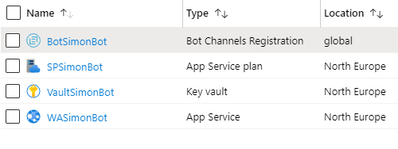

# Introduction

In the last post we built a Bot, tested it locally in the emulator, created all resources in Azure and also deployed the Bot to the web service in Azure using ARM templates and Key Vault.

In this second post we will continue with the Bot and run it from within Microsoft Teams with the help of `ngrok`. 

# Prerequisites 
- [Bot Emulator](https://aka.ms/Emulator-wiki-getting-started)
- [Node.js 10.4+](https://nodejs.org/en/download/)
- [Visual Studio Code](https://code.visualstudio.com/)
- [An Azure Account](https://azure.microsoft.com/free/)
- [Office 365 dev tenant](https://developer.microsoft.com/office/dev-program) - for Microsoft Teams
- [Ngrok](https://ngrok.com/download)

# Bot Registration
Last time we created a resource group in Azure which contains the service plan, the web service that runs the Bot, the Bot channels registrations and the Key vault.



We created the Azure AD registration last time we deployed the resources, and the channel registration is using that clientId and secret. We will use this going forward as well.
And the the message endpoint needs to point to somewhere where it's https and it can send the messages.

# Run the Bot in Microsoft Teams from localhost
We will run our Bot locally and it will access the Channel registration. First we need to change the variables in .env to the AppID and Secret we created in the last post. 


And just to clarify, the Bot we have running in the Web Service has also these enviroment variables in it's application settings. 
So in conclusion: All Bots that wants so access this channel registration needs to use this appid and secret, no matter where they are hosted.


## Spin up Ngrok
This creates a tunnel so we could use https, which is required by Microsoft Teams.
```json
ngrok http 3978 --host-header=localhost
```


## Change Messaging Endpoint in the Bot Registration
Go into your resource group and the Bot Channels Registration we created. Change the value from pointing to the Azure Web Service, and instead using the ngrok url.


## Activate Teams Channel
In the channels tab press on the Teams logo to configure the Teams channel registration.


## Start the Bot 
You can now start the bot locally with
```json
npm start
```

## Sideload in to Teams
If you press the Teams icon from channels it will open the Bot within Microsoft Teams


## Test that it works in Teams as it should
Now it should be working fine within the context of Teams. We have created a tunnel which enables us to use localhost as https and have the Bot Registration using that messaging endpoint. The Bot is running locally and sending messages via the Bot Registration in Azure.


## Install the app via App Studio
1. Open app studio
2. Manifest editor
3. Create a new App
4. Fill in all the stuff

5. In the Bot tab, use existing Bot and select from the dropdown. And we will use `personal`scope

6. As you can see it still points to that `ngrok` adress. And we could install the app and it would work.


## Run the Bot in Microsoft Teams from Azure
If we would go back to Azure and get the Url from the Web Service once again, change that in the Channel settings and then change it in the Teams manifest as well. We would have more of a production-like scenario.

## Next step
So sideloading makes perfect sense when you are developing, and we wouldn't really need that Web Service yet, since we are still developing.
In the next post we will continue developing locally and add some dialogs to our Bot.
