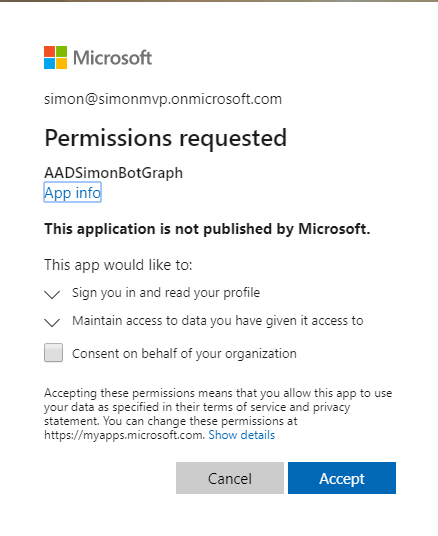
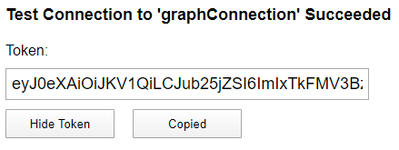

# TODOOOOOOOOO
https://graph.microsoft.com/v1.0/groups?$filter=mailNickname eq 'sps08' or displayName eq 'sps08'


# Introduction

In this post we will have a look at how to secure the Bot and give the user the ability to log in and then call Microsoft Graph. We will utilize the Azure Bot service built in authentication abilities.

# Sourcecode
Here is the link to the Github repository for this post: [https://github.com/simonagren/simon-blog-bot-v3](https://github.com/simonagren/simon-blog-bot-v3)

# Prerequisites 
- [Bot Emulator](https://aka.ms/Emulator-wiki-getting-started)
- [Node.js 10.4+](https://nodejs.org/en/download/)
- [Visual Studio Code](https://code.visualstudio.com/)
- [An Azure Account](https://azure.microsoft.com/free/)
- [Office 365 dev tenant](https://developer.microsoft.com/office/dev-program) - for Microsoft Teams
- [Ngrok](https://ngrok.com/download)

# Register a new Azure AD Application
In the first post, we created an App Registration, but it's for the channel authentication and making sure we don't receive messages from somewhere we shouldn't.

The last time we created the AD Application using the `Azure CLI`. It was less complicated since we just needed the `appId` and `appSecret`, we didn't need to add any permission scopes.
In this post, we will create the App registration and add the connection using the portal. 

## Using Azure CLI
I did make an additional post as a "bonus" to find the `scopes` we want to use, create the AD Application with them, and then create the `connection` from the Bot to the application - all by using `Azure CLI`
  
LINK TO SCOPES
LINK TO CONNECTION

## Using the portal

### Register AD Application

Go to the `Azure Active Directory` blade in the Azure Portal, then `App registrations` and `New registration`. Fill in the values and add the `redirect URI` to: https://token.botframework.com/.auth/web/redirect, then register. As always notice the `appId` and `tenantId`


Create a new *never expiring* `secret` and make note of the value.


Under `API Permissions`, we are going to add `Microsoft Graph` delegated permission scopes. In this case we added `openid`, `profile` (`User.Read` was already there).


### Create Connection from the Bot

Got to your `Bot Channels Registration`, into settings and under `OAuth Connection Settings` press `Add setting`. Fill in a new name, I'm using `Azure AD V2`, the `appId`, `secret`, and the `tenantId`. The scopes are case sensitive and separeted by one single space. 


And after saving, you could click on the connection and `test connection`  as well. First you need to consent and then you could get a token.





### Add connection to .env

we add the name of the connection we just added into the `.env` file. For production scenarios we have to also add the connect

```json
MicrosoftAppId=AADSimonBot
MicrosoftAppPassword=SimonBlogBotDemoStuff1!
connectionName=graphConnection
```

# Code changes

## bot.ts

Since we want to use the Bot in Microsoft Teams later, we will change so the Bot no longer derived from `ActivityHandler`, instead `TeamsActivityHandler`.

```typescript
export class SimonBot extends TeamsActivityHandler {
```

We also add two more methods

### onTokenResponseEvent
In non-Teams situations we need to implement the onTokenResponseEvent to make sure the dialog is run with the new token response event.

```typescript
this.onTokenResponseEvent(async (context, next) => {
      console.log('Running dialog with Token Response Event Activity.');

      // Run the Dialog with the new Token Response Event Activity.
      await (this.dialog as MainDialog).run(context, this.dialogState);

      // By calling next() you ensure that the next BotHandler is run.
      await next();
  });
  }
```

### handleTeamsSigninVerifyState
And in Teams situations we need to implement handleTeamsSigninVerifyState, because Teams handles it a bit differently. 

```typescript
protected async handleTeamsSigninVerifyState(context: TurnContext, query: SigninStateVerificationQuery): Promise<void> {
    await (this.dialog as MainDialog).run(context, this.dialogState);
  }
```

## mainDialog
In the main dialog we import the `OAuthPrompt`, add a new constant
```typescript
const OAUTH_PROMPT = 'OAuthPrompt';
```

and then add an additional `promptStep` and the `OAuthPrompt` using the connection.
```typescript
this.addDialog(new SiteDialog(SITE_DIALOG))
        .addDialog(new WaterfallDialog(MAIN_WATERFALL_DIALOG, [
            this.promptStep.bind(this),
            this.initialStep.bind(this),
            this.finalStep.bind(this)
        ]))
        .addDialog(new OAuthPrompt(OAUTH_PROMPT, {
            connectionName: process.env.connectionName,
            text: 'Please Sign In',
            timeout: 300000,
            title: 'Sign In'
        }));
```

### promptStep

The prompt step only kicks off the new login prompt.

```typescript
private async promptStep(stepContext: WaterfallStepContext): Promise<DialogTurnResult> {
    return await stepContext.beginDialog(OAUTH_PROMPT);
}
```

### initialStep
The initial step is changed. It will now get the `token` from the previous step in the `stepcontext.result`. And an important thing to notice is that we don't save the token. The idea is to call the prompt again when we need the token. If the user is still logged in it will just send back a token, otherwise the user will have to log in again - so there's no need to save the token locally sice we could end up with expired tokens.

And if we didn't get a token, to login wasn't successfull.

```typescript
private async initialStep(stepContext: WaterfallStepContext): Promise<DialogTurnResult> {
    const tokenResponse = stepContext.result;
    if (tokenResponse) {
        await stepContext.context.sendActivity('You are now logged in.');
        
        const siteDetails = new SiteDetails();
        return await stepContext.beginDialog('siteDialog', siteDetails);
    }
    await stepContext.context.sendActivity('Login was not successful please try again.');
    return await stepContext.endDialog();  
}
```

# Login TODO
We could now start the emulator and use the appId and secret.
- Write something
- Then press login and it would work to login and we would receive the token to be shown.

### Login in Teams TODO
If you remember the second post in this series, we just sideloaded the teams App from Azure and tried it in Teams. In this case it really wouldn't work to open the login popup. 
1. Lets start ngrok once again
2. Start App Studio
3. Edit the manifest
Here we need to add `token.botframework.com` as a supported host, this will allow the popup to be opened.
And we need to enter the new URI from ngrok, to make sure the Bot will work in Teams.

Now if you try to log in, it will work the same.

