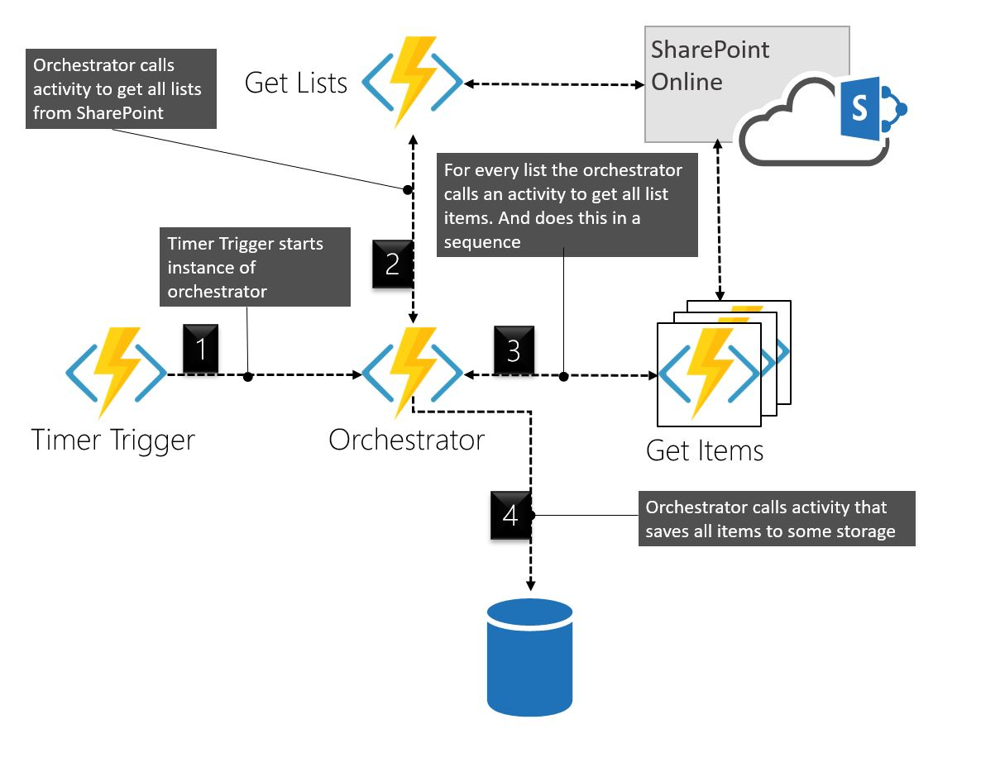

We back at it again! In the last post we built a durable orchestration with the function chaining pattern, and we talked to some extent about the different functions and briefly about triggers. 
Today we will expand what we built and have a look at the fan-out fan-in pattern, were we will do a lot in parallel. This means we also need to talk about throttling in SharePoint and how we could handle this.
We will also extend our example with something called suborchestrations, which could be really useful in more complex orchestrations.

We will deploy and utilize the new improved keyvault syntax for enviroment variables in our Function App.

I think this stuff is really cool, and in the next post we will go in to some of the different commands you could use with the Orchestration Client - or as I have called it earlier: just `client`

## Give me some code, bro

If you would like to follow along, [here](https://github.com/simonagren/durable-step2) is the code.
___

## Tiggers
Here I will provide some code samples for different triggers. These will be as simple as our Timer Trigger is, with nothing additional.

### Http Trigger
Stuff stuff

### Queue Trigger
Stuff stuff

### Some other trigger
Stuff stuff
___

## Throttling in SharePoint Online

### What is throttling?

> SharePoint Online uses throttling to maintain optimal performance and reliability of the SharePoint Online service. Throttling limits the number of user actions or concurrent calls (by script or code) to prevent overuse of resources

### How do we handle this?

Well there seem to be a few options. What we will utilize is the retry-capabilities in the durable functions, so that we are prepared if needed.

> Retry after is the fastest way to handle being throttled because SharePoint Online dynamically determines the right time to try again. In other words, aggressive retries work against you because even though the calls fail, they still accrue against your usage limits. Following the retry header will ensure the shortest delay.

___

## Extending the Project and changing pattern
We will use a common pattern called "Fan out Fan in". It's really about doing a lot of stuff in parallel. To some extent we care about the order of things, that is when we `yield` and wait for an activity. But in many other parts of the code we just run asynchronous calls in parallel and they are finished when they are. We also introduce subOrchestrators, which is basicly an orchestrator started by another orchestrator. We will run plenty of these in parallel.



___


## Changing the Orchestrator (OGetUniquePermItems)

We will change the code to run a suborchestrator instead of an activity for each list, and they will run in parallel. So We will add in some retry options for these. 
- We will use the callSubOrchestrationWithRetry
- callActivityWithRetry

We will only change in the index.js file.

### index.js

And this is some simple code in this orchestrator. Don't worry we will do cooler things in upcoming posts.
- We set up PnPJs
- Call an activity to get all lists from the SharePoint Site
- For every list start activities in a sequence. Get the uniquely permissioned items from each list.
- When all has been fetched, log or call activity to save the data to some storage.

```javascript
const sp =  require("@pnp/sp").sp;
const SPFetchClient = require("@pnp/nodejs").SPFetchClient;
const df = require("durable-functions");

module.exports = df.orchestrator(function* (context) {
    
    // Get input from the client that started
    const siteName = context.df.getInput();
    
    // Setup PnPJs
    sp.setup({
        sp: {
            fetchClientFactory: () => {
                return new SPFetchClient(
                  `${process.env.spTenantUrl}/sites/${siteName}/`, 
                  process.env.spId, 
                  process.env.spSecret);
            },
        },
    });
    
    // Call Activity that fetches all lists that arent hidden, and wait for it to finish
    const lists = yield context.df.callActivity("AGetLists", siteName);

    const output = [];

    for (let list of lists) {
        // For this example we will do all the calls in sequence
        // This could also be done in parallel, but then we need to handle throttling
        output.push(yield context.df.callActivity("AGetUniqueItems", list));
    }

    // Here we could save the result to some DB if we want to
    // yield context.df.callActivity('SaveItems', output);
    
    // For this example we just log the result  
    context.log(JSON.stringify(output));
    
    return context.instanceId;

})
```

## Creating the SubOrchestrator (OGetExtSharedItems)

This one will basicly work as the other Orchestrator used to. We will get all items with one activity. And then if we have any uniquely permissioned items we will check if they have been shared with anyone. Why? Because reasons...

We will only change in the index.js file.

### index.js

And this is some simple code in this orchestrator. Don't worry we will do cooler things in upcoming posts.
- We set up PnPJs
- Call an activity to get all lists from the SharePoint Site
- For every list start activities in a sequence. Get the uniquely permissioned items from each list.
- When all has been fetched, log or call activity to save the data to some storage.

```javascript
const sp =  require("@pnp/sp").sp;
const SPFetchClient = require("@pnp/nodejs").SPFetchClient;
const df = require("durable-functions");

module.exports = df.orchestrator(function* (context) {
    
    // Get input from the client that started
    const siteName = context.df.getInput();
    
    // Setup PnPJs
    sp.setup({
        sp: {
            fetchClientFactory: () => {
                return new SPFetchClient(
                  `${process.env.spTenantUrl}/sites/${siteName}/`, 
                  process.env.spId, 
                  process.env.spSecret);
            },
        },
    });
    
    // Call Activity that fetches all lists that arent hidden, and wait for it to finish
    const lists = yield context.df.callActivity("AGetLists", siteName);

    const output = [];

    for (let list of lists) {
        // For this example we will do all the calls in sequence
        // This could also be done in parallel, but then we need to handle throttling
        output.push(yield context.df.callActivity("AGetUniqueItems", list));
    }

    // Here we could save the result to some DB if we want to
    // yield context.df.callActivity('SaveItems', output);
    
    // For this example we just log the result  
    context.log(JSON.stringify(output));
    
    return context.instanceId;

})
```

## Creating the Get Lists Activity (AGetLists)

In this activity we actually just perform one task and return the values, for this we are using PnPJs. I like to keep an A in the function name if it's an activity.

### function.json

```json
{
  "bindings": [
    {
      "name": "siteName",
      "type": "activityTrigger",
      "direction": "in"
    }
  ],
  "disabled": false
}
```

### index.js

```javascript
const sp =  require("@pnp/sp").sp;

module.exports = async function (context) {
    
    const siteName = context.bindings.siteName;

    if (!siteName) {
        throw new Error("A Site name is required as input.");
    }
    
    context.log(`Getting lists in '${siteName}'...`);
    
    // Get all the Lists
    const lists = await sp.web.lists.select('Id','Title','Hidden').filter('Hidden eq false').get();
    
    return lists;
        
};
```

## Creating the Get Unique Items Activity

It's similar as the previous function.

### function.json
```json
{
  "bindings": [
    {
      "name": "list",
      "type": "activityTrigger",
      "direction": "in"
    }
  ],
  "disabled": false
}
```

### index.js
```javascript
const sp =  require("@pnp/sp").sp;

module.exports = async function (context) {

    const list = context.bindings.list;

    if (!list) {
        throw new Error("A List is required as input.");
    }
    context.log(`Getting items in '${list.Title}'...`);

    // Get all the uniquely permissioned items in this list
    const items = await sp.web.lists.getById(list.Id).items.select('Id','HasUniqueRoleAssignments','FileRef').get();
    
    return items;
        
};
```
___

## Debug

In a previous post we used to emulator for debugging, and that is fully possible in this scenario aswell.

### Azure Storage Emulator
First make sure that you have started Azure Storage Emulator and that you are using version 5.9 or later (in this moment 5.9 is the latest).

### local.settings.json
Then make sure your local.settings.json is configured in the right way for our scenario. We need to use development storage and we also need to provide the SharePoint values for PnPJs to work. Have a look at mine:

```json
{
  "IsEncrypted": false,
  "Values": {
    "AzureWebJobsStorage": "UseDevelopmentStorage=true",
    "AzureWebJobsSecretStorageType": "files",
    "FUNCTIONS_WORKER_RUNTIME": "node",
    "spId": "{AppId}",
    "spSecret": "{AppSecret}",
    "spTenantUrl": "https://{tenant}.sharepoint.com"
  }
}
```

### Press F5

You could set breakpoints where you feel like.
If everything works out you should see some logging of all the items with unique role assignments.

___

## Next Steps
In the next post we will look the fan-out fan-in pattern, were we will do a lot in parallel. This means we also need to talk about throttling in SharePoint and how we could handle this.

We will also extend our example with something called suborchestrations, which could be really useful in more complex orchestrations.

We will deploy and utilize the new improved keyvault syntax for enviroment variables in our Function App.

