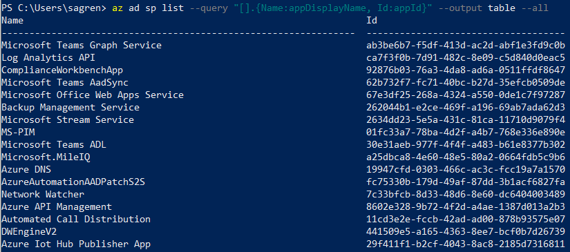
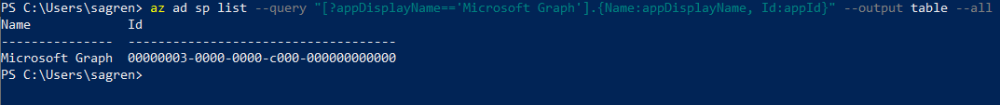
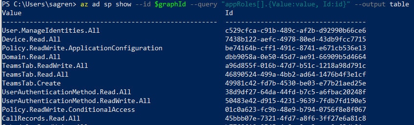
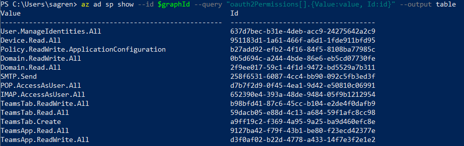

In this small post, we will look at a scenario where we want to register an Azure AD Application using specific scopes. When adding scopes for service principals using the Azure CLI we need to use the internal Ids. 

And one way would be to manually create one registration, get that app and then print out the scopes and then copy and paste. 

I will show you another way

# Prerequisites 
- [Azure CLI](https://docs.microsoft.com/en-us/cli/azure/install-azure-cli)
- [An Azure Account](https://azure.microsoft.com/free/)

# Command overview
When we use the command [az ad app create](https://docs.microsoft.com/en-us/cli/azure/ad/app?view=azure-cli-latest#az-ad-app-create) and want to add permission scopes, we will need to use `--required-resource-accesses`. 

We need to supply a JSON format where `resourceAppId` represents the service provider (ex. Microsoft Graph). 

We also need to add the scopes with ids in `resource access`. And this is one example of how it can look:
```powershell
[{
    "resourceAppId": "00000002-0000-0000-c000-000000000000",
    "resourceAccess": [
        {
            "id": "a42657d6-7f20-40e3-b6f0-cee03008a62a",
            "type": "Scope"
        }
   ]
}]
```  

## List all available service providers
We use the command `az ad sp list` and ` --all` to get all service providers. 

We also add a query `--query "[].{Name:appDisplayName, Id:appId}`. 

The first brackets take all the results, and then we use the `{}` to create an object with custom header names `appDisplayName` and the `appId` and output it as a table.

```powershell
az ad sp list --query "[].{Name:appDisplayName, Id:appId}" --output table --all
```




## Get Microsoft Graph from the service providers 
We use the same base command but change the query slightly 

`--query "[?appDisplayName=='Microsoft Graph'].{Name:appDisplayName, Id:appId}"`. 

Now in the first bracket. we only look for a service provider with the `appDisplayName` of Microsoft Graph and then we output the values in a table. 

```powershell
az ad sp list --query "[?appDisplayName=='Microsoft Graph'].{Name:appDisplayName, Id:appId}" --output table --all
```




## Use the service provider appId in a variable
You could of course just copy the Id from the table we printed. It could be good to know how to work with variables. If you are running Azure CLI from PowerShell, like I am, this is an example to grab the Microsoft Graph service provider Id to a variable.

```powershell
$graphId = az ad sp list --query "[?appDisplayName=='Microsoft Graph'].appId | [0]" --all 
```
## Get the available application permissions
Here we change the command to `az ad sp show` which is used to get a specific service provider. 

In the query `--query "appRoles[].{Value:value, Id:id}"` we get all the `appRoles`, flatten them and then select the value and id to output as a table.

```powershell
az ad sp show --id $graphId --query "appRoles[].{Value:value, Id:id}" --output table
```




## Get specific appRole to variable
We could also query for specific appRoles of course. We changed the query `--query "appRoles[?value=='Mail.Send'].id | [0]` to look for a specific appRole with the value equal to `Mail.Send`

```powershell
$mailSend = az ad sp show --id $graphId --query "appRoles[?value=='Mail.Send'].id | [0]" 
```



## Get the available delegated permissions
Here we continue with the same command but changed the query `--query "oauth2Permissions[].{Value:value, Id:id}"` to instead get `oauth2Permissions`, we flatten them and output value and id as a table.

```powershell
az ad sp show --id $graphId --query "oauth2Permissions[].{Value:value, Id:id}" --output table
```

## Get specific delegated permissions to variable
We could do the same when getting a specific `--query "oauth2Permissions[?value=='openid'].id | [0]` to look for a specific delegated with the value equal to `openid`

```powershell
$openid = az ad sp show --id $graphId --query "oauth2Permissions[?value=='openid'].id | [0]" 
```


# Creating Azure AD Application registration

In this example, we create an app registration that has permissions to the Microsoft Graph and will be able to be utilized by a Bot Framework Bot.

1. Create variables for app name and password
  
  ```powershell
  $appName = "AADSimonBotGraphTest"
  $secret = "SimonBlogBotDemoStuff1!"
  $replyUrl = "https://token.botframework.com/.auth/web/redirect"
  ```


2. Get Microsoft Graph Id
  
  ```powershell
  $graphId = az ad sp list --query "[?appDisplayName=='Microsoft Graph'].appId | [0]" --all 
  ```

3. Create variables for scopes
  
  ```powershell
    $openid = az ad sp show --id $graphId --query "oauth2Permissions[?value=='openid'].id | [0]"
    $profile = az ad sp show --id $graphId --query "oauth2Permissions[?value=='profile'].id | [0]"
    $userRead = az ad sp show --id $graphId --query "oauth2Permissions[?value=='User.Read'].id | [0]"
    $groupReadAll = az ad sp show --id $graphId --query "oauth2Permissions[?value=='Group.Read.All'].id | [0]"
  ```
4. Create a JSON structure for resources

  In PowerShell, you need to have the JSON as one string, without any new rows, etc (as far as I know). And it also has to be escaped. That is why I added the last `ConvertTo-Json` which, in this case, escapes the double quotes from `"` to `\"`.

  In more complex scenarios you might want to get a bit fancier with HOW you build the string, but the beginning `@"` and ending `@"` let me use variables in the string. 

  You could as well put the JSON in a .json file and then use it. But it makes more sense when using hardcoded values.

```powershell
$resources = @"
[{ "resourceAppId": $graphId, "resourceAccess": [{"id": $openid,"type": "Scope"},{"id": $profile,"type": "Scope"},{"id": $userRead,"type": "Scope"},{"id": $groupReadAll,"type": "Scope"}]}]
"@ | ConvertTo-Json
```

5. Create the AD Application

Here we use the `az ad app create` and add in our variables that we created and the "scopes". And in this case, we create a single-tenant app.

```powershell
az ad app create --display-name $appName --password $secret --reply-urls $replyUrl --required-resource-accesses $resources --available-to-other-tenants false
```

6. (Optional) Admin consent

Try to stay away from scopes that require Admin consent. If you need to consent you could do this using this command with the `appId` you get after creation 

```powershell
az ad app permission admin-consent --id $appId 
```

# Recap
You have gotten a small glance of how it's done behind the scenes, and you could definitely benefit from these concept when it comes to automation.

You have learned how to create an Azure AD application registration with the permission scopes of choice. And you have a another tool in you arsenal, right next to the Azure Portal way.

Until next time.