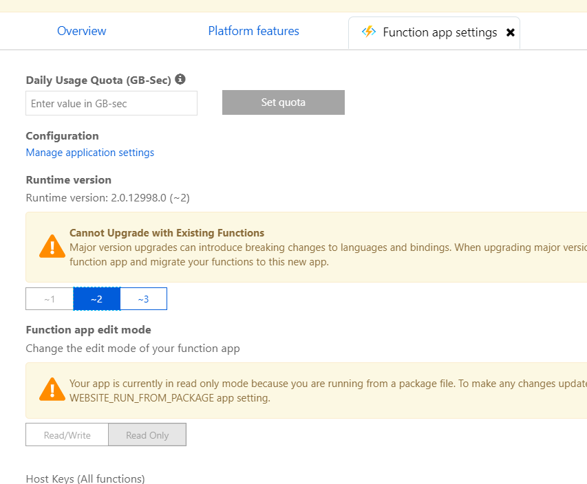
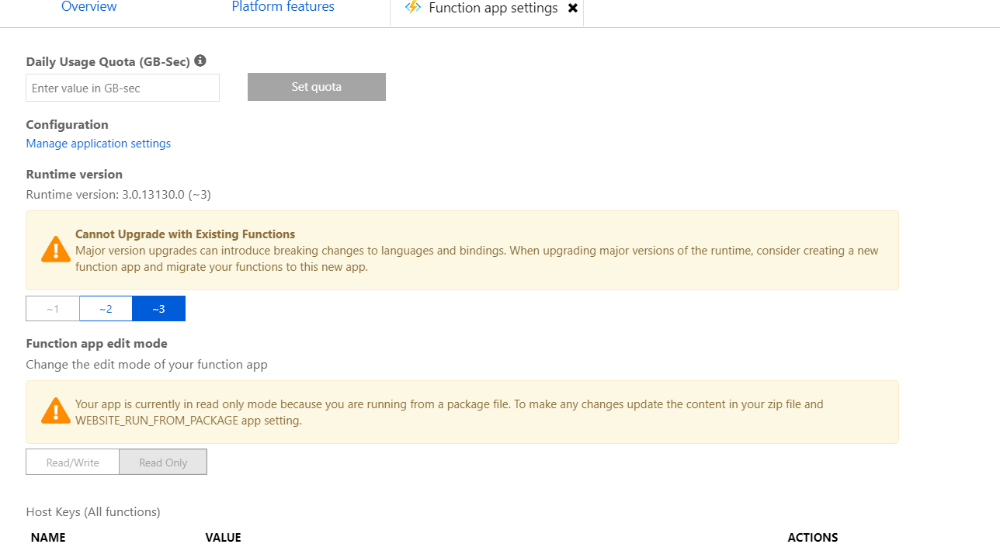
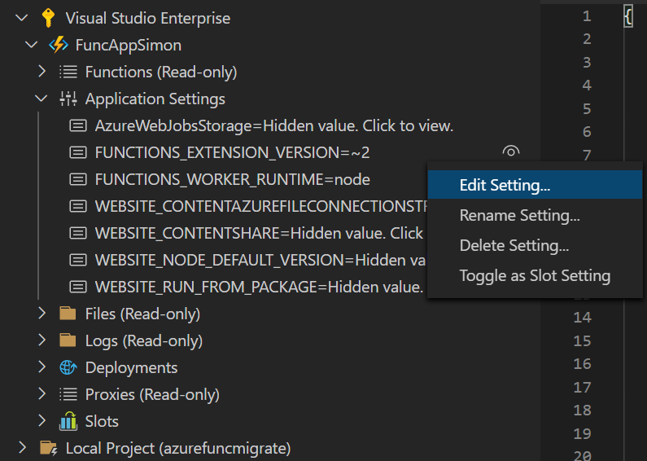
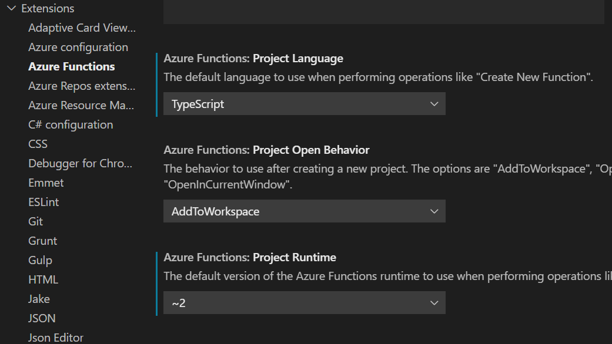
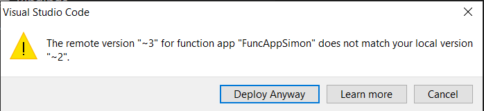
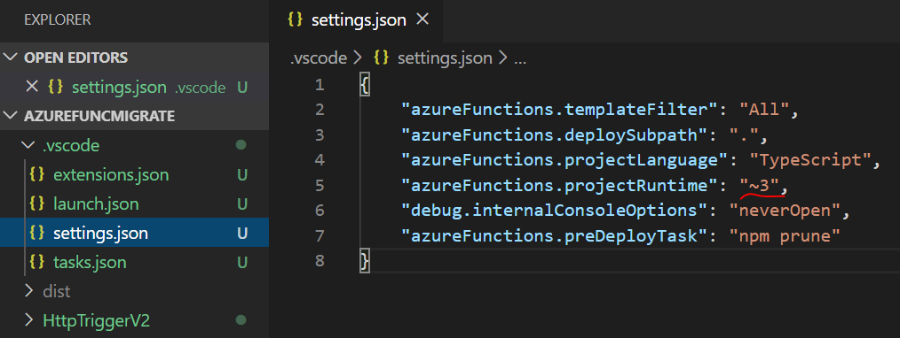

Last time we visited Azure Functions, I did a brief introduction of Azure Functions 3.0 that now supports `Node 12`. The function app runtime you select gives you different options when it comes to platform versions. Go and check out that post if you want to know more.

I have created a **Function App and** a **Function** with version 2.x. And today we are going to have a look at the different options when it comes to migrating from 2.x to 3.x. There's not a lot of steps. I will give you a few options and try to clarify a few things.

# Prerequisites 
- [Azure Cli](https://docs.microsoft.com/en-us/cli/azure/install-azure-cli)
- [An Azure Account](https://azure.microsoft.com/free/)
- [Visual Studio Code](https://code.visualstudio.com/)
- [Azure Functions Extension](https://marketplace.visualstudio.com/items?itemName=ms-azuretools.vscode-azurefunctions)

# Changes in Azure

## Using Azure Portal
As I mentioned in the previous post, if there's a `function` added to the `function app` we could only change the runtime between 2.x and 3.x. Changing to 1.x is only possible if there's no `function`.



### Changing runtime from Function app settings
We could move into the `Function app settings` and from there just change from `~2` to `~3`. This takes a few moments and then we have successfully changed the runtime.



This will change the `Application settings` to have runtime `~3` and Node version `~12`. And this means that changing the application settings also forces a `runtime` change. We could go either path.

## Using Azure CLI
In the previous post, we had a look at how to use Azure CLI to get all app settings and even query for specific settings. Now we will look at how to change the settings. As mentioned earlier, this makes the same changes as if we would change the `runtime` in the portal.

### Change runtime in app settings
Here we use the command `az functionapp config appsettings set` to set the runtime for the function app. we also use the name of the `function app` and the name of the `resource-group`.

```json
az functionapp config appsettings set -n funcappsimon -g rgfuncappsimon -s FUNCTIONS_EXTENSION_VERSION=~3
```

### Change Node version in app settings
Here we use the command `az functionapp config appsettings set` to set the Node versions for the function app. we also use the name of the `function app` and the name of the `resource-group`.

```json
az functionapp config appsettings set -n funcappsimon -g rgfuncappsimon -s WEBSITE_NODE_DEFAULT_VERSION=~12
```

## Using Azure Functions Extension
Using Azure Functions Extension we could just use the available application settings, right-click and edit the setting.



# Changes in Visual Studio Code
Many times we only need to make changes in Azure, if there are no breaking changes or we don't need to deploy anything else.

## Breaking changes
Even though the migration is often smooth there are still some breaking changes:
https://docs.microsoft.com/sv-se/azure/azure-functions/functions-versions#javascript

## Settings in Azure Functions Extension for creating new
I'm primarily using the extension when it comes to creation, deployment and changing settings. This is not the first time I'm mentioning the extension. In an old post of mine, I'm walking you through the steps on how to generate a `Function App` and `functions` using the `Azure Functions Extension` for `Visual Studio Code`. 



Nowadays you change the settings of your extension in VS Code when it comes to `project language` and `runtime`. If you look at the picture you can see that I have `~2` selected from before. I can now just change it to `~3` to match de default values of the `Azure Portal` and `Azure CLI`.

## Changes in the code
I used the extension to deploy the `Function App` to Azure as a 2.x. And if we have made our changes in Azure and changed the runtime to 3.x, and then try to deploy, the extension picks this up. You could still deploy, but it notices you have a local 2.x project and a 3.x in Azure.



So go into your code project, `.vscode`, and then in `settings.json` change the `azureFunctions.projectRuntime` to `~3`.



Beware that changing the local project setting to `~3` and then deploying to an `already deployed function app` does NOT change the runtime in Azure.

# Conclusion
My preferred way would be to use the Azure Functions Extension all the way. Remember to change the default version to `~3`. And the approach for migration would be:
1. Change to `~3` in the `settings.json`. 
2. Do an `npm start` and try the function locally in the emulator. Make sure it works
3. Via the `Azure Function Extension` change the app settings of the `function app` to use runtime `~3` and node `~12`.
4. Deploy the functions to the function app via the extension.
5. Drink a preferred beverage while waiting.

Now it's deployed and hopefully working. And you are awesome! 