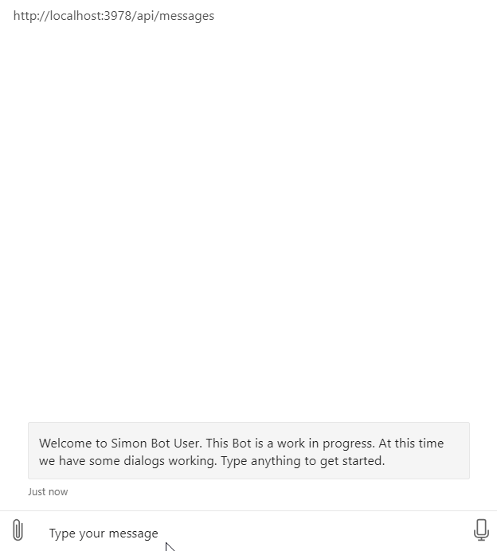
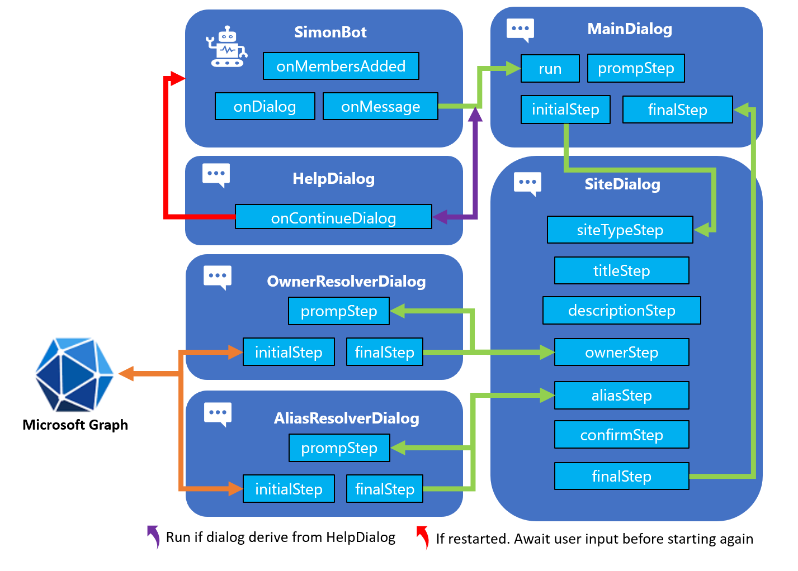

I the previous post, we created a new Azure AD Application registration, gave it permissions to Microsoft Graph. We also added an OAuth prompt to the main dialog and made it possible for the user to log in both in the emulator and Microsoft Teams.

In this post, we will add some helpers and enable the user to call the Microsoft Graph. We will create an example using both the <a href="https://github.com/microsoftgraph/msgraph-sdk-javascript" target="_blank">Microsoft Graph JavaScript Client Library</a> and <a href="https://pnp.github.io/pnpjs/" target="_blank">PnPjs v2</a> for hooking into the Azure Bot Service auth flow. We will add some additional validation logic into the `Owner Resolver Dialog`, and also add a similar `Alias Resolver Dialog`.

| Bot Framework in Node.js                                                                  | Complimentary post                                                                                                          |
|-------------------------------------------------------------------------------------------|-----------------------------------------------------------------------------------------------------------------------------|
| <a href="https://simonagren.github.io/azurebot-nodejs-part1" target="_blank">Let's begin (Part 1)</a>     | <a href="https://simonagren.github.io/azurebot-armtemplate-keyvault" target="_blank">Bot Framework 4 ARM template Deploy with Key Vault</a> |
| <a href="https://simonagren.github.io/azurebot-nodejs-part2" target="_blank">Microsoft Teams (Part 2)</a> |                                                                                                                             |
| <a href="https://simonagren.github.io/azurebot-nodejs-part3" target="_blank">Dialogs (Part 3)</a>         |                                                                                                                             |
| <a href="https://simonagren.github.io/azurebot-nodejs-part4" target="_blank">Interruptions (Part 4)</a> |                                                                                                                             |
| <a href="https://simonagren.github.io/azurebot-nodejs-part5" target="_blank">Auth and Microsoft Graph (Part 5)</a> |<a href="https://simonagren.github.io/azcli-adscope" target="_blank">Azure AD & Microsoft Graph permission scopes, with Azure CLI</a>                                                                                                                             |
|  |<a href="https://simonagren.github.io/azcli-connection" target="_blank">Azure AD & Microsoft Graph OAuth Connection, with Azure CLI</a>                                                                                                                             |
| Calling Microsoft Graph (Part 6)         |                                                                                                                             |

## What we will build today



# Sourcecode
Here is the link to the Github repository for this post: [https://github.com/simonagren/simon-blog-bot-v6](https://github.com/simonagren/simon-blog-bot-v6)

# Prerequisites 
- [Bot Emulator](https://aka.ms/Emulator-wiki-getting-started)
- [Node.js 10.4+](https://nodejs.org/en/download/)
- [Visual Studio Code](https://code.visualstudio.com/)
- [An Azure Account](https://azure.microsoft.com/free/)
- [Office 365 dev tenant](https://developer.microsoft.com/office/dev-program) - for Microsoft Teams
- [Ngrok](https://ngrok.com/download)
- [App Studio installed in Teams](https://docs.microsoft.com/en-us/microsoftteams/platform/concepts/build-and-test/app-studio-overview#installing-app-studio)

# Getting a token from the Azure Bot Service

In the previous post, we saw that the `OAuthPrompt` gives us a token after the user logs in. We will not store the token locally (which I explained more in the last post), instead call the OAuth prompt again whenever we need a token.

Normally you would have to add `MSAL` or `ADAL` settings that the `GraphClient` or `PnPjs` would use to fetch a token, and then use to call Microsoft Graph.

In the Bot, we already have a token and we will work with that in the clients.

# Project changes

This is a high-level visualization of how the Bot is built:



## npm packages

We will install these packages:
- [Microsoft Graph Client](https://www.npmjs.com/package/@microsoft/microsoft-graph-client)
    ```json
    npm i @microsoft/microsoft-graph-client
    ```
- [Microsoft Graph Types](https://www.npmjs.com/package/@microsoft/microsoft-graph-types)    
    ```json
    npm i @microsoft/microsoft-graph-types --save-dev
    ```
- [PnPjs: Graph and NodeJs](https://pnp.github.io/pnpjs/getting-started/#connect-to-microsoft-graph-from-node)
    ```json
    npm i @pnp/graph-commonjs @pnp/nodejs-commonjs
    ```
## Files we added
In the `src` folder we create an additional folder `helpers`. This will in our case contain 3 new files:

- **graphHelper.ts**: the Microsoft Graph helper class, that will contain examples utilizing both `simple-graph-client` and `simple-pnpjs-client` to call Microsoft Graph. 
- **simple-graph-client.ts**: wiring up the `GraphClient` from Microsoft, with the token from the Bot. It contains methods to call the Microsoft Graph.
- **simple-pnpjs-client.ts**: wiring up the `PnPjs` graph client from `Patterns And Practices (PnP)`, with the token from the Bot. It contains methods to call the Microsoft Graph.

We also add another dialog in the form of:
- **aliasResolverDialog.ts**: A dialog similar to owner resolver dialog. It will call Microsoft Graph to see if the group alias is already taken.

## graphHelper
The graph helper imports `simple-graph-client` and `simple-pnpjs-client`, and contains two methods: `userExists()` and `aliasExists`. 

The methods will be used in the Owner resolver dialog and Alias Resolver Dialog. Both methods want a `TokenResponse` and a `string`. 

### userExists
This method instantiates a new `client` using the `SimpleGraphClient` based in the Microsoft Graph SDK, by sending in the token. Then we run the `userExists()` with the string input, to see if the user (owner) exists in the tenant.

```typescript
public static async userExists(tokenResponse: any, emailAddress: string): Promise<boolean> {
    if (!tokenResponse) {
        throw new Error('GraphHelper.userExists(): `tokenResponse` cannot be undefined.');
    }
    const client = new SimpleGraphClient(tokenResponse.token);
    return await client.userExists(emailAddress);   
}
```
### Alias exists
This method instantiates a new `client` using the `SimplePnPJsClient` based on PnPjs V2, by sending in the token. Then we run the `aliasExists()` with the string input, to see if the group alias is already taken in the tenant.

```typescript
public static async aliasExists(tokenResponse: any, alias: string): Promise<boolean> {
    if (!tokenResponse) {
        throw new Error('GraphHelper.aliasExists(): `tokenResponse` cannot be undefined.');
    }
    const client = new SimplePnPJsClient(tokenResponse.token);
    return await client.aliasExists(alias);
}
```

## Simple Graph Client
In this case, we first import the `Client` and the `User` type.

```typescript
import { Client } from '@microsoft/microsoft-graph-client';
import { User } from '@microsoft/microsoft-graph-types';
```
Then we initialize the `Client` with the token that was injected. 

```typescript
constructor(token: any) {
    if (!token || !token.trim()) {
        throw new Error('SimpleGraphClient: Invalid token received.');
    }
    this.token = token;

    this.graphClient = Client.init({
        authProvider: (done) => {
            done(null, this.token);
        }
    });
}
```

Then we call the Microsoft Graph to see if the user exists.
```typescript
public async userExists(emailAddress: string): Promise<boolean> {
    if (!emailAddress || !emailAddress.trim()) {
        throw new Error('SimpleGraphClient.userExists(): Invalid `emailAddress` parameter received.');
    }
    try {
        const user: User = await this.graphClient
        .api(`/users/${emailAddress}`)
        .get();

        return user ? true : false;

    } catch (error) {
        return false;
    }
}
```

## Simple PnPjs Client
We import the Microsoft Graph types for `Group`, `graph` from the PnPjs Graph package (with an alias) and also `BearerTokenFetchClient` from the PnPjs Nodejs package.

If you have seen some more of my posts I usually use the `AdalTokenFetchClient`, where you supply the `clientId` and `clientSecret` of your Azure AD application. But this time we already have a token so the `BearerTokenFetchClient` is perfect in this scenario. 

```typescript
import { Group } from '@microsoft/microsoft-graph-types';
import { graph as graphClient } from '@pnp/graph-commonjs';
import { BearerTokenFetchClient } from '@pnp/nodejs-commonjs';
```

Then we initialize the `graphClient` with the token that was injected. 

```typescript
constructor(token: any) {
    if (!token || !token.trim()) {
        throw new Error('SimpleGraphClient: Invalid token received.');
    }
    this.token = token;

    graphClient.setup({
        graph: {
            fetchClientFactory: () => {
                return new BearerTokenFetchClient(this.token);
            }
        }
    });
}
```
Then we call the Microsoft Graph to see if the alias exists.

```typescript
public async aliasExists(alias: string): Promise<boolean> {
    if (!alias || !alias.trim()) {
        throw new Error('SimplePnPjsClient.aliasExists(): Invalid `alias` parameter received.');
    }
    try {
        const group: Group[] = await graphClient.groups.filter(`mailNickname eq '${alias}' or displayName eq '${alias}'`)();
        return group.length > 0;
    } catch (error) {
        return false;
    }
}
```

## Owner resolver dialog and Alias Resolver Dialog
Just as in the previous blog post, we have added an `OAuthPrompt` to these dialogs, and an additional `promptStep`. This is because we need the token now to call Microsoft Graph. 

Check out that post if you need more details.

The `promptStep` only kicks off the new login prompt.

```typescript
private async promptStep(stepContext: WaterfallStepContext): Promise<DialogTurnResult> {
    return await stepContext.beginDialog(OAUTH_PROMPT);
}
```

Then the `initialStep` has been changed to collect the token from `stepcontext.result`. And if we didn't get a token, the login wasn't successful.

And these parts are the same in both `ownerResolverDialog` and `aliasResolverDialog`.

### Owner resolver dialog

In the `ownerPromptValidator` we have added some additional validation to make sure, not only that the email is correctly formatted, but also a valid existing user.

Here we are using the `GraphHelper` to see if the user exists. Once again, we send in the tokenResponse and the email address the use wrote to see if it exists in the tenant. And this one is using `Microsoft Graph Client`.

```typescript      
if (!await GraphHelper.userExists(OwnerResolverDialog.tokenResponse, owner))  {
    promptContext.context.sendActivity('User doesn\'t exist.');
    return false;
}
```

### Alias resolver dialog
Here we have added just one validation to make sure that the alias doesn't already exist. Here the `GraphHelper` is used again and this one is utilizing `PnPjs`.

```typescript
if (await GraphHelper.aliasExists(AliasResolverDialog.tokenResponse, alias))  {
    promptContext.context.sendActivity('Alias already exist.');
    return false;
}
```

# Next step
In this post, we have looked at how we could call Microsoft Graph in two different ways. And how to incorporate Microsoft Graph into our prompt validation.

In the next post, we will get a bit fancy using Adaptive Cards in our prompts.


