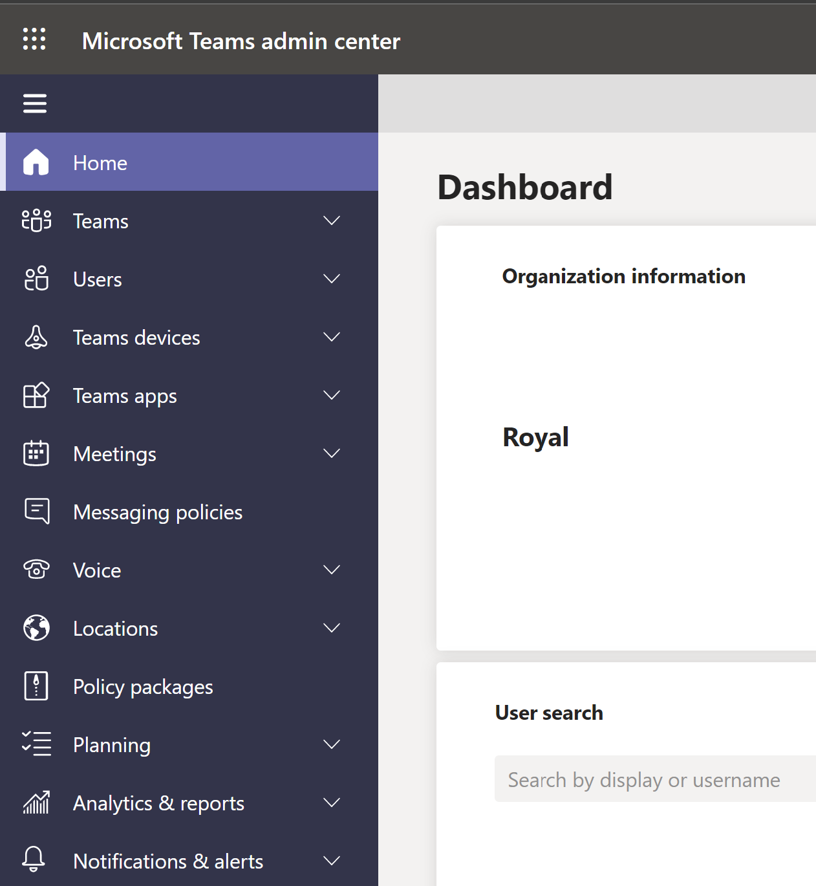
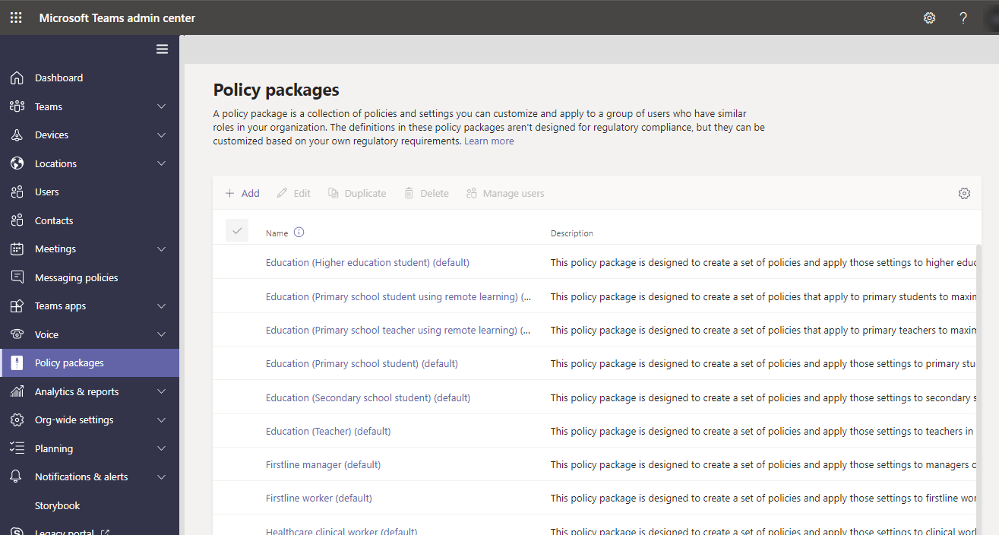

I introduced some governance options and high-level thoughts regarding them. In this post, I want to give you a quick overview of what settings and policies are available in the Teams Admin center. For example, what is the difference between a setting and a policy, and how are they implemented?

# Teams Admin Center settings and policies
Within Microsoft Teams Admin Center, there are settings and policies. Settings affect all teams and users globally, while policies are applied directly to users or inherited from parent containers such as groups or even globally. 
You can use the Global (Org-wide default) policy and customize it or create one or more custom policies. It's common to create custom policies for different parts of the organization. For example, HR might need other applications in Teams, and some users might need to have "public preview" enabled to evaluate new features.
We have an incredible amount of configuration possibilities in Teams Admin center:

## Policies

- **Teams policies:** and channel policies are used to control what settings or features are available to users when they are using teams and channels. 

- **Template policies:** let you create and set up policies for people in your organization so they can see only certain templates.  

- **Teams update policies:** are used to manage Teams and Office preview users that will see pre-release or preview features in the Teams app.

- **App permissions policies:** control what apps you want to make available to Teams users in your organization. 
Microsoft-, third-party-, and custom-apps.

- **App setup policies:** control how apps are made available to a user with the Teams app. 
Which are pinned, can users pin etc.

- **Meeting policies:** are used to control what features are available to users when they join Microsoft Teams meetings

- **Live events policies:** are used to turn on or off features, such as who can join a live event, if transcription is provided for attendees, or if recording live events is available for people that schedule and hold live events.

- **Messaging policies:** are used to control what chat and channel messaging features are available to users in Teams

## Some settings
- **Teams Settings:** let you set up your teams for features such as email integration, cloud storage options, and device set up.

- **Guest access:** lets people outside your organization access teams and channels. When you turn on Guest Access, you can turn on or off features guest users can or can't use.

- **External access:** lets your Teams and Skype for Business users communicate with other users outside of your organization. 

- **Org-wide app settings:** when you are managing apps for your organization, you are controlling what apps are available to users in your organization's app store.

- **Live events settings:** Teams live events settings lets you control org-wide settings for all live events that are scheduled. You can choose to include a support URL when live events are held and set up a third-party video distribution provider for all live events organized and scheduled by people in your organization

- **Team & channel settings:** You can edit the team specific settings from manage teams.

# Policy precedence
A user can only have one effective policy for each policy type, and it is essential to understand the order that policies take precedence.
The rules of precedence decided the users' effective policy.
1. **Directly Assigned Policy:** this policy takes precedence.
2. **Group Assigned Policy:** this policy takes precedence if the user is a part of a group where the policy is assigned, and no policy is assigned directly.
3. **Org-wide policy:** the default Global policy is applied if the user is not part of a group policy or directly assigned. 
Make sure to consider this if you want to assign policies to a subset of the users in the tenant.

# Policy packages
Policy packages let you control Teams features that you want to allow or restrict for specific sets of people across your organization. 
Each policy package in Teams is designed around a user role and includes predefined policies and policy settings that support the collaboration and communication activities that are typical for that role.

Policy packages support the following Teams policy types:
- Messaging policy
- Meeting policy
- App setup policy
- Calling policy
- Live events policy

You can use the policy packages included in Teams or create your own custom policy packages. 
You can even customize the settings of the policies in a policy package to suit the needs of your users.
Create your own policy packages by adding the policy types and policies that you need. 
You manage policy packages by using the Microsoft Teams admin center or PowerShell.

Thanks for reading
/Simon
