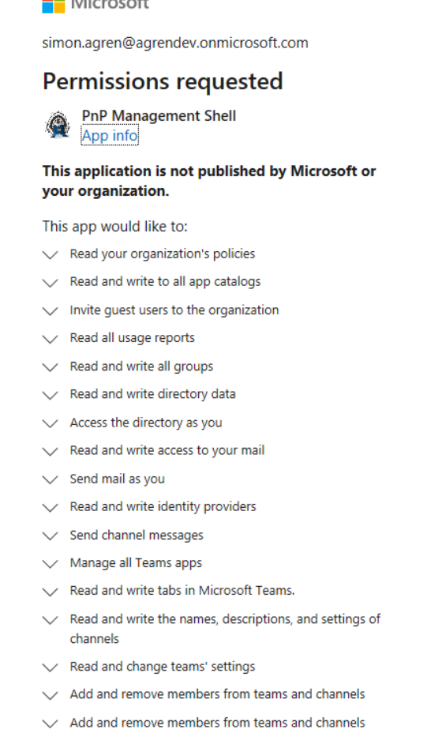

When it comes to authentication in PnP Powershell, the team have done great work providing a variety of options. The authentication has changed a little and now requires an Azure AD Application registration. You could either create an application registration or use the default option. In order to make life easier for you, PnP PowerShell (and Microsoft CLI) defaults to using `PnP Management Shell`. What is PnP Management Shell?

> IMPORTANT!: If you haven't already upgraded from the legacy PnP PowerShell module you can follow  <a href="https://pnp.github.io/powershell/articles/installation.html" target="_blank">this instruction</a>

# PnP Management Shell
It's a multi-tenant Azure AD application, registered in "the PnP" tenant. If you decide to consent and allow people in your organization to use `PnP Management Shell`, you are not creating a new application registration. It is added to `enterprise applications` in the Azure AD of your tenant. PnP Management Shell only uses delegated permission and is prepared with all the necessary scopes to utilize every cmdlet in PnP PowerShell. 
Not all organizations are keen to consent to all of the scopes. 

You have three options:
- Consent to PnP Management Shell and all of the scopes
- Create your own Azure AD Application registration
- Consent to PnP Management Shell and the specific scopes you want

# Consent to PnP Management Shell and all of the scopes
This is the most convenient option for you as a user. Since PnP PowerShell default to using `PnP Management Shell` if not else specified. If you fully consent you are free to "PnP PowerShell away". It's not an option for some organizations that always think "least privileges needed".

If you want to consent to all of the scopes you could log in as an administrator using:
```powershell
Connect-PnPOnline "<tenant>.sharepoint.com" -Interactive
```
or you could run this cmdlet:
```powershell
Register-PnPManagementShellAccess
```
Then you will be presented with a large dialog where you can consent. If you are an admin you can consent for your organization.



# Create your own Azure AD Application registration
You could create an Azure AD application registration that works very similar to the `PnP Management Shell` and only use delegated permissions. You could also involve application permissions and authentication methods other than credentials, such as certificates etc. 

> NOTE
> You can read some more <a href="https://pnp.github.io/powershell/articles/auhtentication.html" target="_blank">here</a> regarding how you would connect using you own application registration in PnP PowerShell.

If you use delegated permissions, make sure to enable **Allow public client flows** under the `Authentication` tab. Make sure you add the redirect URI's `nativeclient`and `http://localhost` under **Mobile and desktop applications**:
 

The PnP team has made it easy to create an Azure AD app using the command `Register-PnPAzureADApp`. Read more <a href="https://docs.microsoft.com/en-us/powershell/module/sharepoint-pnp/register-pnpazureadapp?view=sharepoint-ps
" target="_blank">here</a> regarding the cmdlet itself.


# Selected PnP Management Shell scopes
PnP Management is an "enterprise application" and we can't just go to application registrations and add permissions via the UI. Since we are working with delegated permissions, we could utilize some of the normal ways of granting permissions - just like you would with an application registration in your tenant:
 - Using the browser
 - Using Azure CLI

> NOTE:
> If we were working with application permissions. We would need to address the service principal itself. We will look at this in another post regarding managed identity 

## Using the browser
In a normal application consent flow, we usually do `individual consent`. This is what's happening when we are presented with the consent dialog in PnP PowerShell. If we happen to be an Admin, we could also admin consent for the organization.

We could also resort to `admin consent` right away in the browser.

### Individual consent
Using the client id of `PnP Management Shell` and the scopes we want to grant. Notice I left out the `redirect_uri` parameter, which we would normally use inside an application.

```typescript
https://login.microsoftonline.com/common/oauth2/v2.0/authorize?
client_id=31359c7f-bd7e-475c-86db-fdb8c937548e
&response_type=code
&scope=https://graph.microsoft.com/group.readwrite.all
```

### Admin consent
We could also, as an admin go directly to the admin consent endpoint. Here we pass in the client id and the scopes again.

```typescript
https://login.microsoftonline.com/organizations/v2.0/adminconsent?
client_id=31359c7f-bd7e-475c-86db-fdb8c937548e
&scope=https://graph.microsoft.com/group.readwrite.all
```

### Azure CLI
When it comes to granting `delegated` permissions, we could utilize Azure CLI and grant permissions right away. I might be confusing that we are using the command `application` instead of `sp`, even when we are working with the service principal. And the application is hosted in another tenant. 

We need to create the service principal (using the client id) in our tenant, if it doesn't already exist. Then, we utilize the `application grant` to grant the scopes. We don't need additional admin consent after this.

```powershell
# Log in
az login
# hardcoded PnP Management Shell id
$pnpmsId = "31359c7f-bd7e-475c-86db-fdb8c937548e"
# Check if exists, otherwise create
$sp = az ad sp show --id $pnpmsId
if ($sp -eq $null) {
    az ad sp create --id $pnpmsId
}
# Get Microsoft Graph service principal Id
$graphId = az ad sp list --query "[?appDisplayName=='Microsoft Graph'].appId | [0]" --all
# grant permissons. Add them as comma separated 
az ad app permission grant --id $pnpmsId --api $graphId --scope Group.ReadWrite.All
```


# Conclusion
PnP PowerShell is extremely powerful and has been for a very long time. There has been a few authentication changes, and I advice you to read the documentation in order to decide what best fits your scenario. 
The PnP team has made it easy for you to admin consent and then use the default PnP Management Shell. If your organization doesn't allow for that, you could create your own application registration. And a third option is to consent to a subset of scopes for the PnP Management Shell. I hope you now have the tools you need to make it fit your scenario.