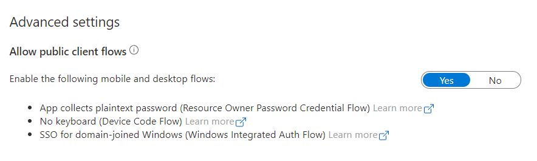
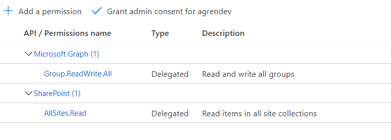
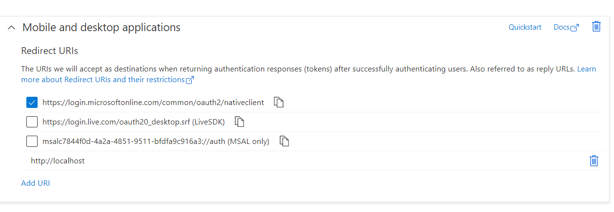
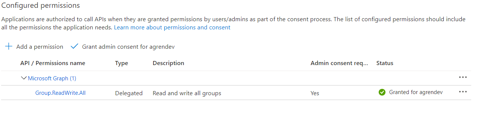
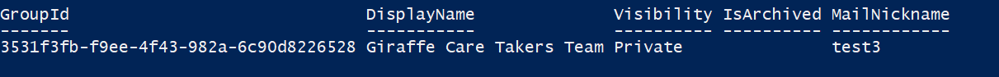

The background of this post is that I got a question from a friend of mine. He was in a situation where they were not allowed to utilize the PnP Management Shell, so they had created an application registration. 

He wanted to use an MFA account and connect using their Previously created application registration. However, he didn't quite understand how to adapt the application registration and couldn't find an example in the documentation on how to connect. 

Despite the PnP team providing good documentation, I know how confusing it could be.  

# Let's break it down
As mentioned earlier, the authentication has changed and now requires an Azure AD Application registration. PnP PowerShell (and Microsoft CLI) defaults to using `PnP Management Shell`. We will look at using our own application registration and delegated permissions.

## First, make sure we have an app registration
We need an application registration. You could get help from PnP PowerShell to create one. Here is an example:

```powershell
Register-PnPAzureADApp  -ApplicationName "PnP Delegated Yo" ´
                        -Tenant "agrendev.onmicrosoft.com" ´ 
                        -GraphDelegatePermissions "Group.ReadWrite.All" ´ 
                        -Interactive
```

## Previously
Many of us are used to connect with either `-Credentials` or with `-UseWebLogin` in the legacy version of PnP-PowerShell. `-UseWebLogin` was the only option we had while using an MFA account. This was cookie-based authentication, using your credentials as a logged-in user in the browser.

## Nowadays
We should connect with `-Credentials` or, if we are using an MFA account, use `-Interactive`. These options require different adaptations in the application registration, depending on your chosen path. For example, you could prepare for both if you want.

### Credentials

```powershell
Connect-PnPOnline   -Url "https://agrendev.sharepoint.com" ´ 
                    -Credentials (Get-Credential) ´
                    -ClientId {CLIENT_ID}
```

You don't need any of the **redirect URI's** for' -Credential' based authentication. But, you do need to:

1. go to **authentication** > change the `allowPublicClient` property to true > and click save.

2. Add the delegated scopes you want 


> IMPORTANT!
> A less documented thing is that you also need to grant consent in **API Permissions** to the `SharePoint` scope `AllSites.Read`. Otherwise, you will get a `403`. So it makes more sense to add `AllSites.FullControl` if you plan to use PnP PowerShell for SharePoint operations.  

### Interactive

```powershell
Connect-PnPOnline   -Url "https://agrendev.sharepoint.com" ´
                    -Interactive -ClientId {CLIENT_ID} ´
```
When it comes to MFA accounts, you should use `-Interactive` based authentication. It's different from the old `-UseWebLogin` as this is Not cookie based authentication. This, will log you in interactively and utilize the delegated permissions in the application registration. 

Now you DO need the **redirect URI's** and the `allowPublicClient` set to true.

1. Go to **authentication** > change the `allowPublicClient` property to true > and click save.

2. Use the `nativeclient` redirectURI and add `http://localhost` :


3. Add the delegated scopes you want to use


## When we are connected
If we have done all the required prerequisites, you can connect. For example, we could use any cmdlet utilized to scopes we have granted. 

```powershell
Get-PnPTeamsTeam -Identity "Giraffe Care Takers Team"
```
We get the following result

