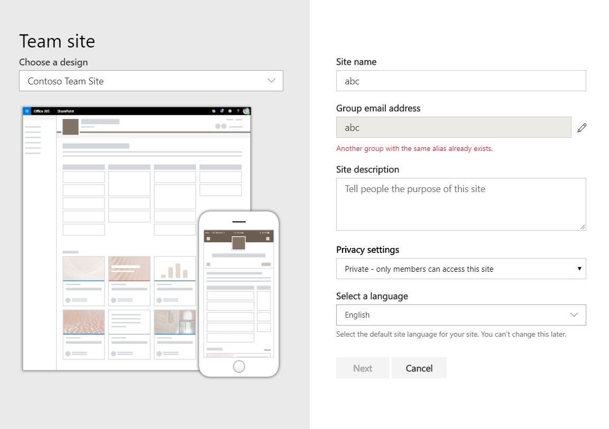
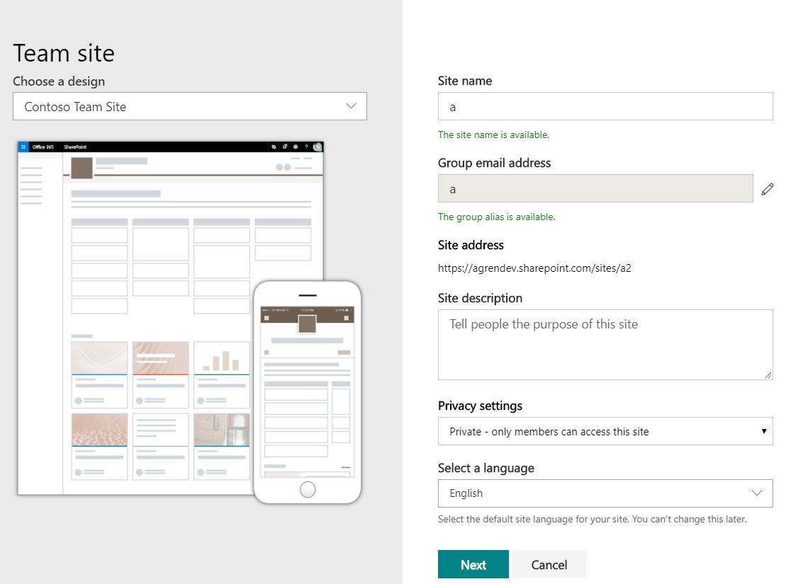
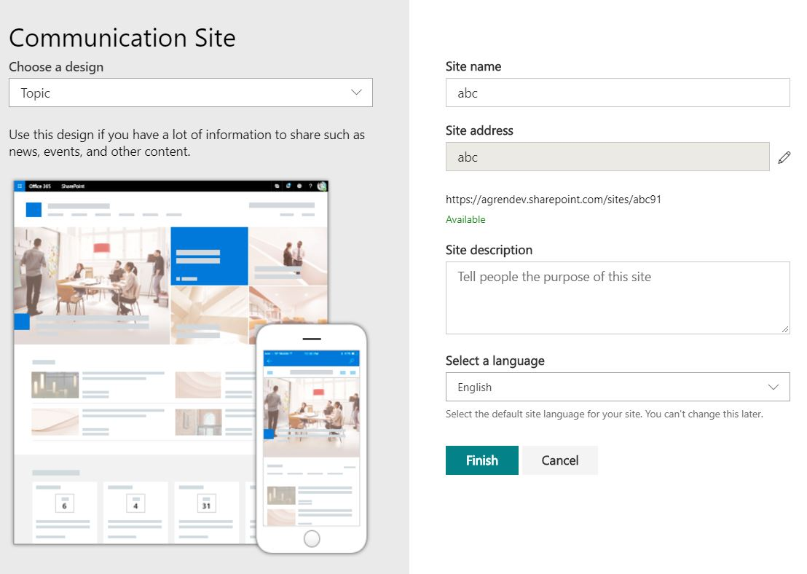
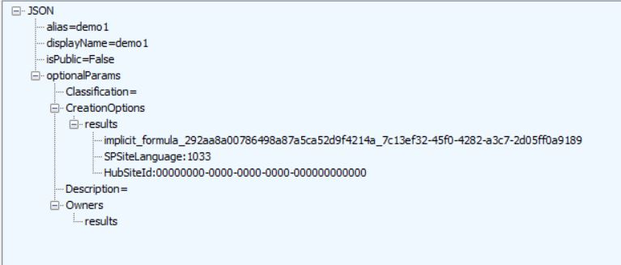
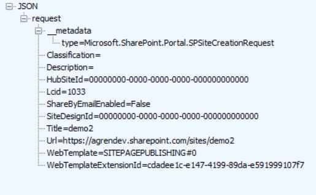
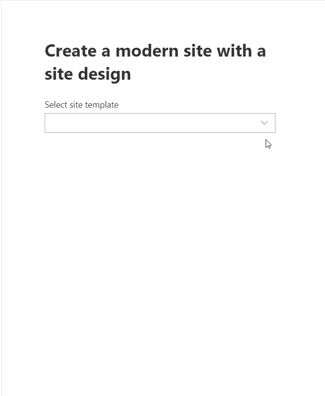
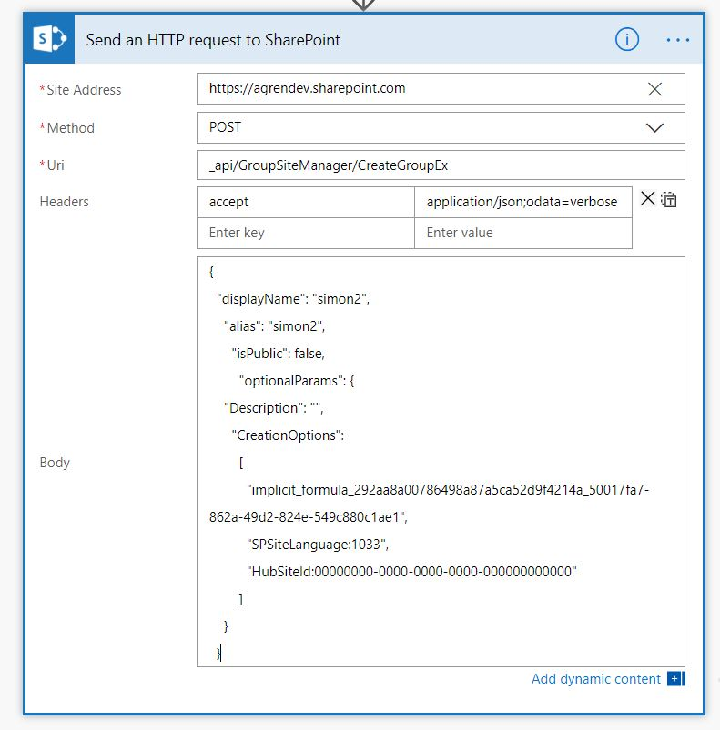

In this post I will show you some REST operations to create modern SharePoint sites along with site designs, similar to the creation from the SharePoint UI. 

I will show you how I used this in a [simple SPFx web part](https://github.com/simonagren/SPFxCreateSiteSiteDesigns) and how I did some quick work in Flow to create a Modern Team Site.

## Background 

Recently I have been experimenting with some SharePoint site provisioning from the Node.js Durable Functions. I'm currently just playing around with it, but I will share it with you later if I find it useful.

On Twitter I saw a discussion between [Beau](https://twitter.com/Beau__Cameron) and [Drew](https://twitter.com/dmadelung) regarding provisioning, and then Beau, [Sébastien](https://twitter.com/sebastienlevert) and I discussed it a bit further.

The main takeaway - which aligns with my general standpoint - was that if we do custom provisioning solutions it might be better to just use the PnP provisioning templates. And from the UI only use site designs when sufficient, and for when they arent fill in the blanks with PnP templates. 

This discussion got me thinking: "Why shouldn't we be able to create with a site design from custom solutions?". So I began dissecting how Microsoft has done while creating from the UI, and I found some cool stuff. Hopefully this will be news to some of you, I have not seen anything about this.

## The rest operations

If you are familiar with the site creation in the SharePoint UI you should know that you first select if it's a Modern Team Site or a Collaboration Site you should create. 

A lot of REST calls are made, and I'm only going to talk about the ones I decided to use for this simplified scenario.

### Get all site designs

```json
_api/Microsoft.Sharepoint.Utilities.WebTemplateExtensions.SiteScriptUtility.GetSiteDesigns
```

First off they get all available site designs. The `WebTemplate` property is `64`for a modern team site and `68` for a collaboration site.
So the right site designs will be available according to what site you choose to create.
We are going to use the `Id` of the site design in the site creation process, more on that later.

### Check the group alias

```json
_api/SP.Directory.DirectorySession/ValidateGroupName(displayName='Alias',%20alias='Alias')
```

When we create a modern team site we make a REST call to see if the alias is available. If this returns false then the group already exists.

- If the group already exists, we don't make any additional calls to check the site url.



### Check valid URL

```json
_api/GroupSiteManager/GetValidSiteUrlFromAlias?alias='Alias'&isTeamSite=true
```

If the alias check is returned ok, then we check for a valid URL. In team site creation scenarios we should pobably only get back the URL that is equal to the alias.




But in communication site scenarios - as you might have seen before - we could get back another suggested URL if it's already taken. 



### Create a Modern Team Site

```json
_api/GroupSiteManager/CreateGroupEx
```


While looking around in fiddler when you create a Modern Team Site I a saw this in the requests body `CreationOptions` `implicit_formula_292aa8a00786498a87a5ca52d9f4214a_7c13ef32-45f0-4282-a3c7-2d05ff0a9189`. 




I then realized that the last part of that string is the Site Design Id, and the first part seems to be the same in other tenants as well. 

This means that by changing that last part of the string to the Id of our site design of choice (Team Site Site Design) we could create Team sites with that site design, in a similar way Microsoft is doing it from the UI.

### Create a communication site

```json
_api/SPSiteManager/Create
```

For this I also looked around in fiddler and I saw that when you create a communication site they are actually not using the `SiteDesignId` other than the OOT templates, for the custom they are using the `WebTemplateExtesionId`



This also means that we could create a communication site with the site design of our choice.

## SPFx Web Part

[simple SPFx web part](https://github.com/simonagren/SPFxCreateSiteSiteDesigns)

This is a web part I threw together just to show you the main concepts. Feel free to use it and maybe do something better with the code, create some components etc.

If you are familiar with me you know I do most of my work with the help of PnPJs. But since we would need to make a PR and change some things it the methods I would use, I decided to make this with normal SPFx spHttpClient calls.




### Selecting a site design

The web part gets all site designs when it mounts, adds them to the state and then populates the drop down. Then depending on Team Site or Communication the inputs are shown/behaves differently.

```typescript
// Get all available site designs
  private async _getSiteDesigns(): Promise<any> {
    return this.props.client.post(
      `https://agrendev.sharepoint.com/_api/Microsoft.Sharepoint.Utilities.WebTemplateExtensions.SiteScriptUtility.GetSiteDesigns`, 
      SPHttpClient.configurations.v1, null)
      .then((response: SPHttpClientResponse) => {
        return response.json();
      }).then(result => {
        return result.value;
      });
  }
  ```

### Validating the Group Alias
As I said before while creating a Team Site the entered text is validated as a Group Alias, this is being done by this method.

```typescript
// Validate the alias to make sure the group does not exist
  private async _validateGroupName(groupName: string): Promise<boolean> {
    return this.props.client.get(
      `https://agrendev.sharepoint.com/_api/SP.Directory.DirectorySession/ValidateGroupName(displayName='${groupName}',%20alias='${groupName}')`, 
    SPHttpClient.configurations.v1)
      .then((response: SPHttpClientResponse) => {
        return response.json();
      }).then(result => {
        return result.IsValidName;
      });
  }
```

### Validating Site Url
This method is being used by both Team Site and Communication site creation. It returns a valid URL, either the same you entered or a suggestion for another.

```typescript
// Get a valid site url. Returns suggestion if it already exists. Like in the UI
  private async _getValidSiteUrl(siteName: string): Promise<string> {
    return this.props.client.get(
      `https://agrendev.sharepoint.com/_api/GroupSiteManager/GetValidSiteUrlFromAlias?alias='${siteName}'&isTeamSite=true`, 
      SPHttpClient.configurations.v1)
      .then((response: SPHttpClientResponse) => {
        return response.json();
      }).then(result => {
        return result.value;
      });
  }
  ```

  ### Creating a Modern Team Site
  This method creates a modern team site and uses the Site Design what we chose. I needed to use the 
  `'Accept': 'application/json;odata.metadata=minimal'` in the Header, someone might have a better idea.

  ```typescript
  // Create modern team time
  public async createTeamSite(displayName: string, alias: string, isPublic = true, lcid = 1033, description = "", classification = "", owners?: string[], siteDesignId?: string): Promise<any> {

    const creationOptions = [`SPSiteLanguage:${lcid}`];
    if (siteDesignId) {
      creationOptions.push(`implicit_formula_292aa8a00786498a87a5ca52d9f4214a_${siteDesignId}`)
    }

    const postBody = {
      alias: alias,
      displayName: displayName,
      isPublic: isPublic,
      optionalParams: {
        Classification: classification,
        CreationOptions: creationOptions,
        Description: description,
        Owners: owners ? owners : [],
      },
    };

    const opt: ISPHttpClientOptions = {};
    opt.headers = {
      'Accept': 'application/json;odata.metadata=minimal',
    }
    opt.body = JSON.stringify(postBody);

    return this.props.client.post(`https://agrendev.sharepoint.com/_api/GroupSiteManager/CreateGroupEx`, SPHttpClient.configurations.v1, opt)
      .then((response: SPHttpClientResponse) => {
        return response.json();
      }).then(result => {
        return result;
      });

  }
  ```

### Create Communication Site
This method creates a communication site with the site design we chose. In this case I also had to use the `'Accept': 'application/json;odata.metadata=minimal'` in the Header.

```typescript
// Create communication site
  public createCommunicationSite(title: string, lcid: number, url: string, webTemplateExtensionId?: string, description?: string, classification?: string, shareByEmailEnabled?: boolean,
    siteDesignId?: string, ): Promise<any> {

    const postBody =
    {
      "request": {
        WebTemplate: "SITEPAGEPUBLISHING#0",
        Title: title,
        Url: url,
        Description: description ? description : "",
        Classification: classification ? classification : "",
        SiteDesignId: siteDesignId ? siteDesignId : "00000000-0000-0000-0000-000000000000",
        Lcid: lcid ? lcid : 1033,
        ShareByEmailEnabled: shareByEmailEnabled ? shareByEmailEnabled : false,
        WebTemplateExtensionId: webTemplateExtensionId ? webTemplateExtensionId : "00000000-0000-0000-0000-000000000000",
        HubSiteId: "00000000-0000-0000-0000-000000000000"
      }

    }

    const opt: ISPHttpClientOptions = {};
    opt.headers = {
      "Accept": "application/json;odata.metadata=minimal",
    }
    opt.body = JSON.stringify(postBody);

    return this.props.client.post(`https://agrendev.sharepoint.com/_api/SPSiteManager/Create`, SPHttpClient.configurations.v1, opt)
      .then((response: SPHttpClientResponse) => {
        return response.json();
      }).then(result => {
        return result;
      });
  }

}
```

## Flow

I just tried some Modern Team Site Creation in Flow, with a hardcoded site design id.



## Final words
Hopefully you learned something. 

Now go and make nice-looking web parts an custom solutions!

I'm open to feedback or suggestions to make these things in a better manner. Feel free to reach out.


